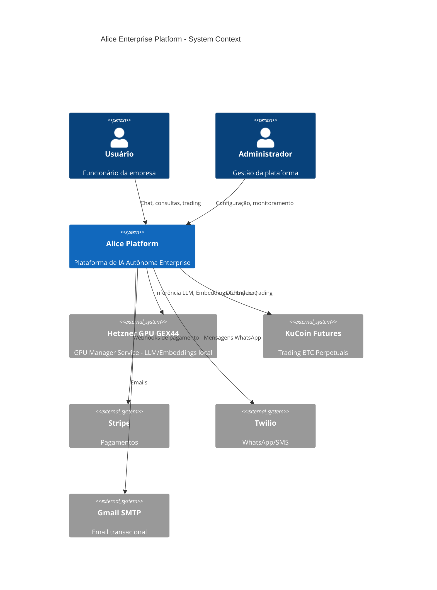
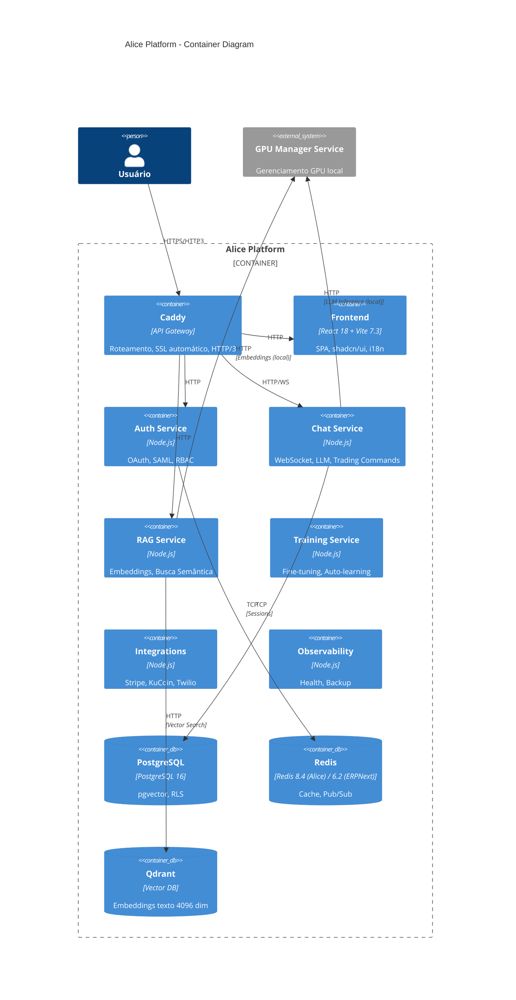
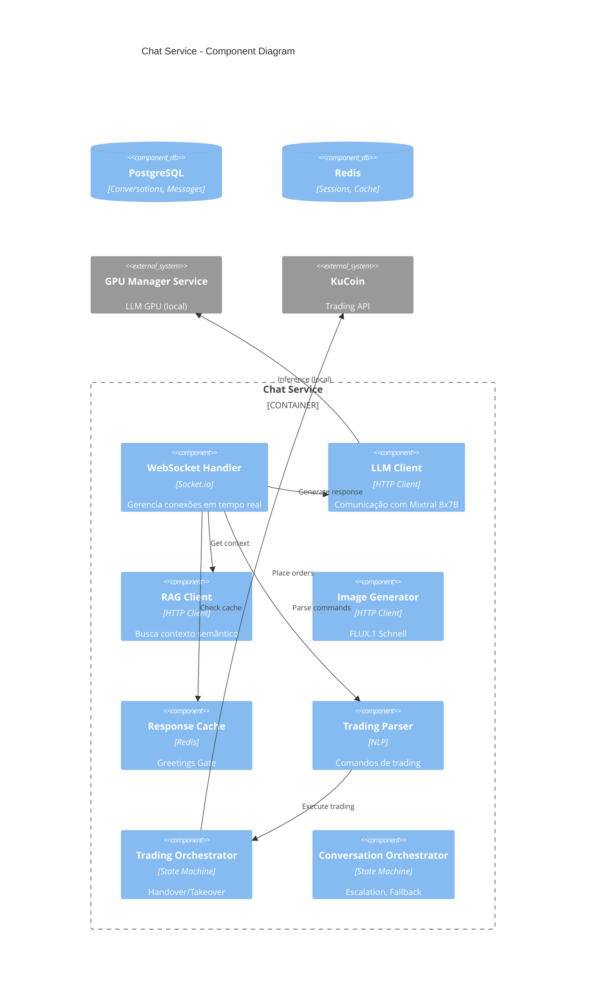
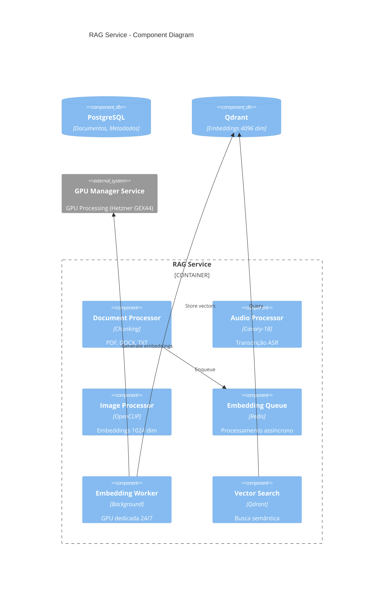
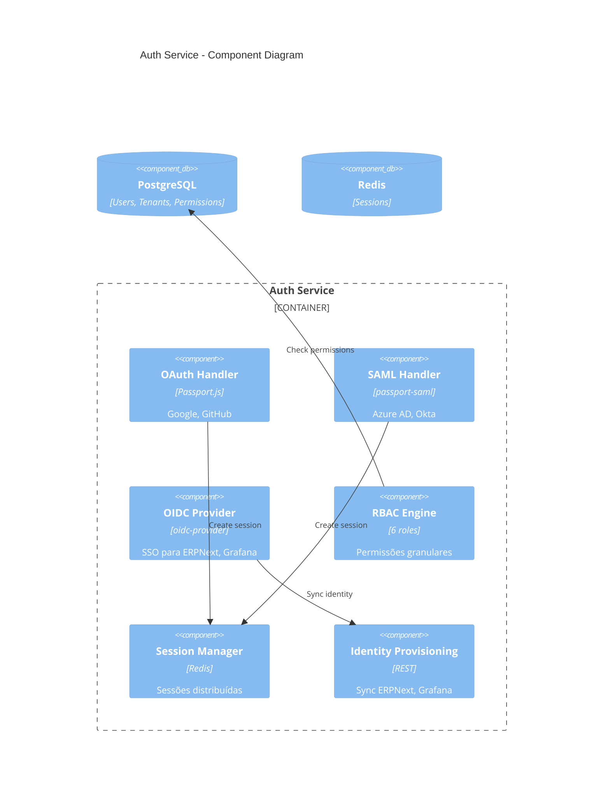
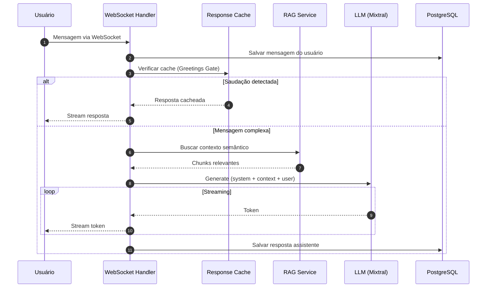
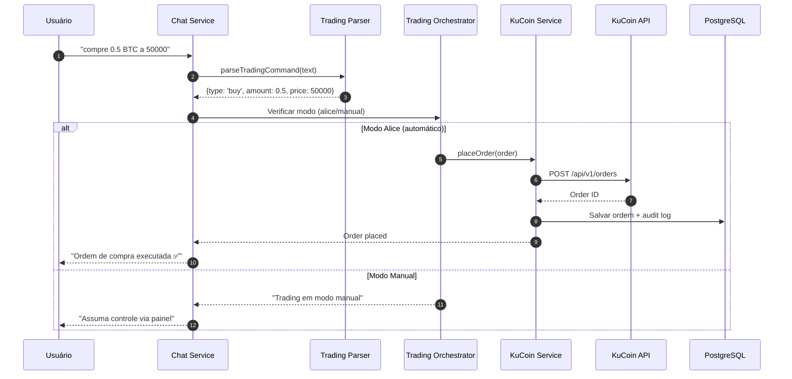
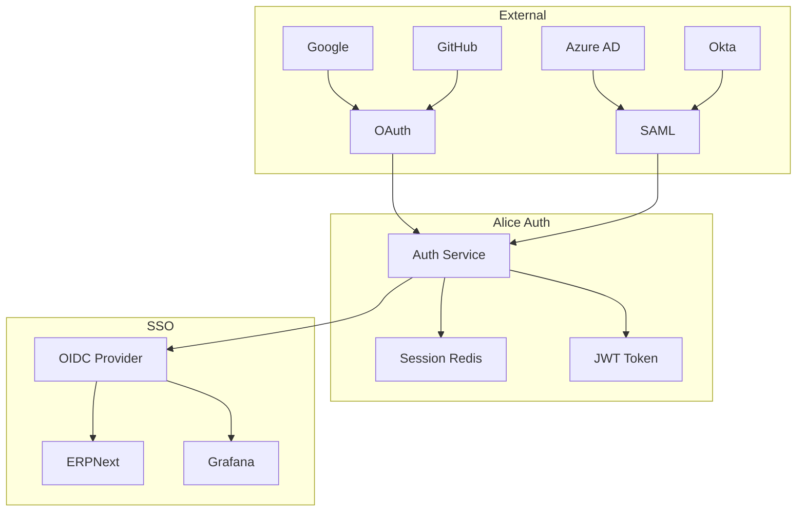
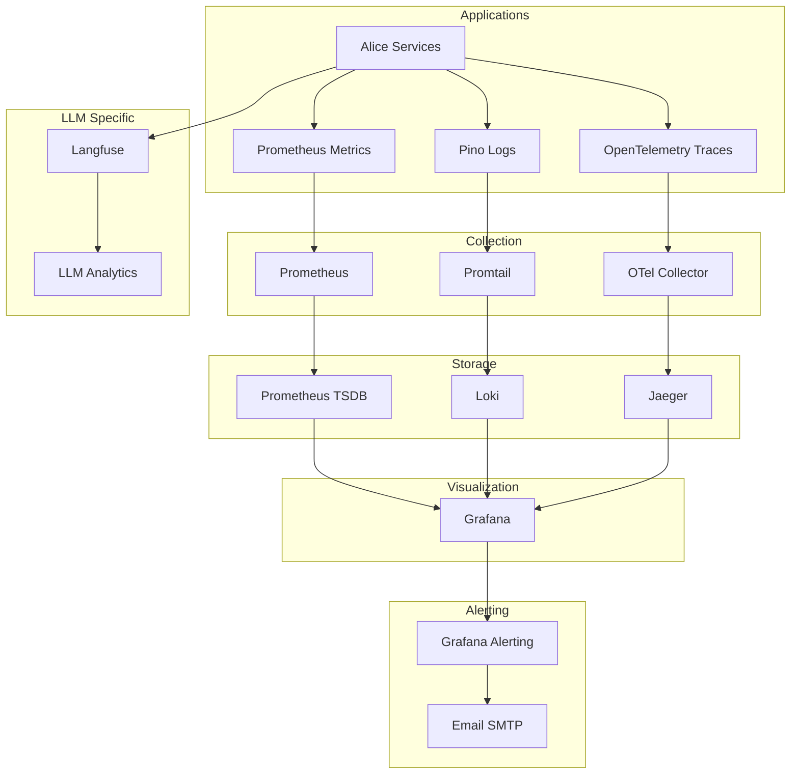
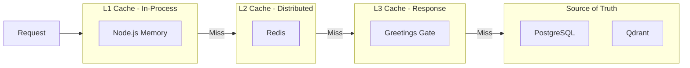

# Alice Enterprise Platform - Arquitetura de Software

> **Autor:** Fillipe Guerra  
> **Data:** 06 de Janeiro de 2026  
> **Versão:** 3.0.0 - Pipeline Enterprise Modular  
> **Framework:** arc42 + C4 Model + ADRs  
> **Idioma:** Português Brasileiro (termos técnicos em inglês)
> 
> **🚀 ATUALIZAÇÃO v3.0.0 (06/01/2026) - Pipeline Modular:**  
> Refatoração completa do CI/CD para arquitetura modular enterprise:
> - **Release Modular v3**: Matrix Strategy (17 builds ‖ ~5-7min, 80% mais rápido)
> - **Deploy Modular v3**: Jobs independentes (5 stacks ‖ ~10min, 66% mais rápido)
> - **Rollback Cirúrgico**: Só reverte stack com falha
> - Ver seções ADR-015 e ADR-016 abaixo

---

## Sumário

1. [Introdução e Objetivos](#1-introdução-e-objetivos)
2. [Restrições Arquiteturais](#2-restrições-arquiteturais)
3. [Contexto do Sistema (C4 Level 1)](#3-contexto-do-sistema-c4-level-1)
4. [Containers (C4 Level 2)](#4-containers-c4-level-2)
5. [Componentes (C4 Level 3)](#5-componentes-c4-level-3)
6. [Visão de Runtime](#6-visão-de-runtime)
7. [Visão de Deployment](#7-visão-de-deployment)
8. [Conceitos Transversais](#8-conceitos-transversais)
9. [Decisões Arquiteturais (ADRs)](#9-decisões-arquiteturais-adrs)
10. [Aderência às 18 Regras](#10-aderência-às-18-regras)
11. [12-Factor App Compliance](#11-12-factor-app-compliance)
12. [Riscos e Dívida Técnica](#12-riscos-e-dívida-técnica)
13. [Glossário](#13-glossário)

---

## 1. Introdução e Objetivos

### 1.1 Visão do Produto

**Alice** é uma plataforma enterprise de IA autônoma 100% self-hosted, projetada para organizações que exigem:

- **Privacidade Total**: Dados nunca saem da infraestrutura própria
- **Autonomia**: LLM próprio (Mixtral 8x7B) sem dependência de APIs externas
- **Customização**: Fine-tuning específico via LoRA para cada domínio
- **Custo Previsível**: Sem cobrança por token de terceiros
- **Compliance**: LGPD, GDPR, SOC 2 ready

### 1.2 Objetivos de Qualidade

| Prioridade | Objetivo | Métrica | Meta |
|------------|----------|---------|------|
| 1 | **Disponibilidade** | Uptime | 99.9% |
| 2 | **Segurança** | OWASP Top 10 | 10/10 mitigados |
| 3 | **Performance** | P95 Latency (chat) | < 2s |
| 4 | **Escalabilidade** | Concurrent Users | 1000+ |
| 5 | **Manutenibilidade** | Code Coverage | > 80% |

### 1.3 Stakeholders

| Stakeholder | Responsabilidade | Expectativa |
|-------------|------------------|-------------|
| Product Owner | Direção do produto | ROI, features |
| Arquiteto | Decisões técnicas | Qualidade, escalabilidade |
| Desenvolvedores | Implementação | Clareza, padrões |
| DevOps | Operações | Observabilidade, automação |
| Segurança | Compliance | Zero vulnerabilidades |
| Usuários Finais | Consumo | UX, velocidade |

> Atualização 21/12/2025: CI ajustado para evitar execuções duplicadas (push restrito ao `main` + PR em `main`) e correção de tipos do frontend (SignalApprovalPanel) garantindo build do Release.

---

## 2. Restrições Arquiteturais

### 2.1 Restrições Técnicas

#### Padrões de Repositório (Line Endings e EditorConfig)

- **Line endings determinísticos (2025)**: o repositório usa **LF** como padrão para arquivos de texto, com exceção de scripts Windows (`.bat/.cmd/.ps1`) que usam **CRLF**.
- **Fonte de verdade**: `.gitattributes` (Git) + `.editorconfig` (editores/IDE).
- **Objetivo**: eliminar diffs ruidosos e garantir builds/reviews determinísticos em Windows/Linux/macOS.

| Restrição | Descrição | Justificativa |
|-----------|-----------|---------------|
| **Node.js 22 LTS** | Runtime backend obrigatório | Performance, suporte long-term |
| **PostgreSQL 16** | Banco principal com pgvector | Embeddings vetoriais, RLS |
| **TypeScript strict** | Zero `any` permitido | Regra 8 CLAUDE.md |
| **Docker Compose** | Orquestração de containers | Simplicidade, portabilidade |
| **pnpm** | Package manager | Monorepo, deduplicação |

### 2.2 Restrições Organizacionais

| Restrição | Descrição | Impacto |
|-----------|-----------|---------|
| **100% Self-hosted** | Sem dependência de SaaS externos para core | Autonomia total |
| **Documentação PT-BR** | Regra 10 CLAUDE.md | Acessibilidade |
| **Zero Mocks em Produção** | Regra 6 CLAUDE.md | Qualidade enterprise |
| **Commits Consolidados** | Regra 18 CLAUDE.md | Histórico limpo |

### 2.3 Convenções

```
alice/
├── apps/                    # Microsserviços (Regra 15)
│   ├── auth-service/        # Autenticação/Autorização
│   ├── chat-service/        # Chat + LLM + Trading
│   ├── rag-service/         # Embeddings + Busca Semântica
│   ├── training-service/    # Fine-tuning + Auto-learning
│   ├── integrations-service/# APIs externas + Trading
│   ├── observability-service/# Métricas + Backup
│   └── frontend-service/    # React SPA
├── packages/                # Código compartilhado
│   ├── shared/              # Schema Drizzle ORM
│   ├── database/            # Conexão PostgreSQL
│   ├── logger/              # Pino singleton
│   ├── config/              # Validação Zod
│   └── shared-utils/        # Utilities enterprise
├── infra/                   # Infraestrutura
│   ├── docker/              # Docker Compose
│   └── scripts/             # Automação e deploy
│   └── scripts/             # Automação
└── docs/                    # Documentação
```

---

## 3. Contexto do Sistema (C4 Level 1)

### 3.1 Diagrama de Contexto



### 3.2 Integrações Externas

| Sistema | Propósito | Protocolo | Autenticação |
|---------|-----------|-----------|--------------|
| **Hetzner GPU GEX44** | GPU Manager Service local - LLM/Embeddings/FLUX/ASR | HTTP (localhost) | N/A (interno) |
| **KuCoin Futures** | Trading BTC | REST + WebSocket | HMAC-SHA256 |
| **Stripe** | Pagamentos | Webhooks | Signature verification |
| **Twilio** | WhatsApp/SMS | REST | API Key + Token |
| **Gmail SMTP** | Email | SMTP/TLS | App Password |
| **ERPNext** | ERP/CRM | REST | OAuth 2.0 SSO |
| **Grafana** | Dashboards | REST | OAuth 2.0 SSO |

---

## 4. Containers (C4 Level 2)

### 4.1 Diagrama de Containers



### 4.2 Catálogo de Containers (50 Total)

#### Infraestrutura Core (7)

| # | Container | Tecnologia | Porta | Responsabilidade |
|---|-----------|------------|-------|------------------|
| 1 | `alice-caddy` | Caddy 2.8.4 | 80,443 | API Gateway, SSL automático, HTTP/3 |
| 2 | `alice-pgbackrest-init` | pgBackRest | - | Inicialização stanza backup |
| 3 | `alice-postgres` | PostgreSQL 16 | 5432 | Banco principal + pgvector |
| 4 | `alice-redis` | Redis 8.4 | 6379 | Cache distribuído (node-redis 5.x) |
| 5 | `alice-qdrant` | Qdrant | 6333 | Embeddings texto (4096 dim) |
| 6 | `alice-tor` | torproxy | 9050 | Proxy SOCKS5 Tor (.onion) |
| 7 | `alice-searxng` | SearXNG | 8080 | Metabusca interna |

> **NOTA 02/01/2026**: Traefik, traefik-init e dockerproxy foram substituídos por Caddy. Vantagens: SSL automático com retry inteligente, HTTP/3 nativo, footprint 40MB (vs 100MB Traefik), configuração declarativa via Caddyfile.

#### Microsserviços Alice (7)

| # | Container | Tecnologia | Porta | Responsabilidade |
|---|-----------|------------|-------|------------------|
| 8 | `alice-frontend` | React 18 + Vite 7.3 | 5000 | SPA, UI/UX |
| 9 | `alice-auth` | Node.js | 3001 | OAuth, SAML, RBAC |
| 10 | `alice-chat` | Node.js | 3002 | WebSocket, LLM, Trading |
| 11 | `alice-rag` | Node.js | 3003 | RAG, Embeddings |
| 12 | `alice-training` | Node.js | 3004 | Fine-tuning, Auto-learning |
| 13 | `alice-integrations` | Node.js | 3005 | Stripe, KuCoin, Twilio |
| 14 | `alice-observability` | Node.js | 3007 | Health, Backup |

#### ERPNext Stack (15)

| # | Container | Descrição |
|---|-----------|-----------|
| 15-29 | ERPNext | MariaDB, Redis 6.2 x2 (cache+queue), Backend, Frontend, WebSocket, Scheduler, 9 Workers |

#### Observability Stack (13)

| # | Container | Descrição |
|---|-----------|-----------|
| 30-42 | Observability | Prometheus, **Grafana** (+ Alerting), Loki, Promtail, Jaeger, Langfuse x2, **ClickHouse**, Vector, OTel, Node-Exporter, cAdvisor |

> **NOTA 01/01/2026**: Alertmanager removido. Grafana Alerting assumiu 100% das funcionalidades de alertas com UI completa.

#### Backup (1)

| # | Container | Descrição |
|---|-----------|-----------|
| 44 | `alice-pgbackrest` | Backup enterprise PostgreSQL |

---

## 5. Componentes (C4 Level 3)

### 5.1 Chat Service - Componentes



### 5.2 RAG Service - Componentes



### 5.3 Auth Service - Componentes



---

## 6. Visão de Runtime

### 6.1 Fluxo de Chat com LLM



### 6.2 Fluxo de Trading via Chat



### 6.3 Fluxo de Embeddings (GPU Dedicada 24/7)


---

## 7. Visão de Deployment

### 7.1 Diagrama de Deployment

```mermaid
C4Deployment
    title Alice Platform - Deployment View

    Deployment_Node(hetzner, "Hetzner Cloud", "Nuremberg, Germany") {
        Deployment_Node(vm, "GEX44 GPU Server", "Intel i5-13500 14 Core, 64GB DDR4, 2x 1.92TB NVMe RAID 1, RTX 4000 Ada 20GB") {
            Deployment_Node(docker, "Docker 29.1.2") {
                Container(caddy, "Caddy", "API Gateway")
                Container(services, "Alice Services", "7 containers")
                Container(erpnext, "ERPNext", "15 containers")
                Container(obs, "Observability", "13 containers")
                Container(backup, "pgBackRest", "Backup")
            }
        }
        Deployment_Node(gpuServices, "GPU Services", "Local GPU Services") {
            Container(gpuManager, "GPU Manager Service", "Fila priorizada, VRAM monitoring")
            Container(mixtral, "Mixtral 8x7B", "vLLM AWQ")
            Container(flux, "FLUX.1 Schnell", "Image Gen")
            Container(qwen, "Qwen3-Embedding", "4096 dim")
            Container(canary, "Canary-1B", "ASR")
        }
    }
    
    Rel(caddy, services, "HTTP")
    Rel(services, gpuServices, "HTTP", "GPU Inference (local)")
```

### 7.2 Estrutura de Volumes

```
/mnt/alice-data/                    # Volume Hetzner 100GB
├── data/                           # Dados persistentes
│   ├── postgresql/                 # PostgreSQL + pgvector
│   ├── mariadb/                    # ERPNext
│   └── redis/                      # Cache persistente
├── uploads/                        # Mídia multimodal
│   ├── {tenantId}/                 # Isolamento por tenant
│   │   ├── image/
│   │   ├── audio/
│   │   └── document/
│   └── {tenantId}/                 # Uploads por tenant
├── backups/                        # Backups enterprise
│   ├── postgresql/                 # pgBackRest (WAL, PITR)
│   ├── mariadb/                    # ERPNext dumps
│   └── manifests/                  # Metadados JSON
└── logs/                           # Logs de serviços
```

### 7.3 Pipeline CI/CD Unificada (27/12/2025)

```mermaid
flowchart LR
    subgraph Development
        A[Git Push] --> B[GitHub Actions CI]
    end
    
    subgraph CI
        B --> C[Lint + Type Check]
        C --> D[Unit Tests]
        D --> E[Build Docker Images]
        E --> F[Push to GHCR]
    end
    
    subgraph CD
        F --> G[Create Release]
        G --> H[Deploy Hetzner]
        H --> I[Deploy Production Server]
        I --> J[Health Checks]
        J --> K[Rollback if failed]
    end
    
    subgraph Production
        K --> L[51 Containers Hetzner GEX44]
        L --> M[GPU Manager Service + 4 GPU Services (local)]
        M --> N[Prometheus Monitoring]
    end
```

> **Pipeline Enterprise (27/12/2025):** Deploy Server (CPX32 - 4 vCPU AMD EPYC, 8GB RAM) com Runner Enterprise Hardening (kernel tuning, Docker daemon, limits, systemd) + Production Server (GEX44 GPU). Todos os serviços GPU rodam localmente no servidor único, eliminando latência de rede.

> **Otimização CI Performance (27/12/2025):** Composite action `.github/actions/setup-node-pnpm` elimina duplicação de setup (14 execuções → 1x). Versões Node.js/pnpm calculadas uma vez no job `detect-changes` e passadas via outputs. Jobs que não precisam de Node.js (compliance-checks, trigger-release) não fazem setup. Economia estimada: ~6-10 minutos por run de CI.

> **Server GPU Optimizations (28/12/2025):** Servidor de produção Hetzner GEX44 otimizado para máxima performance GPU. **Docker daemon:** default-runtime nvidia (GPU como runtime padrão), live-restore true, BuildKit GC 20GB. **NVIDIA:** Persistence Mode ENABLED (GPU sempre ativa, sem cold start), CDI configurado em /etc/cdi/nvidia.yaml (Container Device Interface - best practice 2025), Container Toolkit 1.18.1. **Kernel sysctl:** vm.swappiness=10 (prioriza RAM), vm.dirty_ratio=40 (I/O throughput), kernel.shmmax=64GB (CUDA shared memory), net.core.rmem_max=16MB (buffers rede), fs.file-max=2M. **Hardware:** RTX 4000 Ada 20GB, Driver 580.95.05, CUDA 13.0. Servidor 100% limpo, 1.7TB disponível.

> **Deploy Enterprise Hardening (02/01/2026):** Workflow de deploy com validações enterprise completas. **Smoke Tests Pós-Deploy:** PostgreSQL (pg_isready), pgvector (operação vetorial real `SELECT '[1,2,3]'::vector <-> '[4,5,6]'::vector`), Redis (PING), Caddy (HTTP 80/443), GPU Manager (health endpoint), conectividade inter-serviços (Chat→GPU Manager via rede Docker). **Persistência de Logs:** Todos os logs de deploy salvos em `/opt/alice/logs/deploy-YYYYMMDD-HHMMSS.log` para troubleshooting futuro. **Validação pgBackRest:** Verifica existência do repositório, permissões (999:999), estrutura e corrige automaticamente se necessário. **pgBackRest Stanza Fix:** `pgbackrest-init` agora cria stanza sem precisar de `pg_control` (passa configs via CLI sem `pg1-*`), sincronizada após PostgreSQL iniciar. **Caddy Healthcheck:** Melhorado para verificar HTTP (portas 80/443) além de admin API (porta 2019).

---

## 8. Conceitos Transversais

### 8.1 Segurança

#### 8.1.1 Autenticação Multi-Protocolo



#### 8.1.2 RBAC - 6 Níveis de Acesso

| Role | Descrição | Exemplos de Permissão |
|------|-----------|----------------------|
| `super_admin` | Acesso total | Tudo |
| `admin` | Admin tenant | users:*, agents:*, training:* |
| `manager` | Gerente | conversations:*, reports:* |
| `operator` | Operador | conversations:read, trading:read |
| `viewer` | Visualizador | conversations:read, dashboard:read |
| `guest` | Convidado | public:read |

#### 8.1.3 Row Level Security (RLS)

```sql
-- Exemplo de RLS policy para isolamento multi-tenant
CREATE POLICY "tenant_isolation" ON conversations
    USING (tenant_id = current_setting('app.tenant_id')::uuid);

-- Tabelas com RLS ativo (17/12/2025):
-- conversations, messages, agents, documents, embeddings,
-- training_data, fine_tuning_jobs, trading_signals,
-- trading_orders, trading_positions, trading_risk_config,
-- trading_audit_log, trading_dataset, trading_lora_jobs,
-- trading_control_history
```

#### 8.1.4 Security Hardening

| Medida | Cobertura | Status |
|--------|-----------|--------|
| `no-new-privileges` | 51/51 containers | ✅ 100% |
| `read_only: true` | 25/51 containers | ✅ Onde aplicável |
| Resource limits | 51/51 containers | ✅ 100% |
| SHA256 digests | 26 imagens | ✅ 100% |
| Healthchecks | 38/38 containers | ✅ 100% |

### 8.2 Observabilidade

#### 8.2.1 Stack Completo



#### 8.2.2 Métricas Prometheus

| Categoria | Métricas | Labels |
|-----------|----------|--------|
| **HTTP** | `alice_http_request_duration_seconds` | method, route, status |
| **LLM** | `alice_llm_inference_duration_seconds` | model, tenant_id |
| **RAG** | `alice_rag_search_duration_seconds` | namespace |
| **Trading** | `alice_trading_orders_total` | type, status |
| **Cache** | `alice_response_cache_hits_total` | tenant_id |
| **Circuit Breaker** | `alice_circuit_breaker_state` | name |

### 8.3 Resiliência

#### 8.3.1 Circuit Breakers

```typescript
// Presets enterprise definidos em circuit-breaker.ts
const PRESETS = {
  default: { threshold: 5, timeout: 30000, resetTimeout: 30000 },
  kucoinFutures: { threshold: 3, timeout: 10000, resetTimeout: 60000 },
  embeddingsGPU: { threshold: 3, timeout: 60000, resetTimeout: 120000 },
  asrCanary: { threshold: 3, timeout: 120000, resetTimeout: 180000 },
  mixtralLLM: { threshold: 3, timeout: 60000, resetTimeout: 120000 },
  imageGeneration: { threshold: 5, timeout: 30000, resetTimeout: 60000 },
};
```

#### 8.3.2 Retry Policies

| Serviço | Max Retries | Backoff | Timeout |
|---------|-------------|---------|---------|
| LLM Inference | 3 | Exponential | 60s |
| Embeddings GPU | 3 | Exponential | 60s |
| KuCoin API | 3 | Linear | 10s |
| Stripe Webhooks | 5 | Exponential | 30s |

### 8.4 Performance

#### 8.4.1 Caching Strategy



#### 8.4.2 Connection Pooling

| Recurso | Pool Size | Timeout |
|---------|-----------|---------|
| PostgreSQL | 20 | 30s |
| Redis | 10 | 10s |
| HTTP Clients | 100 | 30s |

### 8.5 Logging

#### 8.5.1 Structured Logging (Pino)

```typescript
// Padrão de log enterprise
logger.info({
  correlationId: req.headers['x-correlation-id'],
  tenantId: req.tenantId,
  userId: req.userId,
  method: req.method,
  path: req.path,
  statusCode: res.statusCode,
  latencyMs: Date.now() - startTime,
}, 'Request completed');
```

#### 8.5.2 Log Levels

| Ambiente | Level | Destination |
|----------|-------|-------------|
| Development | `debug` | Console (pino-pretty) |
| Production | `info` | JSON → Promtail → Loki |

---

## 9. Decisões Arquiteturais (ADRs)

### ADR-001: Escolha do LLM (Mixtral 8x7B)

| Aspecto | Decisão |
|---------|---------|
| **Status** | Aceito |
| **Contexto** | Necessidade de LLM enterprise 100% self-hosted |
| **Decisão** | Mixtral 8x7B (MoE ~12B ativos) via vLLM AWQ |
| **Alternativas** | Llama 3.3 70B (muito grande), GPT-4 (não self-hosted) |
| **Consequências** | + Custo fixo, + Privacidade, - Qualidade vs GPT-4 |

### ADR-002: Arquitetura de Embeddings

| Aspecto | Decisão |
|---------|---------|
| **Status** | Aceito |
| **Contexto** | Embeddings de alta qualidade para RAG e Trading |
| **Decisão** | Qwen3-Embedding-8B (4096 dim) → Qdrant, OpenCLIP (1024 dim) → pgvector |
| **Alternativas** | BGE-M3 (1024 dim), NV-Embed-v2 (Non-Commercial) |
| **Consequências** | + Qualidade máxima, + Licença Apache 2.0, - Maior storage |

### ADR-003: Multi-Tenancy com RLS

| Aspecto | Decisão |
|---------|---------|
| **Status** | Aceito |
| **Contexto** | Isolamento de dados entre tenants |
| **Decisão** | Row Level Security (RLS) no PostgreSQL |
| **Alternativas** | Schema por tenant, Database por tenant |
| **Consequências** | + Simplicidade, + Performance, - Complexidade de queries |

### ADR-004: GPU Dedicada 24/7 (Hetzner GEX44)

| Aspecto | Decisão |
|---------|---------|
| **Status** | Aceito (atualizado 26/12/2025) |
| **Contexto** | Gerenciamento de requisições GPU no servidor dedicado |
| **Decisão** | GPU Manager Service com fila priorizada (Redis) + Monitoramento VRAM + GPU dedicada 24/7 (sem cold start) |
| **Alternativas** | Sem gerenciamento centralizado |
| **Consequências** | + Otimização de VRAM, + Priorização de requisições, + Latência mínima (local), + Sem cold start |

### ADR-005: Response Cache (Greetings Gate)

| Aspecto | Decisão |
|---------|---------|
| **Status** | Aceito (17/12/2025) |
| **Contexto** | Mensagens simples ativavam GPU desnecessariamente |
| **Decisão** | Cache Redis para saudações (TTL 24h, respostas pré-definidas) |
| **Alternativas** | Sempre usar LLM, Modelo local pequeno |
| **Consequências** | + Economia GPU ~5-10%, + Latência < 10ms para saudações |

### ADR-006: Trading Architecture

| Aspecto | Decisão |
|---------|---------|
| **Status** | Aceito |
| **Contexto** | Trading BTC Futures via chat com IA |
| **Decisão** | Parser NLP + Orchestrator (handover/takeover) + KuCoin Client |
| **Alternativas** | UI-only trading, Webhooks automáticos |
| **Consequências** | + UX natural, + Controle IA/Manual, - Complexidade de parsing |

### ADR-007: Arquitetura Multi-Stack Modular (05/01/2026)

| Aspecto | Decisão |
|---------|---------|
| **Status** | Aceito |
| **Data** | 05 de Janeiro de 2026 |
| **Contexto** | Deploy monolítico de 50 containers causava rollback total quando ERPNext falhava, derrubando Alice e Grafana que funcionavam. Pipeline era "all-or-nothing" sem possibilidade de produção parcial. |
| **Decisão** | Separar a plataforma em **5 stacks independentes** (INFRA, ALICE, OBSERVABILITY, ERPNEXT, BACKUP) com Docker Compose files separados e workflow de deploy modular (`deploy-stack.yml`). |
| **Alternativas** | (1) Kubernetes com namespaces - rejeitado por complexidade excessiva para 50 containers; (2) Docker Swarm stacks - rejeitado por falta de GPU support nativo; (3) Manter monolítico - rejeitado pelo problema de rollback total |
| **Consequências** | + Produção parcial (Alice funciona se ERPNext falhar); + Rollback cirúrgico por stack; + Deploy independente; + Isolamento de falhas; - Maior complexidade de orquestração; - Necessidade de manter dependências entre stacks |

**Arquivos Criados:**
- `infra/docker/stacks/docker-compose.base.yml` - Networks e volumes compartilhados
- `infra/docker/stacks/docker-compose.infra.yml` - Stack de infraestrutura (10 containers)
- `infra/docker/stacks/docker-compose.alice.yml` - Stack Alice + GPU (8 + 5 containers)
- `infra/docker/stacks/docker-compose.observability.yml` - Stack de observabilidade (13 containers)
- `infra/docker/stacks/docker-compose.erpnext.yml` - Stack ERPNext (15 containers)
- `infra/docker/stacks/docker-compose.backup.yml` - Stack de backup (1 container)
- `.github/workflows/deploy-stack.yml` - Workflow para deploy/rollback por stack

**Ordem de Deploy:**
1. INFRA (obrigatório primeiro)
2. Drizzle push (migrações)
3. ALICE + OBSERVABILITY (paralelos)
4. ERPNEXT (independente)
5. BACKUP (após postgres healthy)

**Histórico de Versões:**
- Cada stack mantém `/opt/alice/versions/{stack}.current` e `{stack}.previous`
- Rollback usa versão anterior automaticamente

### ADR-008: Release Modular com Matrix Strategy (06/01/2026)

| Aspecto | Decisão |
|---------|---------|
| **Status** | Aceito |
| **Data** | 06 de Janeiro de 2026 |
| **Contexto** | Release workflow v2 (`release.yml`) construía 17 imagens Docker **sequencialmente** em um único job "build-all" (~34min). Para troubleshooting, logs eram misturados dificultando identificação de falhas específicas. Uma imagem falhava, parava todo o build. Violava best practices oficiais GitHub Actions 2025 para builds paralelos. |
| **Decisão** | Refatorar para **Release Modular v3** (`release-modular.yml`) usando **Matrix Strategy** com 7 jobs independentes: `validate`, `analyze-changes`, `build-microservices` (matrix 12 imagens), `build-gpu` (matrix 5 imagens), `smoke-test`, `publish-release`, `trigger-deploy`. |
| **Alternativas** | (1) Manter monolítico com bash loop - rejeitado por violar best practices e impossibilitar paralelização; (2) Usar reusable workflows - rejeitado por complexidade de passing outputs entre workflows; (3) Terraform/Dagger - rejeitado por introduzir dependência externa |
| **Consequências** | + 80% mais rápido (~5-7min vs ~34min); + Isolamento de falhas (`fail-fast: false`); + Logs isolados por imagem; + Retag inteligente (diff analysis); + Smoke test PostgreSQL/pgvector; + Troubleshooting facilitado; - Maior número de jobs (7 vs 1); - Necessidade de coordenação via `needs` |

**Arquitetura Matrix Strategy:**

```yaml
build-microservices:
  strategy:
    fail-fast: false
    matrix:
      image:
        - { name: "api-gateway", dockerfile: "./apps/api-gateway/Dockerfile" }
        - { name: "auth", dockerfile: "./apps/auth-service/Dockerfile" }
        # ... 10 mais (12 total em paralelo)
```

**Jobs Criados:**
1. **validate**: Valida versão, cria tag Git, gera changelog
2. **analyze-changes**: Git diff para determinar quais imagens precisam rebuild
3. **build-microservices**: Matrix 12 imagens (auth, chat, rag, training, integrations, observability, frontend, gpu-manager, postgres, minio, qdrant, redis)
4. **build-gpu**: Matrix 5 imagens (mixtral-vllm, flux-schnell, embeddings-gpu, asr-canary, lora-trainer)
5. **smoke-test**: Teste crítico PostgreSQL + pgvector (detecta SIGILL/AVX-512)
6. **publish-release**: Cria GitHub Release com notas geradas
7. **trigger-deploy**: Dispara `deploy-stack-modular.yml` via `workflow_dispatch`

**Performance:**
- v2 (sequencial): 17 builds x ~2min/cada = ~34min
- v3 (paralelo): max(12 builds, 5 builds) x ~2min/cada = **~5-7min** ⚡

**Workflow File:** `.github/workflows/release-modular.yml`

### ADR-009: Deploy Modular com Jobs Independentes (06/01/2026)

| Aspecto | Decisão |
|---------|---------|
| **Status** | Aceito |
| **Data** | 06 de Janeiro de 2026 |
| **Contexto** | Deploy workflow v2 (`deploy-stack.yml`) tinha um único job "deploy-all" com 5 stacks deployados **sequencialmente** via SSH (~30min). Rollback automático só funcionava se TODOS os stacks falhassem. Rollback manual exigia `workflow_dispatch` separado. Violava best practices para pipelines modulares enterprise. |
| **Decisão** | Refatorar para **Deploy Modular v3** (`deploy-stack-modular.yml`) com **15 jobs independentes**: `validate`, `prepare`, `deploy-infra`, `health-infra`, `rollback-infra`, `drizzle-push`, `deploy-alice`, `health-alice`, `rollback-alice`, `deploy-observability`, `health-observability`, `rollback-observability`, `deploy-erpnext`, `health-erpnext`, `rollback-erpnext`, `deploy-backup`, `health-backup`, `rollback-backup`, `notify`. |
| **Alternativas** | (1) Manter monolítico com bash case - rejeitado por impossibilitar paralelização e rollback cirúrgico; (2) Matrix strategy para stacks - rejeitado por não permitir dependências condicionais entre stacks; (3) Separate workflows por stack - rejeitado por duplicação de código |
| **Consequências** | + 66% mais rápido (~10min vs ~30min); + Rollback cirúrgico (só stack com falha); + Produção parcial real; + Paralelização de 4 stacks após infra; + Logs isolados por stack; + Rollback manual integrado; + Health checks completos (50 containers); - Maior número de jobs (15 vs 1); - Maior complexidade de `needs` e condições |

**Arquitetura Jobs Independentes:**

```yaml
deploy-alice:
  needs: [validate, prepare, drizzle-push]
  if: |
    (needs.validate.outputs.deploy_alice == 'true') &&
    (needs.drizzle-push.result == 'success' || needs.drizzle-push.result == 'skipped')
  # Deploy alice stack

health-alice:
  needs: [deploy-alice]
  if: needs.deploy-alice.result == 'success'
  # Health check: alice-frontend, alice-auth, alice-chat, alice-rag, alice-training, alice-integrations, alice-observability, gpu-manager-service

rollback-alice:
  needs: [deploy-alice, health-alice]
  if: failure() && needs.deploy-alice.result == 'success' && needs.health-alice.result == 'failure'
  # Rollback automático
```

**Características Enterprise:**
1. **Isolamento Docker Compose**: Cada stack usa `-p alice-{stack}` (project name único)
2. **External Networks/Volumes**: Recursos compartilhados via `docker-compose.base.yml` preservados entre deploys/rollbacks
3. **Health Checks Robustos**: Retry logic 30-45x, logs detalhados
4. **Rollback Modes**:
   - **Automático**: Dispara se health check FALHAR após deploy SUCCESS
   - **Manual**: `rollback: true` + `rollback_version: vX.Y.Z` via `workflow_dispatch`
5. **Race Condition Free**: `IMAGE_TAG` passado direto via env var (não modifica `.env.prod`)
6. **Validação Completa**: Checa `rollback_version` format, external volumes, drizzle-push dependencies

**Ordem de Deploy (Paralelo):**
```
prepare → deploy-infra → health-infra → drizzle-push
                                           ↓
                        ┌──────────────────┼──────────────────┬──────────────┐
                        │                  │                  │              │
                  deploy-alice    deploy-observability  deploy-erpnext  deploy-backup
                  health-alice    health-observability  health-erpnext  health-backup
                 rollback-alice*  rollback-observability* rollback-erpnext* rollback-backup*
                        │                  │                  │              │
                        └──────────────────┴──────────────────┴──────────────┘
                                           ↓
                                        notify
```

**Performance:**
- v2 (sequencial): 5 stacks x ~6min/cada = ~30min
- v3 (paralelo): infra (~4min) + max(alice, observability, erpnext, backup) (~6min) = **~10min** ⚡

**Workflow File:** `.github/workflows/deploy-stack-modular.yml`

**Bugs Corrigidos na v3:**
- ✅ `$GITHUB_OUTPUT` em SSH scripts (não funciona no servidor remoto)
- ✅ Race condition em rollbacks paralelos (sed modificando `.env.prod`)
- ✅ Health checks incompletos (ERPNext 5/10, Observability 6/13, INFRA sem Tor/SearXNG)
- ✅ Missing `drizzle-push` job (migrations não rodavam em fresh deploys)
- ✅ Dependency `jq` não instalado (trocado por pure-bash `urlencode`)
- ✅ External volumes não criados (faltava `-f docker-compose.base.yml`)
- ✅ Rollback manual não funcionava (inputs ignorados)
- ✅ UTF-8 encoding incorreto (`urlencode` sem `LC_ALL=C`)
- ✅ 14 bugs críticos adicionais identificados e corrigidos

---

## 10. Aderência às 18 Regras

### Mapeamento Completo

| # | Regra | Implementação | Status |
|---|-------|---------------|--------|
| 1 | **LER ANTES DE AGIR** | Workflow de diagnóstico em todas as features | ✅ |
| 2 | **NÃO DUPLICAR** | `packages/shared-utils` para código comum | ✅ |
| 3 | **WORKFLOW ESTRUTURADO** | Diagnóstico → Plano → Aprovação → Implementação | ✅ |
| 4 | **APROVAÇÃO OBRIGATÓRIA** | PR review obrigatório para changes grandes | ✅ |
| 5 | **NÃO MENTIR** | Logs estruturados, métricas reais | ✅ |
| 6 | **SEM SOLUÇÕES TEMPORÁRIAS** | Zero mocks em produção, PostgreSQL para tudo | ✅ |
| 7 | **MUDANÇAS CIRÚRGICAS** | Commits atômicos, rollback automático | ✅ |
| 8 | **QUALIDADE OBRIGATÓRIA** | TypeScript strict, zero `any`, Pino | ✅ |
| 9 | **VALIDAÇÃO CONTÍNUA** | CI/CD com tests, linting, type-check | ✅ |
| 10 | **DOCUMENTAÇÃO PT-BR** | Toda documentação em português | ✅ |
| 11 | **SEGUIR DOCS OFICIAIS** | Versões latest, best practices 2025 | ✅ |
| 12 | **PRODUÇÃO HETZNER** | Deploy automático via GitHub Actions | ✅ |
| 13 | **INTERNACIONALIZAÇÃO** | i18n PT-BR primário, EN secundário | ✅ |
| 14 | **VERIFICAR SECRETS** | GitHub Secrets, secrets em arquivo | ✅ |
| 15 | **MICROSSERVIÇOS** | `apps/` para serviços, `packages/` compartilhado | ✅ |
| 16 | **MELHORES PRÁTICAS** | Circuit breakers, health checks, rate limiting | ✅ |
| 17 | **REVIEW ANTES DO COMMIT** | Review automático Cursor, commits consolidados | ✅ |
| 18 | **COMMITS CONSOLIDADOS** | Commits enterprise com múltiplas mudanças | ✅ |

---

## 11. 12-Factor App Compliance

### Mapeamento Completo

| # | Fator | Implementação | Status |
|---|-------|---------------|--------|
| 1 | **Codebase** | Monorepo Git, branches por feature | ✅ |
| 2 | **Dependencies** | `pnpm-lock.yaml`, versions pinadas | ✅ |
| 3 | **Config** | Environment variables, Zod validation | ✅ |
| 4 | **Backing Services** | PostgreSQL, Redis, Qdrant como attached resources | ✅ |
| 5 | **Build, Release, Run** | CI → GHCR → Deploy separados | ✅ |
| 6 | **Processes** | Stateless Node.js, state em Redis/PostgreSQL | ✅ |
| 7 | **Port Binding** | Express exporta via porta configurável | ✅ |
| 8 | **Concurrency** | Horizontal scaling via replicas Docker | ✅ |
| 9 | **Disposability** | Graceful shutdown, fast startup | ✅ |
| 10 | **Dev/Prod Parity** | Docker Compose em ambos ambientes | ✅ |
| 11 | **Logs** | Pino → stdout → Promtail → Loki | ✅ |
| 12 | **Admin Processes** | Migrations, seeds como scripts separados | ✅ |

---

## 12. Riscos e Dívida Técnica

### 12.1 Riscos Identificados

| Risco | Probabilidade | Impacto | Mitigação |
|-------|---------------|---------|-----------|
| GPU GEX44 indisponível | Baixa | Alto | GPU Manager Service com circuit breakers, monitoramento VRAM |
| KuCoin API rate limit | Média | Médio | Rate limiting local, backoff |
| PostgreSQL disk full | Baixa | Alto | Alertas, backup rotation |
| Token limit LLM excedido | Média | Baixo | Truncation, context management |

### 12.2 Cobertura de Testes

A plataforma possui uma **suite de testes unitários completa** usando **Vitest**:

| Categoria | Arquivos | Cobertura |
|-----------|----------|-----------|
| **Services** | 7 | auth, chat, rag, training, integrations, observability, learning-orchestrator |
| **Processors** | 3 | image, audio, document |
| **Packages** | 2 | database, shutdown-manager |
| **Security** | 3 | security-fixes, rbac-validation, rbac-cache |
| **Config/Schema** | 3 | config-validation, schema-validation, feature-flags |
| **Health** | 1 | health-endpoints (6 microsserviços) |
| **Logger** | 2 | frontend-logger, logger-proxy |
| **TOTAL** | **24 arquivos** | **~1286 casos de teste** |

**Configuração Enterprise:**
- **Framework**: Vitest 3.2+ com coverage v8
- **Thresholds mínimos**: 50% (statements, branches, functions, lines)
- **Setup global**: `tests/setup.ts` com Pino logger
- **Execução**: `pnpm test` ou `pnpm test:coverage`

### 12.3 Dívida Técnica

| Item | Prioridade | Esforço | Status |
|------|------------|---------|--------|
| Testes E2E (Playwright/Cypress) | Alta | Grande | Planejado |
| Load testing (k6/Artillery) | Média | Médio | Planejado |
| Disaster recovery drill | Alta | Grande | Planejado |
| Documentação API (OpenAPI) | - | - | ✅ **Completo** |

**Nota**: Documentação OpenAPI está 100% implementada em todos os microsserviços via `@alice/shared-utils/openapi`.

---

## 13. Glossário

| Termo | Definição |
|-------|-----------|
| **ADR** | Architecture Decision Record - registro de decisões arquiteturais |
| **C4 Model** | Context, Container, Component, Code - framework de diagramação |
| **arc42** | Template de documentação de arquitetura |
| **LLM** | Large Language Model |
| **MoE** | Mixture of Experts - arquitetura de modelo |
| **RAG** | Retrieval-Augmented Generation |
| **RLS** | Row Level Security |
| **vLLM** | Biblioteca para serving de LLMs |
| **AWQ** | Activation-aware Weight Quantization |
| **OIDC** | OpenID Connect - protocolo de autenticação |
| **RBAC** | Role-Based Access Control |
| **OTel** | OpenTelemetry - observabilidade |

---

*Documento criado seguindo arc42 + C4 Model + ADR best practices 2025*

*Autor: Fillipe Guerra*  
*Data: 28 de Dezembro de 2025*
*Versão: 1.11.0 - Server GPU Optimizations Enterprise*
*Total de Containers: 51 (8 infra + 7 Alice + 15 ERPNext + 14 observability + 6 GPU + 1 backup)*  
*Stack: Express 5.2, Vite 7.3, Tailwind CSS 4.1, HTTP/2*  
*LLM: Mixtral 8x7B (vLLM AWQ) via GPU Manager Service (Hetzner GEX44)*  
*Embeddings: Qwen3-Embedding-8B (4096 dim) + OpenCLIP (1024 dim)*  
*Performance: HTTP Compression, HNSW m=24, SHA Pinning 95%+*  
*Framework: arc42 + C4 Model + ADRs*  
*Compliance: 18 Regras CLAUDE.md ✅ | 12-Factor App ✅*
*Otimização CI (27/12/2025): Composite action reutilizável elimina duplicação de setup (14x → 1x), economia de ~6-10min por run*