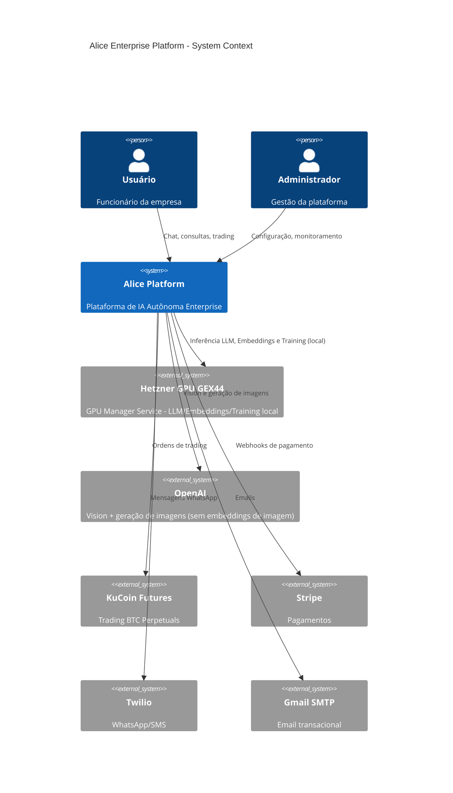
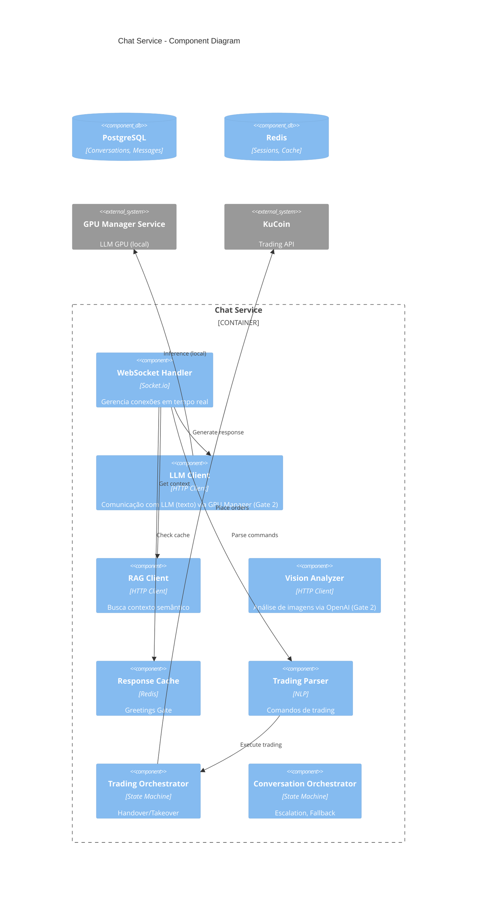
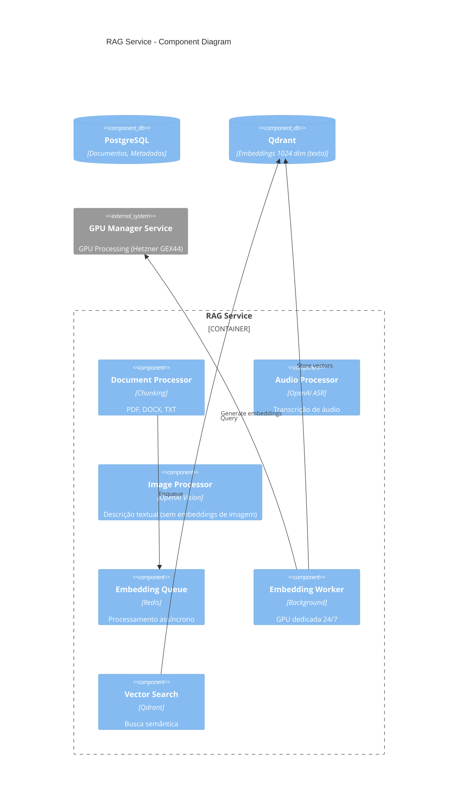
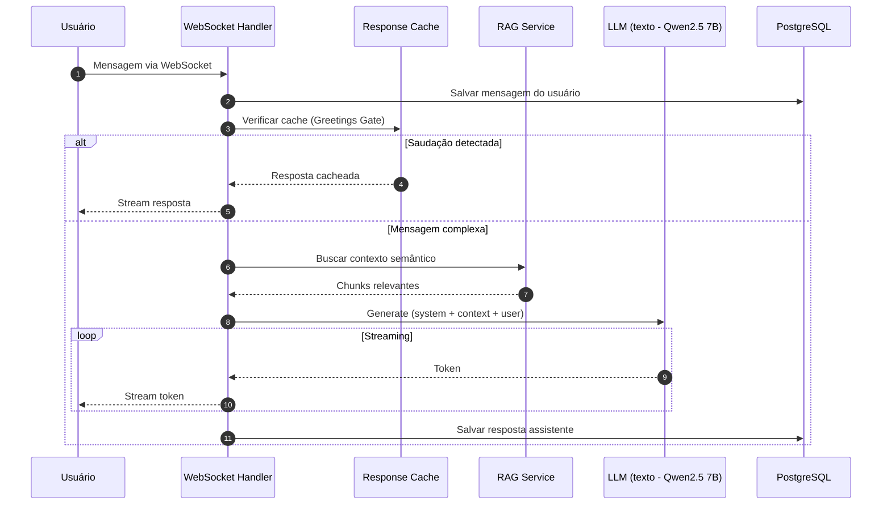
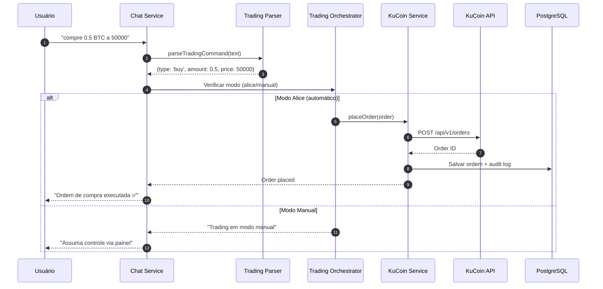
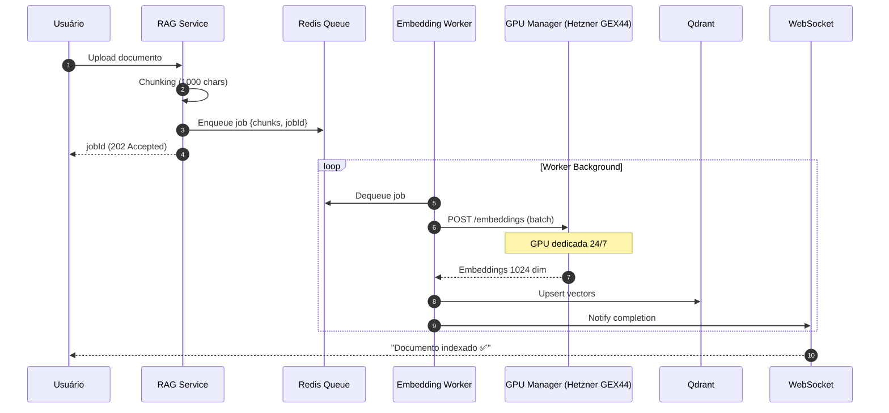
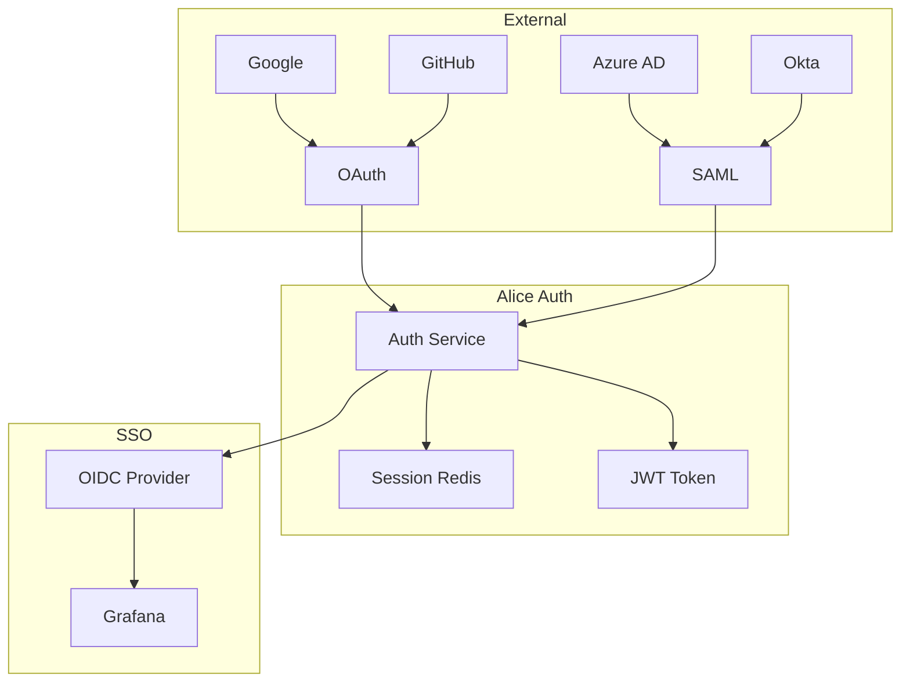
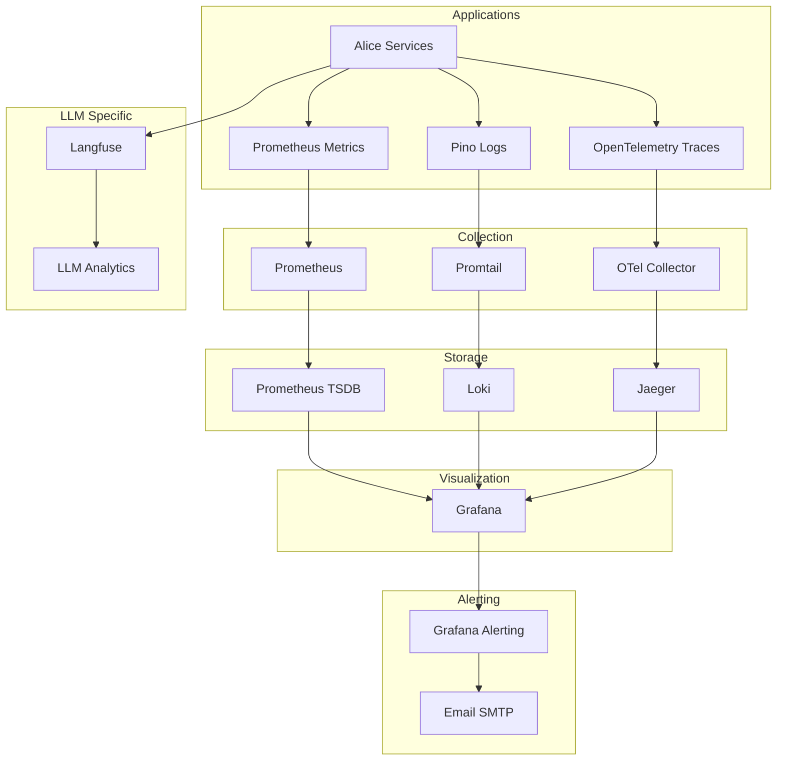
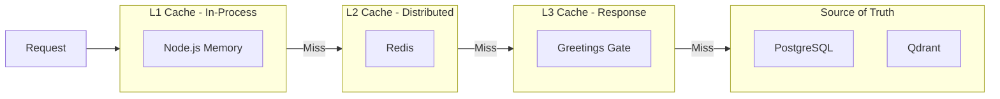

# Alice Enterprise Platform - Arquitetura de Software

> **Autor:** Fillipe Guerra  
> **Data:** 10 de Março de 2026  
> **Versão:** 3.9.313 - Plano enterprise 100% concluído com fechamento residual de frontend  
> **Framework:** arc42 + C4 Model + ADRs  
> **Idioma:** Português Brasileiro (termos técnicos em inglês)
> 
> **Notas de atualização:** detalhes de CI/CD, Smart Deploy e troubleshooting ficam em `docs/DEPLOYMENT.md` (SSOT). Hardening de DR/restore (offsite criptografado + readiness checks) fica em `docs/DR-RUNBOOK.md` e `apps/observability-service/src/backup-orchestrator.ts`.

### Atualizações incrementais recentes (10/03/2026)

- Rebase/squash não-interativo concluído sobre `origin/main`, com consolidação histórica e backup da linha pré-consolidação em `backup/pre-squash-20260310-1`.
- Guardrails de governança ativados em enforcement contínuo via `package.json` (`verify:enterprise-focus`, `verify:enterprise-focus:full`, `validate:enterprise`) com `ENFORCE_FAILURE=true`.
- Frontend Wise: nova rodada de consolidação reduziu o domínio `apps/frontend-service/src/pages/wise-payments` para 176 arquivos TS/TSX e 13.976 linhas, removendo microcomponentes/constantes redundantes e reduzindo arquivos `<40` linhas para 16.
- Frontend Trading/Chat: redução incremental adicional de densidade em `apps/frontend-service/src/pages/TradingContent.tsx` (1321 linhas) e `apps/frontend-service/src/pages/Chat/useChatPageLayoutController.ts` (591 linhas).
- Frontend Wise: consolidação de composição em `apps/frontend-service/src/pages/wise-payments/use-wise-page-composition.ts` com remoção de wrappers redundantes (`use-wise-tab-props.ts`, `build-wise-profile-scoped-tab-props.ts`, `build-wise-operational-tabs-props.ts`, `build-wise-tab-profile-props.ts`, `build-wise-tab-operational-props.ts` e `wise-tab-props-types.ts`), reduzindo fragmentação local sem alterar contratos.
- Governança de execução: novo guardrail `scripts/verify-enterprise-focus.sh` para monitorar churn documental, concentração de foco por domínio e densidade/fragmentação de containers frontend.
- Frontend Trading/Chat: redução incremental de densidade em `apps/frontend-service/src/pages/TradingContent.tsx` (1387 -> 1331 linhas) e `apps/frontend-service/src/pages/Chat/useChatPageLayoutController.ts` (612 -> 597 linhas), mantendo comportamento e contratos.
- Plano por blocos (`docs/PLANO-IMPLEMENTACAO-ENTERPRISE-BLOCOS.md`) encerrado formalmente com status 100% concluído após fechamento de residuais críticos de frontend e consolidação documental SSOT.
- Frontend Trading: `apps/frontend-service/src/pages/TradingContent.tsx` recebeu cleanup final de composição de `section-props` por domínio (`primaryTabsOptions`, `operationalTabsOptions`, `dialogsOptions`, `layoutOptions`) mantendo semântica de contratos e comportamento.
- Frontend Chat: `apps/frontend-service/src/pages/Chat/useChatPageLayoutController.ts` recebeu cleanup final de layout controller com normalização de handlers, flags derivadas e remoção de wrappers inline residuais.
- Frontend Trading: `apps/frontend-service/src/pages/TradingContent.tsx` recebeu redução de densidade na composição de `section-props/options` com contextos compartilhados de i18n/mercado, preservando contratos de UI/API e mantendo o composition root sem novos micro-módulos.
- Frontend Chat: `apps/frontend-service/src/pages/Chat/useChatPageLayoutController.ts` recebeu cleanup de orquestração com callbacks nomeados e eliminação de wrappers inline redundantes em `approval policy`, `quick-reply` e `training submit`, sem alteração de API/RBAC.
- Auditoria anti-fragmentação (janela de 400 commits): identificado hotspot objetivo em `apps/frontend-service/src/pages/wise-payments` (193 arquivos TS/TSX, 14.245 linhas); diretriz de execução ajustada para evitar nova micro-fragmentação e priorizar fechamento dos residuais críticos do plano.
- Frontend Wise: `apps/frontend-service/src/pages/wise-payments/components/wise-catalog-params-fields.tsx` passou a atuar como composition root fino e delegar os campos para `wise-catalog-path-param-inputs.tsx` e `wise-catalog-query-param-controls.tsx`, mantendo contrato funcional de parâmetros de path/query.
- Frontend Wise: `apps/frontend-service/src/pages/wise-payments/components/wise-balances-header.tsx` passou a atuar como composition root fino e delegar o fluxo modal de criação para `wise-balances-new-balance-dialog.tsx` e `wise-balances-new-balance-form-fields.tsx`, reduzindo densidade local sem alteração de API/RBAC.
- Frontend Wise: `apps/frontend-service/src/pages/wise-payments/components/wise-sca-tab-content.tsx` passou a atuar como composition root fino de UI, delegando blocos para `wise-sca-toolbar.tsx` e `wise-sca-payload-card.tsx`; contratos compartilhados foram centralizados em `apps/frontend-service/src/pages/wise-payments/components/wise-sca-tab-types.ts`.
- Frontend Wise: `apps/frontend-service/src/pages/wise-payments/components/wise-simulations-operation-card.tsx` passou a delegar blocos para `wise-simulations-operation-select.tsx`, `wise-simulations-operation-fields.tsx` e `wise-simulations-operation-response.tsx`, reduzindo densidade local da seção operacional sem alteração de API/RBAC.
- Frontend Wise: `apps/frontend-service/src/pages/wise-payments/components/wise-webhooks-tab-content.tsx` passou a atuar como composition root fino de UI, delegando blocos para `wise-webhooks-toolbar.tsx`, `wise-webhooks-create-card.tsx`, `wise-webhooks-delete-card.tsx` e `wise-webhooks-response-card.tsx`; contratos compartilhados foram centralizados em `apps/frontend-service/src/pages/wise-payments/components/wise-webhooks-tab-types.ts`.
- Frontend Wise: `apps/frontend-service/src/pages/wise-payments/components/wise-card-orders-actions-card.tsx` passou a delegar blocos operacionais para `wise-card-orders-order-reference-row.tsx`, `wise-card-orders-json-action-block.tsx` e `wise-card-orders-actions-footer.tsx`; contratos compartilhados foram centralizados em `apps/frontend-service/src/pages/wise-payments/components/wise-card-orders-actions-card-types.ts`.
- Frontend Wise: `apps/frontend-service/src/pages/wise-payments/components/wise-exchange-quote-form-card.tsx` passou a delegar seções para `wise-exchange-quote-form-fields.tsx` e `wise-exchange-quote-result-card.tsx`, reduzindo densidade local da seção de quote/execute.
- Frontend Wise: `apps/frontend-service/src/pages/wise-payments/components/wise-spend-limits-tab-content.tsx` passou a atuar como composition root fino, delegando seções para `wise-spend-limits-fetch-controls.tsx`, `wise-spend-limits-update-panels.tsx` e `wise-spend-limits-response-panels.tsx`; contratos compartilhados foram centralizados em `apps/frontend-service/src/pages/wise-payments/components/wise-spend-limits-tab-types.ts`.
- Frontend Wise: `apps/frontend-service/src/pages/wise-payments/components/wise-kyc-tab-content.tsx` passou a atuar como composition root fino, delegando seções para `wise-kyc-toolbar.tsx`, `wise-kyc-evidences-card.tsx`, `wise-kyc-upload-card.tsx` e `wise-kyc-reviews-card.tsx`; contratos compartilhados foram centralizados em `apps/frontend-service/src/pages/wise-payments/components/wise-kyc-tab-types.ts`.
- Frontend Wise: `apps/frontend-service/src/pages/wise-payments/components/wise-simulations-tab-content.tsx` passou a atuar como composition root fino, delegando seções para `wise-simulations-toolbar.tsx` e `wise-simulations-operation-card.tsx`; contratos compartilhados foram centralizados em `apps/frontend-service/src/pages/wise-payments/components/wise-simulations-tab-types.ts`.
- Frontend Trading: early-returns de status/configuração/tenant foram extraídos de `apps/frontend-service/src/pages/TradingContent.tsx` para `apps/frontend-service/src/components/trading/TradingStatusGate.tsx` via `resolveTradingStatusGate(...)`, reduzindo densidade do container e mantendo comportamento.
- Frontend Wise: `apps/frontend-service/src/pages/wise-payments/components/wise-quotes-tab-content.tsx` passou a atuar como composition root fino, delegando seções para `wise-quotes-form-card.tsx` e `wise-quotes-result-card.tsx`; contratos compartilhados foram centralizados em `apps/frontend-service/src/pages/wise-payments/components/wise-quotes-tab-types.ts`.
- Frontend Wise: `apps/frontend-service/src/pages/wise-payments/components/wise-statements-tab-content.tsx` passou a atuar como composition root fino, delegando seções para `wise-statements-filter-card.tsx` e `wise-statements-result-card.tsx`; contratos compartilhados foram centralizados em `apps/frontend-service/src/pages/wise-payments/components/wise-statements-tab-types.ts`.
- Frontend Wise: `apps/frontend-service/src/pages/wise-payments/components/wise-cards-tab-content.tsx` passou a atuar como composition root fino de apresentação, delegando seções para `wise-cards-toolbar.tsx` e `wise-cards-list-card.tsx`.
- Frontend Wise: contratos compartilhados da tab de cards foram centralizados em `apps/frontend-service/src/pages/wise-payments/components/wise-cards-tab-types.ts`, reduzindo duplicação tipada entre subcomponentes.
- Frontend Wise: `apps/frontend-service/src/pages/wise-payments/components/wise-card-transactions-tab-content.tsx` passou a atuar como composition root fino, delegando seções para `wise-card-transactions-toolbar.tsx` e `wise-card-transactions-fetch-card.tsx`; contratos compartilhados foram centralizados em `apps/frontend-service/src/pages/wise-payments/components/wise-card-transactions-tab-types.ts`.
- Frontend Wise: `apps/frontend-service/src/pages/wise-payments/components/wise-account-details-tab-content.tsx` passou a atuar como composition root fino, delegando seções para `wise-account-details-toolbar.tsx`, `wise-account-details-create-card.tsx`, `wise-account-details-list-card.tsx`, `wise-account-details-orders-card.tsx` e `wise-recipient-requirements-card.tsx`.
- Frontend Wise: contratos compartilhados da tab de account-details foram centralizados em `apps/frontend-service/src/pages/wise-payments/components/wise-account-details-tab-types.ts`, reduzindo duplicação tipada entre subcomponentes.
- Frontend Wise: `apps/frontend-service/src/pages/wise-payments/components/wise-catalog-tab-content.tsx` passou a atuar como composition root fino, delegando seções para `wise-catalog-operation-config.tsx`, `wise-catalog-params-fields.tsx` e `wise-catalog-execution-panel.tsx`; contratos compartilhados foram centralizados em `apps/frontend-service/src/pages/wise-payments/components/wise-catalog-tab-types.ts`.
- Frontend Wise: `apps/frontend-service/src/pages/wise-payments/components/wise-transfers-tab-content.tsx` passou a atuar como composition root fino de apresentação, delegando seções para `wise-transfers-header.tsx`, `wise-transfers-list-card.tsx` e `wise-transfers-actions-card.tsx`.
- Frontend Wise: contratos compartilhados da tab de transfers foram centralizados em `apps/frontend-service/src/pages/wise-payments/components/wise-transfers-tab-types.ts`, reduzindo duplicação tipada entre subcomponentes.
- Frontend Wise: `apps/frontend-service/src/pages/wise-payments/components/wise-exchange-tab-content.tsx` passou a atuar como composition root fino, delegando seções para `wise-exchange-quote-form-card.tsx` e `wise-exchange-rates-card.tsx`; contratos compartilhados foram centralizados em `apps/frontend-service/src/pages/wise-payments/components/wise-exchange-tab-types.ts`.
- Frontend Wise: `apps/frontend-service/src/pages/wise-payments/components/wise-balances-tab-content.tsx` passou a atuar como composition root fino de apresentação, delegando seções para `wise-balances-header.tsx`, `wise-balances-grid.tsx`, `wise-balance-capacity-card.tsx` e `wise-total-funds-card.tsx`.
- Frontend Wise: contratos compartilhados da tab de balances foram centralizados em `apps/frontend-service/src/pages/wise-payments/components/wise-balances-tab-types.ts`, reduzindo duplicação tipada entre subcomponentes.
- Frontend Wise: `apps/frontend-service/src/pages/wise-payments/components/wise-disputes-tab-content.tsx` passou a atuar como composition root fino de apresentação, delegando seções para `wise-disputes-toolbar.tsx`, `wise-dispute-reasons-card.tsx`, `wise-dispute-flow-card.tsx`, `wise-dispute-upload-card.tsx`, `wise-dispute-status-update-card.tsx` e `wise-disputes-list-card.tsx`.
- Frontend Wise: contratos compartilhados da tab de disputes foram centralizados em `apps/frontend-service/src/pages/wise-payments/components/wise-disputes-tab-types.ts`, reduzindo duplicação tipada entre subcomponentes.
- Frontend Wise: `apps/frontend-service/src/pages/wise-payments/components/wise-spend-controls-tab-content.tsx` passou a atuar como composition root fino de apresentação, delegando seções para `wise-spend-controls-toolbar.tsx`, `wise-spend-controls-create-card.tsx`, `wise-spend-controls-assign-card.tsx`, `wise-spend-controls-delete-card.tsx` e `wise-spend-controls-list-card.tsx`.
- Frontend Wise: contratos compartilhados da tab de spend-controls foram centralizados em `apps/frontend-service/src/pages/wise-payments/components/wise-spend-controls-tab-types.ts`, reduzindo duplicação tipada entre subcomponentes.
- Frontend Wise: `apps/frontend-service/src/pages/wise-payments/components/wise-recipients-tab-content.tsx` passou a atuar como composition root fino de apresentação, delegando seções para `wise-recipients-header.tsx`, `wise-recipients-list-card.tsx`, `wise-card-permissions-card.tsx` e `wise-card-secure-card.tsx`.
- Frontend Wise: contratos compartilhados da tab de recipients foram centralizados em `apps/frontend-service/src/pages/wise-payments/components/wise-recipients-tab-types.ts`, reduzindo duplicação tipada entre subcomponentes.
- Frontend Wise: `apps/frontend-service/src/pages/wise-payments/components/wise-card-orders-tab-content.tsx` passou a atuar como composition root fino de apresentação, delegando seções para `wise-card-orders-toolbar.tsx`, `wise-card-orders-create-card.tsx`, `wise-card-orders-actions-card.tsx` e `wise-card-orders-list-card.tsx`.
- Frontend Wise: contratos compartilhados da tab de card orders foram centralizados em `apps/frontend-service/src/pages/wise-payments/components/wise-card-orders-tab-types.ts`, reduzindo duplicação tipada entre subcomponentes.
- Frontend Wise: `apps/frontend-service/src/pages/wise-payments/use-wise-account-card-order-mutations.ts` passou a atuar como composition root fino, delegando mutações para `use-wise-account-details-order-mutation.ts` (account details orders), `use-wise-card-order-write-mutations.ts` (write path) e `use-wise-card-order-read-mutations.ts` (read path).
- Frontend Wise: novo módulo `apps/frontend-service/src/pages/wise-payments/use-wise-account-card-dispute-state.ts` centraliza todo o estado local de account/card/dispute/kyc; `apps/frontend-service/src/pages/wise-payments/use-wise-account-card-dispute-actions.ts` passou a focar em orchestration de mutations/handlers.
- Frontend Wise: `apps/frontend-service/src/pages/wise-payments/use-wise-page-composition.ts` passou a atuar como composition root mais fino, delegando suites dedicadas para composição de actions e derivação de estado operacional.
- Frontend Wise: nova suite `apps/frontend-service/src/pages/wise-payments/use-wise-actions-suite.ts` centraliza wiring de ações de domínio (`reference`, `catalog`, `recipient`, `card-spend`, `transfer/card`, `webhook/simulation/sca`, `account/dispute`, `user activity`, `balance/exchange`) e mantém `useWiseSpendControlDefaultCurrency` no boundary apropriado.
- Frontend Wise: nova suite `apps/frontend-service/src/pages/wise-payments/use-wise-refresh-derived.ts` centraliza composição de `refreshActions` e `derivedData`, reduzindo acoplamento do container principal.
- Frontend Wise: `apps/frontend-service/src/pages/wise-payments/use-wise-card-spend-actions.ts` foi reduzido para composition root fino de estado + mutações + wiring.
- Frontend Wise: handlers de `card status` e `spend controls` foram desacoplados para `apps/frontend-service/src/pages/wise-payments/use-wise-card-spend-control-handlers.ts`.
- Frontend Wise: handlers de `spend limits` (`fetch/update profile`, `fetch/update/delete card`) foram desacoplados para `apps/frontend-service/src/pages/wise-payments/use-wise-card-spend-limits-handlers.ts`.
- Frontend Wise: contratos compartilhados de catálogo (`WiseCatalogOperation`, `WiseCatalogParamKey` e `WiseCatalogParams`) foram centralizados em `apps/frontend-service/src/pages/wise-payments/wise-catalog-types.ts`.
- Frontend Wise: `apps/frontend-service/src/pages/wise-payments/use-wise-catalog-workbench.ts` passou a consumir tipos compartilhados e removeu duplicação de contratos locais.
- Frontend Wise: `apps/frontend-service/src/pages/wise-payments/components/wise-catalog-tab-content.tsx` passou a consumir tipos compartilhados do domínio de catálogo, mantendo contrato funcional inalterado.
- Frontend Wise: `apps/frontend-service/src/pages/wise-payments/use-wise-tab-props.ts` passou a atuar como composition root fino e delegar montagem das tabs para `build-wise-tab-profile-props.ts` e `build-wise-tab-operational-props.ts`.
- Frontend Wise: contratos tipados da composição de tabs foram centralizados em `apps/frontend-service/src/pages/wise-payments/wise-tab-props-types.ts` e a derivação profile-scoped foi isolada em `apps/frontend-service/src/pages/wise-payments/build-wise-profile-scoped-tab-props.ts`.
- Frontend Wise: `apps/frontend-service/src/pages/wise-payments/wise-payments-constants.tsx` passou a atuar como barrel de constants, com segmentação por domínio em `apps/frontend-service/src/pages/wise-payments/wise-catalog-operations.ts`, `wise-currency-options.ts` e `wise-status-badge.tsx`.
- Frontend Wise: composição de props profile-scoped foi segmentada para `apps/frontend-service/src/pages/wise-payments/build-wise-profile-core-tabs-props.ts` (account/cards/orders/transactions/spend-controls) e `apps/frontend-service/src/pages/wise-payments/build-wise-profile-compliance-tabs-props.ts` (disputes/kyc/webhooks/simulations/sca).
- Frontend Wise: contratos tipados compartilhados das tabs profile-scoped foram centralizados em `apps/frontend-service/src/pages/wise-payments/wise-profile-tabs-props-types.ts`.
- Frontend Wise: `apps/frontend-service/src/pages/wise-payments/build-wise-profile-tabs-props.ts` passou a atuar como composition root fino, agregando os builders por domínio com contrato inalterado.
- Frontend Wise: composição de props operacionais de tabs foi segmentada para `apps/frontend-service/src/pages/wise-payments/build-wise-operational-finance-tabs-props.ts` (finance/transfers/recipients/quotes/batch/statements) e `apps/frontend-service/src/pages/wise-payments/build-wise-operational-admin-tabs-props.ts` (profiles/users/activities/spend-limits/catalog).
- Frontend Wise: contratos tipados compartilhados das tabs operacionais foram centralizados em `apps/frontend-service/src/pages/wise-payments/wise-operational-tabs-props-types.ts`.
- Frontend Wise: `apps/frontend-service/src/pages/wise-payments/build-wise-operational-tabs-props.ts` passou a atuar como composition root fino, agregando os builders por domínio sem alteração de contratos.
- Frontend Wise: handlers de `account details/card orders/card transactions` foram desacoplados para `apps/frontend-service/src/pages/wise-payments/use-wise-account-card-order-action-handlers.ts`.
- Frontend Wise: handlers de `dispute status/flow/upload` e `kyc uploads/evidences` foram desacoplados para `apps/frontend-service/src/pages/wise-payments/use-wise-dispute-kyc-action-handlers.ts`.
- Frontend Wise: `apps/frontend-service/src/pages/wise-payments/use-wise-account-card-dispute-actions.ts` passou a atuar como composition root fino de estado + wiring de handlers/mutações preservando contrato.
- Frontend Wise: mutações de `dispute status/flow/upload` foram desacopladas para `apps/frontend-service/src/pages/wise-payments/use-wise-account-card-dispute-flow-mutations.ts`.
- Frontend Wise: mutações de `kyc required evidences/upload document/upload additional` foram desacopladas para `apps/frontend-service/src/pages/wise-payments/use-wise-account-card-dispute-kyc-mutations.ts`.
- Frontend Wise: `apps/frontend-service/src/pages/wise-payments/use-wise-account-card-dispute-dispute-kyc-mutations.ts` passou a atuar como composition root fino, compondo os subdomínios `dispute` e `kyc` com contrato inalterado.
- Frontend Wise: mutações de `account details` e `card orders` foram desacopladas para `apps/frontend-service/src/pages/wise-payments/use-wise-account-card-order-mutations.ts`.
- Frontend Wise: mutação de `card transaction details` foi desacoplada para `apps/frontend-service/src/pages/wise-payments/use-wise-card-transaction-mutation.ts`.
- Frontend Wise: `apps/frontend-service/src/pages/wise-payments/use-wise-account-card-dispute-card-order-mutations.ts` passou a atuar como composition root fino, compondo os dois subdomínios e preservando contratos.
- Frontend Wise: operações de transferências (`fund/cancel`) foram desacopladas para `apps/frontend-service/src/pages/wise-payments/use-wise-transfer-operations.ts`.
- Frontend Wise: operações de permissões e secure de cartão foram desacopladas para `apps/frontend-service/src/pages/wise-payments/use-wise-card-permission-secure-operations.ts`.
- Frontend Wise: `apps/frontend-service/src/pages/wise-payments/use-wise-transfer-and-card-operations.ts` passou a atuar como composition root fino, compondo os dois subdomínios operacionais e preservando contratos.
- Frontend Wise: mutação de status de cartão foi desacoplada para `apps/frontend-service/src/pages/wise-payments/use-wise-card-status-mutations.ts`.
- Frontend Wise: mutações de spend-controls foram desacopladas para `apps/frontend-service/src/pages/wise-payments/use-wise-spend-control-mutations.ts`, centralizando `create/assign/unassign/delete`.
- Frontend Wise: mutações de spend-limits foram desacopladas para `apps/frontend-service/src/pages/wise-payments/use-wise-spend-limits-mutations.ts` e `apps/frontend-service/src/pages/wise-payments/use-wise-card-spend-mutations.ts` passou a atuar como composition root fino agregador.
- Frontend Wise: mutações de webhook foram desacopladas para `apps/frontend-service/src/pages/wise-payments/use-wise-webhook-mutations.ts`, centralizando `list/create/delete`.
- Frontend Wise: mutações de simulation foram desacopladas para `apps/frontend-service/src/pages/wise-payments/use-wise-simulation-mutations.ts`, centralizando operações `transfer/profile/balance/card/kyc/bank`.
- Frontend Wise: mutações de SCA foram desacopladas para `apps/frontend-service/src/pages/wise-payments/use-wise-sca-mutations.ts` e `apps/frontend-service/src/pages/wise-payments/use-wise-webhook-simulation-sca-mutations.ts` passou a atuar como composition root fino agregador.
- Frontend Wise: queries globais de dados foram desacopladas para `apps/frontend-service/src/pages/wise-payments/use-wise-global-data-queries.ts`, centralizando `balances/transfers/recipients/batch/profiles/users me`.
- Frontend Wise: queries profile-scoped foram desacopladas para `apps/frontend-service/src/pages/wise-payments/use-wise-profile-scoped-data-queries.ts`, centralizando `cards/spend-controls/disputes/kyc/card-orders/dispute-reasons/account-details`.
- Frontend Wise: `apps/frontend-service/src/pages/wise-payments/use-wise-data-queries.ts` passou a atuar como composition root de estado (`profileFilter/cardOrdersPage`), guard (`wiseQueryEnabled`) e tratamento agregado de erros, preservando contratos.
- Frontend Wise: mutações de `account details`, `card orders` e `card transactions` foram desacopladas para `apps/frontend-service/src/pages/wise-payments/use-wise-account-card-dispute-card-order-mutations.ts`.
- Frontend Wise: mutações de `dispute flow`, `dispute upload/status` e `kyc upload/evidences` foram desacopladas para `apps/frontend-service/src/pages/wise-payments/use-wise-account-card-dispute-dispute-kyc-mutations.ts`.
- Frontend Wise: `apps/frontend-service/src/pages/wise-payments/use-wise-account-card-dispute-mutations.ts` passou a atuar como composition root fino, agregando os dois submódulos e preservando contratos.
- Frontend Wise: contratos de `transfer/card actions` foram centralizados em `apps/frontend-service/src/pages/wise-payments/wise-transfer-and-card-types.ts`.
- Frontend Wise: operações de transferências e cartões (`fund/cancel transfer`, `permissions`, `secure key/details/pin`) foram desacopladas para `apps/frontend-service/src/pages/wise-payments/use-wise-transfer-and-card-operations.ts`.
- Frontend Wise: `apps/frontend-service/src/pages/wise-payments/use-wise-transfer-and-card-actions.ts` passou a atuar como composition root de estado/composição e delegar execução operacional ao módulo dedicado, preservando contratos.
- Frontend Wise: contratos/defaults do fluxo de saldo/câmbio/extrato foram centralizados em `apps/frontend-service/src/pages/wise-payments/wise-balance-exchange-statement-types.ts`.
- Frontend Wise: mutações de quote, criação/exclusão de balances, quote/execução de exchange e consulta de statement foram desacopladas para `apps/frontend-service/src/pages/wise-payments/use-wise-balance-exchange-statement-mutations.ts`.
- Frontend Wise: `apps/frontend-service/src/pages/wise-payments/use-wise-balance-exchange-statement-actions.ts` passou a atuar como composition root fino de estado/handlers, delegando IO de mutações ao módulo dedicado e preservando contratos.
- Frontend Wise: contratos e defaults de webhook/simulation/SCA foram centralizados em `apps/frontend-service/src/pages/wise-payments/wise-webhook-simulation-sca-types.ts`.
- Frontend Wise: mutações de webhooks (`list/create/delete`), simulações (`transfer/profile/card/kyc/bank`) e SCA (`POST/DELETE`) foram desacopladas para `apps/frontend-service/src/pages/wise-payments/use-wise-webhook-simulation-sca-mutations.ts`.
- Frontend Wise: `apps/frontend-service/src/pages/wise-payments/use-wise-webhook-simulation-sca-actions.ts` passou a atuar como composition root fino de estado/handlers, delegando IO de mutações ao módulo dedicado e preservando contratos.
- Frontend Wise: contratos de spend/card (`NotifyFn`, `ParseJsonSafeFn`, formulários, assignments, options/result e defaults) foram centralizados em `apps/frontend-service/src/pages/wise-payments/wise-card-spend-types.ts`.
- Frontend Wise: mutações de `card status`, `spend-controls` e `spend-limits` foram desacopladas para `apps/frontend-service/src/pages/wise-payments/use-wise-card-spend-mutations.ts`, reduzindo densidade do módulo de ações.
- Frontend Wise: `apps/frontend-service/src/pages/wise-payments/use-wise-card-spend-actions.ts` passou a atuar como composition root de estado/handlers, delegando camada de mutation para o módulo dedicado e preservando contratos.
- Frontend Wise: novo módulo `apps/frontend-service/src/pages/wise-payments/use-wise-query-hooks.ts` passou a centralizar hooks reutilizáveis de consulta para endpoints Wise globais e profile-scoped (`useWiseApiQuery` e `useWiseProfileScopedQuery`).
- Frontend Wise: `apps/frontend-service/src/pages/wise-payments/use-wise-data-queries.ts` passou a consumir os hooks reutilizáveis e removeu duplicação de `useQuery/queryFn`, preservando contratos de paginação (`cardOrdersPage`) e filtros por `profileFilter`.
- Frontend Trading: a composição completa da página foi separada para `apps/frontend-service/src/pages/TradingContent.tsx`, que concentra estado local, queries, mutações, handlers e renderização de seções/tabs/dialogs.
- Frontend Trading: `apps/frontend-service/src/pages/Trading.tsx` passou a manter apenas o boundary de autenticação/autorização (wrapper fino), montando `TradingContent` somente após validação de sessão e permissão RBAC.
- Frontend Trading: a separação explícita entre `guard boundary` e `feature composition` reduz acoplamento operacional da mega-página sem alterar contratos de API, payloads ou políticas RBAC.

- Frontend Chat: orquestração de `state/queries/handlers/sections` da página foi desacoplada para `apps/frontend-service/src/pages/Chat/useChatPageLayoutController.ts`, consolidando a montagem de `chatPageLayoutProps` em um controller dedicado.
- Frontend Chat: `apps/frontend-service/src/pages/Chat/index.tsx` passou a operar como composition root fino, consumindo `useChatPageLayoutController()` e delegando o render para `ChatPageLayout`.
- Frontend Trading: composição agregada de `primary/operational/dialogs/layout section-props` foi desacoplada para `apps/frontend-service/src/components/trading/TradingPageSectionProps.ts`, consolidando um boundary único para montagem de contratos de apresentação.
- Frontend Trading: `apps/frontend-service/src/pages/Trading.tsx` passou a consumir `buildTradingPageSectionProps(...)`, removendo chamadas diretas repetidas de `buildTradingPrimaryTabsSectionProps`, `buildTradingOperationalTabsSectionProps`, `buildTradingDialogsSectionProps` e `buildTradingLayoutSectionProps` no composition root.
- Frontend Trading: `apps/frontend-service/src/components/trading/index.ts` passou a exportar `buildTradingPageSectionProps` via barrel, preservando o padrão de consumo centralizado.
- Frontend Wise: mutações de `account details/card orders/disputes/KYC` foram desacopladas para `apps/frontend-service/src/pages/wise-payments/use-wise-account-card-dispute-mutations.ts`, centralizando IO/transições de mutation por domínio.
- Frontend Wise: contratos tipados compartilhados do fluxo account/card/dispute foram centralizados em `apps/frontend-service/src/pages/wise-payments/wise-account-card-dispute-types.ts`, reduzindo acoplamento e duplicação de contratos locais.
- Frontend Wise: `apps/frontend-service/src/pages/wise-payments/use-wise-account-card-dispute-actions.ts` passou a atuar como composition root fino de estado/handlers, delegando a camada de mutation para o módulo dedicado e preservando contratos.
- Frontend Trading: mutações de execução de ordens foram desacopladas para `apps/frontend-service/src/components/trading/useTradingOrderExecutionMutations.ts` (create/cancel/sync), removendo esse bloco de `useTradingControlOrderMutations.ts`.
- Frontend Trading: mutações e ações de risco/controle foram desacopladas para `apps/frontend-service/src/components/trading/useTradingRiskControlActions.ts` (`updateRiskConfigMutation`, `handleModeChange`, `handleTradingToggle`) com contratos tipados compartilhados em `apps/frontend-service/src/components/trading/trading-control-order-types.ts`.
- Frontend Trading: `apps/frontend-service/src/components/trading/useTradingControlOrderMutations.ts` passou a atuar como composition root fino de mutações, preservando o contrato consumido por `useTradingControlOrderActionSuite` e `Trading.tsx`.
- Frontend Trading: hardening de tipagem de payload de conta/posição foi consolidado em `apps/frontend-service/src/components/trading/TradingDomainTypes.ts` com novos guards de domínio (`isFuturesPositionArray`, `isSpotAccountArray`, `isFuturesAccountOverview`, `isMarginCrossOverview`, `isMarginIsolatedOverview`).
- Frontend Trading: `apps/frontend-service/src/pages/Trading.tsx` e `apps/frontend-service/src/components/trading/useTradingAccountPositionState.ts` passaram a consumir os guards de domínio e remover casts de payload inline, mantendo comportamento funcional e contratos de API/RBAC.
- Frontend Chat: composição final de props da página foi desacoplada para `apps/frontend-service/src/pages/Chat/chat-page-layout-props-builder.ts`, centralizando montagem tipada de `ChatPageLayout` em blocos (`state`, `sections`, `viewport` e `handlers`).
- Frontend Chat: `apps/frontend-service/src/pages/Chat/index.tsx` passou a consumir `buildChatPageLayoutProps(...)`, removendo bloco inline equivalente e eliminando cast de workspace na troca de contexto.
- Integrations: fluxo principal de geração de sinal LLM foi desacoplado para `apps/integrations-service/src/trading-llm-signal-generation-service.ts`, centralizando a orquestração completa do pipeline (`profile`, análise, contexto operacional, prompt budget, execução LLM, persistência e validação final).
- Integrations: `apps/integrations-service/src/index.ts` passou a manter um wrapper fino `generateTradingSignalFromLlm(...)` delegando para `generateTradingSignalFromLlmCore`, removendo bloco inline equivalente e preservando contratos.
- Frontend Trading: composição de handlers de interação/mutação foi desacoplada para `apps/frontend-service/src/components/trading/useTradingCompositeActionHandlers.ts`, centralizando wrappers de `page interactions`, `dialogs`, `scheduler`, `signal profile`, `workspace actions` e invalidação de conta.
- Frontend Trading: `apps/frontend-service/src/pages/Trading.tsx` passou a consumir `useTradingCompositeActionHandlers(...)`, removendo bloco inline equivalente de orquestração de handlers sem alteração de contratos de API/RBAC.
- Integrations: contexto operacional de geração de sinal foi desacoplado para `apps/integrations-service/src/trading-signal-context-service.ts`, centralizando resolução de contexto RAG, orderbook, notícias, validação de dataset aprovado de Trading e construção de trade plan.
- Integrations: `apps/integrations-service/src/index.ts` passou a consumir `buildTradingSignalOperationalContext(...)` no fluxo `generateTradingSignalFromLlm`, removendo bloco inline equivalente e preservando contratos.
- Integrations: orquestração de análise de sinal (`analysisMatrix`, consenso, arbitragem triangular e ensemble) foi desacoplada para `apps/integrations-service/src/trading-signal-analysis-orchestration-service.ts`.
- Integrations: `apps/integrations-service/src/index.ts` passou a consumir `buildTradingSignalAnalysisContext(...)` no fluxo `generateTradingSignalFromLlm`, removendo bloco inline equivalente e preservando contratos.
- Integrations: composição de prompt multi-timeframe com orçamento de tokens e redução progressiva de notícias foi desacoplada para `buildTradingSignalPromptBudget` em `apps/integrations-service/src/trading-llm-prompt-service.ts`.
- Integrations: `apps/integrations-service/src/index.ts` passou a consumir `buildTradingSignalPromptBudget(...)` no fluxo `generateTradingSignalFromLlm`, removendo bloco inline equivalente e preservando contratos.
- Integrations: etapa de montagem/persistência do payload final de sinal LLM (`createSignal` com metadata de técnicas/consenso/arbitragem/analysisMatrix) foi desacoplada para `apps/integrations-service/src/trading-llm-signal-persistence-service.ts`.
- Integrations: `apps/integrations-service/src/index.ts` passou a consumir `createTradingLlmSignalPersistenceService` no fluxo `generateTradingSignalFromLlm`, removendo bloco inline equivalente e preservando contratos.
- Integrations: etapa final de validação/persistência de sinal LLM foi desacoplada para `apps/integrations-service/src/trading-llm-validation-finalize-service.ts`, centralizando seleção de snapshot, `validateAndPersist` e atualização de metadata com `validationSummary`.
- Integrations: `apps/integrations-service/src/index.ts` passou a consumir `createTradingLlmValidationFinalizeService` no fluxo `generateTradingSignalFromLlm`, removendo bloco inline equivalente e preservando contratos.
- Integrations: etapa de pós-processamento de sinal LLM foi desacoplada para `apps/integrations-service/src/trading-llm-signal-post-processing-service.ts`, centralizando promoção direcional por consenso multi-timeframe e geração de `deterministicOverride`.
- Integrations: `apps/integrations-service/src/index.ts` passou a consumir `createTradingLlmSignalPostProcessingService` no fluxo `generateTradingSignalFromLlm`, removendo bloco inline equivalente e preservando contratos.
- Integrations: execução de inferência para geração de sinais foi desacoplada para `apps/integrations-service/src/trading-llm-execution-service.ts`, centralizando timeout/retries/backoff, fallback gateway/GPU Manager, validação de adapter LoRA ativo e leitura de structured output.
- Integrations: `apps/integrations-service/src/index.ts` passou a consumir `createTradingLlmExecutionService` no fluxo `generateTradingSignalFromLlm`, removendo bloco inline equivalente e preservando contratos de rotas/payloads.
- Integrations: fluxo legacy institucional de geração de sinais foi desacoplado para `apps/integrations-service/src/trading-legacy-institutional-signal-service.ts`, centralizando o branch de `portfolio_auto` e fallback por candidatos do universo.
- Integrations: `apps/integrations-service/src/index.ts` passou a consumir `createTradingLegacyInstitutionalSignalService` e delegar o branch legado de `generateTradingSignalFromLlm`, removendo bloco inline equivalente e preservando contratos.
- Integrations: análise técnica de trading com persistência de indicadores foi desacoplada para `apps/integrations-service/src/trading-technical-analysis-service.ts`, centralizando cálculo técnico, ensemble e gravação em `tradingTechnicalIndicators`.
- Integrations: `apps/integrations-service/src/index.ts` passou a consumir `createTradingTechnicalAnalysisService` e remover a função inline `calculateAndPersistTechnicalAnalysis`, preservando contratos de rotas de análise e geração de sinais.
- Integrations: orquestração de criação de dataset de trading foi desacoplada para `apps/integrations-service/src/trading-dataset-orchestration-service.ts`, centralizando fluxos completos de criação por `signal` e `order`, incluindo lineage e atualização de `sentToTrainingAt`.
- Integrations: `apps/integrations-service/src/index.ts` passou a inicializar `createTradingDatasetOrchestrationService` e delegar criação de datasets para o módulo dedicado, removendo blocos inline equivalentes e preservando contratos.
- Integrations: resolução de namespace para datasets de trading foi desacoplada para `apps/integrations-service/src/trading-dataset-namespace-service.ts`, centralizando validação de candidatos e inferência de fallback por tenant.
- Integrations: `apps/integrations-service/src/index.ts` passou a consumir `createTradingDatasetNamespaceService` em ambos os fluxos de criação de dataset (`signal` e `order`), removendo duplicação de lógica e preservando contratos.
- Integrations: montagem de seed de dataset por sinal foi desacoplada para `apps/integrations-service/src/trading-dataset-seed-service.ts`, centralizando `buildTradingDatasetSeedFromSignal`.
- Integrations: `apps/integrations-service/src/index.ts` passou a consumir `createTradingDatasetSeedService` com contratos tipados de análise/consenso/prompt, removendo função inline equivalente sem alterar payloads.
- Integrations: helpers core de dataset de trading foram desacoplados para `apps/integrations-service/src/trading-dataset-core-service.ts`, centralizando embedding, deduplicação semântica, score de qualidade e helpers de ação/prompt de ordem.
- Integrations: `apps/integrations-service/src/index.ts` passou a consumir `createTradingDatasetCoreService`, removendo funções inline equivalentes e preservando contratos dos fluxos de criação de dataset por sinal/ordem.
- Integrations: runtime de verificação de integridade do ledger imutável foi desacoplado para `apps/integrations-service/src/integrations-immutable-audit-runtime-service.ts`, centralizando estado compartilhado, execução sob demanda e scheduler (`start/stop`).
- Integrations: `apps/integrations-service/src/index.ts` passou a consumir `createIntegrationsImmutableAuditRuntimeService`, removendo bloco inline equivalente e preservando contratos dos endpoints de health/audit.
- Integrations: runtime de métricas de trading foi desacoplado para `apps/integrations-service/src/trading-metrics-runtime-service.ts`, centralizando refresh de métricas de PnL/ordens/indicadores e ciclo de vida de scheduler.
- Integrations: `apps/integrations-service/src/index.ts` passou a consumir `createTradingMetricsRuntimeService` para `start/stop` de scheduler e removeu bloco inline equivalente, mantendo contratos de métricas.
- Integrations: estado de integridade do ledger imutável (`integrationsImmutableAuditIntegrityState`) passou a ser atualizado in-place com `Object.assign`, preservando referência viva compartilhada com as rotas core de health/audit.
- Integrations: hardening elimina risco de estado stale em `registerIntegrationCoreRoutes` sem alterar payloads/contratos de API.
- Integrations: observabilidade de chamadas externas foi desacoplada para `apps/integrations-service/src/integration-call-observer-service.ts`, centralizando classificação de erros (`timeout`, `breaker_open`, `rate_limit`, `auth`, `not_found`, `http_error`) e telemetria de latência/sucesso/falha.
- Integrations: `apps/integrations-service/src/index.ts` passou a consumir `createIntegrationCallObserverService` para `updateIntegrationMetrics` e `observeIntegrationCall`, removendo funções inline equivalentes e preservando contratos de métricas Prometheus.
- Integrations: runtime de schedulers de sinais e análise foi desacoplado para `apps/integrations-service/src/trading-scheduler-runtime-service.ts`, centralizando polling, lock otimista, execução e persistência operacional (`lastRunAt/lastSuccessAt/lastDurationMs/lastError`).
- Integrations: `apps/integrations-service/src/index.ts` passou a consumir `createTradingSchedulerRuntimeService` para `start/stop` de schedulers de sinal e análise, removendo bloco inline equivalente de runtime e reforçando graceful shutdown com parada explícita dos dois schedulers.
- Integrations: resolução de namespace Trading por tenant, resumo de datasets aprovados, validação de namespace e criação idempotente de perfil (`analysis`/`signal`) foram desacopladas para `apps/integrations-service/src/trading-scope-profile-service.ts`.
- Integrations: `apps/integrations-service/src/index.ts` passou a consumir `createTradingScopeProfileService`, removendo funções inline equivalentes (`resolveTradingNamespaceId`, `fetchTradingDatasetSummary`, `validateTenantNamespace`, `getOrCreateTradingProfile`) e preservando contratos de API/RBAC.
- Integrations: construção de prompt multi-timeframe e orçamento de tokens do LLM foi desacoplada para `apps/integrations-service/src/trading-llm-prompt-service.ts`, centralizando `buildMultiTimeframePrompt` e `resolveMaxTokensForPrompt`.
- Integrations: `apps/integrations-service/src/index.ts` passou a consumir `createTradingLlmPromptService`, removendo constantes/funções inline equivalentes e preservando contratos de geração de sinais e datasets de trading.
- Integrations: normalização/validação do payload de sinal LLM foi desacoplada para `apps/integrations-service/src/trading-llm-signal-normalizer-service.ts`, centralizando normalização de números/cited values e montagem segura do sinal.
- Integrations: `apps/integrations-service/src/index.ts` passou a consumir `createTradingLlmSignalNormalizerService` para `buildLlmSignalFromPartial`, removendo funções inline equivalentes e preservando contratos de geração de sinais.
- Integrations: bloco determinístico de planejamento de sinal/trade foi desacoplado para `apps/integrations-service/src/trading-signal-plan-service.ts`, centralizando resolução de signal type, motivadores, invalidação, SL/TP e montagem do trade plan.
- Integrations: `apps/integrations-service/src/index.ts` passou a consumir helpers do módulo dedicado (`resolveSignalTypeFromAnalysis`, `buildAnalysisMotivators`, `buildTradePlanFromAnalysis`, `formatDurationLabel`), removendo funções inline equivalentes e preservando contratos.
- Integrations: contexto de agente/scheduler de trading foi desacoplado para `apps/integrations-service/src/trading-agent-context-service.ts`, centralizando `getAgenticSettingsOrDefault`, `resolveTradingAgentContext`, `resolveSchedulerUserId` e `buildTradingSignalSystemPrompt`.
- Integrations: `apps/integrations-service/src/index.ts` passou a consumir `createTradingAgentContextService`, removendo funções inline equivalentes e preservando contratos de geração de sinal/scheduler.
- Integrations: fluxo de arbitragem triangular foi desacoplado para `apps/integrations-service/src/trading-arbitrage-service.ts`, centralizando `getOrderBookSnapshot`, resolução de legs de conversão e cálculo de edge/finalAmount/networkFees.
- Integrations: `apps/integrations-service/src/index.ts` passou a consumir `createTradingArbitrageService`, removendo funções inline equivalentes e mantendo compatibilidade com taxas por exchange (`feePctByExchange`) sem alteração de contratos.
- Integrations: parsing/normalização de perfil de trading foi desacoplado para `apps/integrations-service/src/trading-profile-config-service.ts`, centralizando parse de listas/parâmetros, normalizações de técnicas/ensemble/arbitragem, validação de arbitragem e montagem de perfil consolidado.
- Integrations: `apps/integrations-service/src/index.ts` passou a consumir `createTradingProfileConfigService` e `TradingConfigError`, removendo funções/classes inline equivalentes e preservando contratos das rotas/pipelines.
- Integrations: cálculo de consenso majoritário, agregação de scores por técnica e cálculo de ensemble foram desacoplados para `apps/integrations-service/src/trading-analysis-consensus-service.ts`.
- Integrations: `apps/integrations-service/src/index.ts` passou a consumir `buildMajorityConsensus`, `aggregateTechniqueScores` e `buildEnsembleResult` do módulo dedicado, removendo funções inline equivalentes e preservando contratos.
- Integrations: helpers de suporte do fluxo de sinais foram desacoplados para `apps/integrations-service/src/trading-signal-support-service.ts`, centralizando split de símbolo, derivação de ativos intermediários, erro amigável de trading e símbolo padrão por mercado.
- Integrations: `apps/integrations-service/src/index.ts` passou a consumir `createTradingSignalSupportService`, removendo funções inline equivalentes de suporte e preservando contratos.
- Integrations: normalização e consulta de notícias de trading via RAG web-search foram desacopladas para `apps/integrations-service/src/trading-news-service.ts`, centralizando config/query/fetch de notícias.
- Integrations: `apps/integrations-service/src/index.ts` passou a consumir `createTradingNewsService`, removendo funções inline equivalentes de `normalizeTradingNewsConfig`, query de notícias e `fetchNewsSummary` sem alteração de contratos.
- Integrations: composição de market context para trading dataset foi desacoplada para `apps/integrations-service/src/trading-market-context-service.ts`, centralizando fetch de candles, snapshot de indicadores e montagem do contexto de mercado.
- Integrations: `apps/integrations-service/src/index.ts` passou a consumir `createTradingMarketContextService`, removendo funções inline equivalentes de `fetchRecentCandles`, `buildIndicatorSnapshot` e `buildMarketContextFromSignal` sem alteração de contratos.
- Integrations: cálculo/cache de trade fees e network fees KuCoin foi desacoplado para `apps/integrations-service/src/kucoin-trading-fee-service.ts`, centralizando cache Redis, persistência de fallback por tenant e validações de fees por mercado.
- Integrations: `apps/integrations-service/src/index.ts` passou a consumir `createKucoinTradingFeeService`, removendo funções inline equivalentes de `resolveArbitrageFeePctForExchanges` e `resolveNetworkFeesForTenant` sem alteração de contratos.
- Integrations: catálogo de símbolos e preferências de trading foi desacoplado para `apps/integrations-service/src/trading-symbol-catalog-service.ts`, centralizando normalização/listagem/seleção e catálogo de auto-assets por venue.
- Integrations: `apps/integrations-service/src/index.ts` passou a consumir `createTradingSymbolCatalogService`, removendo funções inline equivalentes de `normalizeSignalSymbols`, `selectSymbolFromUniverseCandidates`, `normalizeSymbolList`, `resolveConnectedTradingVenues`, `loadTradingAutoAssetsForVenue` e `fetchTradingSymbolPreferences` sem alteração de contratos.
- Integrations: resolução de tenant para eventos privados do WS KuCoin foi desacoplada para `apps/integrations-service/src/kucoin-private-ws-tenant-service.ts` com `createResolveKucoinTenantIdForPrivateWs`.
- Integrations: `apps/integrations-service/src/index.ts` passou a consumir o módulo dedicado para resolução de tenant privado, removendo função inline equivalente sem alteração de contratos.
- Integrations: request resolvers de trading foram desacoplados para `apps/integrations-service/src/trading-request-resolver-service.ts`, centralizando helpers de resposta/validação (`respondKucoinNotConfigured`, `resolveTradingSymbolOrRespond`, `resolveMarketTypeParam`, `resolveSymbolFromQuery`, `resolveTradingIntervalGranularity`).
- Integrations: `apps/integrations-service/src/index.ts` passou a consumir `createTradingRequestResolver`, removendo funções inline equivalentes e preservando contratos das rotas de trading.
- Integrations: wiring de métricas WS KuCoin foi desacoplado para `apps/integrations-service/src/kucoin-ws-metrics-service.ts`, centralizando mapeamento de estado e registro de listeners public/private com guarda de wiring único.
- Integrations: `apps/integrations-service/src/index.ts` passou a consumir `createKucoinWsMetricsWiring`, removendo bloco inline equivalente de métricas WS sem alteração de contratos.
- Integrations: handlers de market data foram desacoplados para `apps/integrations-service/src/trading-market-data-handlers.ts`, centralizando `handleTradingKlinesRequest` e `handleTradingOrderBookRequest`.
- Integrations: `apps/integrations-service/src/index.ts` passou a consumir `createTradingMarketDataHandlers`, removendo funções inline equivalentes e preservando contratos de `registerTradingMarketDataRoutes`.
- Integrations: configuração WS KuCoin foi desacoplada para `apps/integrations-service/src/kucoin-ws-config-service.ts`, centralizando depths REST/WS, intervalos, validações e registry de tópicos Spot/Margin.
- Integrations: `apps/integrations-service/src/index.ts` passou a consumir `kucoin-ws-config-service` para `resolveTradingIntervals`, `resolveKucoin*OrderBookDepth`, validação de intervalos e gestão de subscriptions Spot/Margin, removendo funções inline equivalentes sem alteração de contratos.
- Integrations: orchestration de startup foi desacoplada para `apps/integrations-service/src/integration-startup-service.ts`, centralizando bootstrap de integrações por tenant e inicialização de caches.
- Integrations: `apps/integrations-service/src/index.ts` passou a consumir `createIntegrationStartupOrchestrator`, removendo bloco inline equivalente de `buildIntegrationSeeds`/`ensureIntegrationSeeded`/`bootstrapIntegrationsForTenants`/`initializeCaches` sem alteração de contratos.
- Integrations: resolução de auth context Wise foi desacoplada para `apps/integrations-service/src/wise-auth-context-service.ts` com `getWiseAuthContextFromRequest`.
- Integrations: `apps/integrations-service/src/index.ts` passou a consumir o módulo dedicado para validação de tenant no fluxo Wise (`getWiseAuthContext` wrapper), removendo função inline equivalente sem alteração de contratos.
- Integrations: bootstrap de canais externos foi desacoplado para `apps/integrations-service/src/integrations-bootstrap-service.ts` com `initializeGmailTransporter` e `initializeStripeClient`.
- Integrations: `apps/integrations-service/src/index.ts` passou a consumir o módulo dedicado de bootstrap para inicialização de Gmail SMTP e Stripe, removendo bloco inline equivalente sem alteração de contratos.
- Integrations: utilitários de chamadas externas e timeout foram desacoplados para `apps/integrations-service/src/integration-external-call-service.ts` (`createExecuteStripeCall` e `withTimeout`).
- Integrations: `apps/integrations-service/src/index.ts` passou a consumir o módulo dedicado de chamadas externas/timeout na orquestração de Stripe, Grafana, GitHub Actions e health checks, removendo funções inline equivalentes sem alteração de contratos.
- Integrations: parser/reparo de resposta LLM de sinais de trading foi desacoplado para `apps/integrations-service/src/trading-llm-signal-parser.ts` com factory `createLlmSignalResponseParser`.
- Integrations: `apps/integrations-service/src/index.ts` passou a consumir o parser dedicado via injeção de dependências (`logger`, `computeSemHash`, `extractValuesFromLLMResponse`), removendo bloco inline equivalente de parsing/normalização/reparo e preservando contratos de geração de sinais.
- Integrations: idempotência de webhook (`checkWebhookIdempotency` + `markWebhookProcessed`) foi desacoplada para `apps/integrations-service/src/webhook-idempotency-service.ts`.
- Integrations: `apps/integrations-service/src/index.ts` passou a consumir `webhook-idempotency-service` com wrapper de logger (`checkWebhookIdempotencyWithLogger`), removendo implementação inline e preservando contratos de `registerStripeRoutes`/`registerWiseWebhookRoutes`.
- Integrations: health checks de integrações (`stripe/wise/twilio/email/openai_vision/trading`) foram desacoplados para `apps/integrations-service/src/integration-health-service.ts`, com fábrica `createIntegrationHealthRefresher`.
- Integrations: `apps/integrations-service/src/index.ts` passou a consumir `createIntegrationHealthRefresher` e remover funções inline equivalentes (`check*Health`, `collectIntegrationHealthStatuses`, `refreshIntegrationHealthMetrics`) mantendo os contratos usados por `registerIntegrationCoreRoutes`.
- Integrations: persistência Wise (`upserts` de profiles/users/balances/recipients/quotes/transfers/cards/orders/transactions/spend-controls/disputes/activities/kyc/webhooks + `insertWiseWebhookEvent`) foi desacoplada para `apps/integrations-service/src/wise-storage-service.ts`.
- Integrations: `apps/integrations-service/src/index.ts` passou a consumir `wise-storage-service` e remover funções inline equivalentes de alto volume, preservando contratos injetados nos módulos `registerWise*Routes`.
- Integrations: fluxo de WhatsApp para processamento de mensagem (Chat Service) e indexação de mídia (RAG) foi desacoplado para `apps/integrations-service/src/twilio-chat-media-service.ts`.
- Integrations: `apps/integrations-service/src/index.ts` passou a consumir `buildProcessMessageWithLLM` e `buildProcessWhatsAppMediaForRAG`, removendo funções inline de alto acoplamento e mantendo os mesmos contratos injetados em `registerTwilioWebhookRoutes`.
- Chat: mutação principal de streaming foi desacoplada para `apps/frontend-service/src/pages/Chat/useChatSendMessageMutation.ts`, isolando `useMutation(createChatStreamMutationConfig(...))` em boundary dedicado.
- Chat: `apps/frontend-service/src/pages/Chat/index.tsx` passou a consumir `useChatSendMessageMutation` e remover wrappers inline de `sendMessage.mutate(...)` usados em `useChatMessageSyncEffects`, `useChatRecordingActions`, `useChatComposerActions` e `useChatUiInteractionHandlers`, sem alterar contratos de API/RBAC.
- WisePayments: composição de queries `profile scoped` foi padronizada para um boundary único com `apps/frontend-service/src/pages/wise-payments/wise-query-builders.ts`, centralizando montagem de URL (`profileId` + params adicionais) e fetch JSON tipado.
- WisePayments: `apps/frontend-service/src/pages/wise-payments/use-wise-data-queries.ts` passou a consumir `fetchWiseProfileScopedJson` para `cards`, `spend-controls`, `disputes`, `kyc-reviews`, `card-orders`, `dispute-reasons`, `account-details` e `account-details/orders`, removendo duplicação de `queryFn` sem alterar contratos de API/RBAC.
- Trading: invalidação de queries de conta (`['account']`) foi desacoplada para `apps/frontend-service/src/components/trading/useTradingAccountInvalidation.ts`; `apps/frontend-service/src/pages/Trading.tsx` passou a consumir esse boundary único na composição de `useTradingWorkspaceActionHandlers`, removendo callback inline equivalente sem alterar contratos de API/RBAC.
- Trading: callbacks residuais do container foram desacoplados para hooks dedicados:
  - `apps/frontend-service/src/components/trading/useTradingKlineInvalidation.ts` para invalidação de `klines`;
  - `apps/frontend-service/src/components/trading/useTradingAuthRedirect.ts` para redirect de autenticação no wrapper.
  `apps/frontend-service/src/pages/Trading.tsx` passou a consumir esses boundaries e removeu callbacks inline equivalentes sem alterar contratos de API/RBAC.
- Chat: bindings residuais do container foram desacoplados para `apps/frontend-service/src/pages/Chat/useChatContainerBindings.ts`, centralizando:
  - `workspaceOptions`;
  - `fallbackMessageUser`;
  - callbacks de `approval policy` e confirmação de exclusão;
  - side-effect de foco por troca de conversa.
  `apps/frontend-service/src/pages/Chat/index.tsx` passou a consumir esse boundary único e removeu `useMemo/useCallback/useEffect` inline equivalentes sem alterar contratos de API/RBAC.
- WisePayments: composição de props das tabs foi desacoplada em dois builders dedicados por domínio:
  - `apps/frontend-service/src/pages/wise-payments/build-wise-profile-tabs-props.ts` para tabs com `profile scope`;
  - `apps/frontend-service/src/pages/wise-payments/build-wise-operational-tabs-props.ts` para tabs operacionais.
  `apps/frontend-service/src/pages/wise-payments/use-wise-tab-props.ts` passou a operar como composition root fino apenas orquestrando os builders, sem alterar contratos de API/RBAC.
- Trading: wrappers operacionais de apresentação (`criticalApiError`, `renderOrderStatusBadge`, `renderSignalTypeBadge` e `wsHealthy`) foram desacoplados para `apps/frontend-service/src/components/trading/useTradingOperationalPresentationWrappers.tsx`; `apps/frontend-service/src/pages/Trading.tsx` passou a consumir esse boundary único e removeu composição inline equivalente sem alterar contratos de API/RBAC.
- Trading: sincronização de `schedulerConfig` para `schedulerForm` foi desacoplada para `apps/frontend-service/src/components/trading/useTradingSchedulerFormSync.ts`; `apps/frontend-service/src/pages/Trading.tsx` passou a consumir esse boundary único e removeu `useEffect` inline equivalente sem alterar contratos de API/RBAC.
- Trading: side-effect de subscribe/unsubscribe de quotes de posições futures foi desacoplado para `apps/frontend-service/src/components/trading/useTradingFuturesQuoteSubscription.ts`; `apps/frontend-service/src/pages/Trading.tsx` passou a consumir esse boundary único e removeu `useEffect` inline equivalente sem alterar contratos de API/RBAC.
- Trading: handlers de eventos realtime (`onError`, `onTicker`, `onOrderUpdate`, `onPositionUpdate`, `onBalance`) foram desacoplados para `apps/frontend-service/src/components/trading/useTradingRealtimeEventHandlers.ts`; `apps/frontend-service/src/pages/Trading.tsx` passou a consumir esse boundary único e removeu handlers inline equivalentes sem alterar contratos de API/RBAC.
- Trading: derivados de `topTradingCandidates` e `signalProfilePayload` (incluindo `isSignalProfilePayloadComplete`) foram desacoplados para `apps/frontend-service/src/components/trading/useTradingDerivedPayloadState.ts`; `apps/frontend-service/src/pages/Trading.tsx` passou a consumir esse boundary único e removeu memoizações inline equivalentes sem alterar contratos de API/RBAC.
- Trading: estado derivado de conexão realtime (`symbol` sanitizado, validação por mercado, `requestSymbol`, `wsEnabled` e `wsChannels`) foi desacoplado para `apps/frontend-service/src/components/trading/useTradingRealtimeConnectionState.ts`; `apps/frontend-service/src/pages/Trading.tsx` passou a consumir esse boundary único e removeu composição inline equivalente sem alterar contratos de API/RBAC.
- Trading: memoizações e callbacks de navegação/opções (`workspaces`, `tabs`, `modes`, `indicators`, `techniques`) foram desacoplados para `apps/frontend-service/src/components/trading/useTradingNavigationPresentation.ts`; `apps/frontend-service/src/pages/Trading.tsx` passou a consumir esse boundary único e removeu composição inline equivalente sem alterar contratos de API/RBAC.
- Trading: estado local de UI/forms/dialogs/execução e refs de autosave foi desacoplado para `apps/frontend-service/src/components/trading/useTradingLocalState.ts`; `apps/frontend-service/src/pages/Trading.tsx` passou a consumir esse boundary único e removeu declarações inline equivalentes de `useState/useRef` sem alterar contratos de API/RBAC.
- Chat: estado local de UI/stream/diálogos/áudio foi desacoplado para `apps/frontend-service/src/pages/Chat/useChatLocalState.ts`; `apps/frontend-service/src/pages/Chat/index.tsx` passou a consumir esse boundary único e removeu declarações inline equivalentes de `useState/useRef` sem alterar contratos de API/RBAC.
- Chat: shell principal da página (`sidebar + header + workspace + viewport + composer + dialogs`) foi desacoplado para `apps/frontend-service/src/pages/Chat/components/ChatPageLayout.tsx`; `apps/frontend-service/src/pages/Chat/index.tsx` passou a consumir esse boundary único e remover composição inline equivalente sem alterar contratos de API/RBAC.
- Chat: seção de workspace foi desacoplada para `apps/frontend-service/src/pages/Chat/components/ChatWorkspaceSection.tsx` e seção de composer (form + `ChatInput`) foi desacoplada para `apps/frontend-service/src/pages/Chat/components/ChatComposerSection.tsx`; `apps/frontend-service/src/pages/Chat/index.tsx` passou a consumir esses boundaries únicos e removeu blocos inline equivalentes sem alterar contratos de API/RBAC.
- Chat: lateral de conversas (drawer mobile + sidebar desktop animada) foi desacoplada para `apps/frontend-service/src/pages/Chat/components/ChatConversationsSidebar.tsx`; `apps/frontend-service/src/pages/Chat/index.tsx` passou a consumir esse boundary único e removeu bloco inline equivalente sem alterar contratos de API/RBAC.
- Chat: header responsivo (desktop/mobile com toggle de sidebar/drawer, badge de modelo, governança e ações) foi desacoplado para `apps/frontend-service/src/pages/Chat/components/ChatHeaderSection.tsx`; `apps/frontend-service/src/pages/Chat/index.tsx` passou a consumir esse boundary único e removeu bloco inline equivalente sem alterar contratos de API/RBAC.
- Trading: seções principais de render (alertas, header, métricas, tabs e dialogs) foram desacopladas para `apps/frontend-service/src/components/trading/TradingPageSections.tsx`; `apps/frontend-service/src/pages/Trading.tsx` passou a consumir esse boundary único, removendo bloco inline equivalente sem alterar contratos de API/RBAC.
- Chat: viewport de mensagens (scroll, seleção, hints/banners e diagnóstico de stream) foi desacoplado para `apps/frontend-service/src/pages/Chat/components/ChatMessagesViewport.tsx`; `apps/frontend-service/src/pages/Chat/index.tsx` passou a consumir esse boundary único, removendo bloco inline equivalente sem alterar contratos de API/RBAC.
- Chat: query de mensagens por conversa (`/api/chat/conversations/:id/messages`) foi desacoplada para `apps/frontend-service/src/pages/Chat/useChatQueryState.ts`; `apps/frontend-service/src/pages/Chat/index.tsx` passou a consumir o hook apenas com `conversationId`, removendo callback inline de fetch sem alterar contratos de API/RBAC.
- Chat: queries de conversas (fetch paginado com cursor, estado de loading/paginação e derivação de `activeConversation`) foram desacopladas para `apps/frontend-service/src/pages/Chat/useChatConversationsQueryState.ts`; `apps/frontend-service/src/pages/Chat/index.tsx` passou a consumir esse boundary único e removeu bloco inline equivalente de `useInfiniteQuery`/derivação sem alterar contratos de API/RBAC.
- WisePayments: orquestração da página (navegação, queries, actions, `derivedData`, `refreshActions` e `tabsContentProps`) foi desacoplada para `apps/frontend-service/src/pages/wise-payments/use-wise-page-composition.ts`; `apps/frontend-service/src/pages/WisePayments.tsx` passou a consumir esse boundary único e removeu composição inline equivalente sem alterar contratos de API/RBAC.
- Trading: composição tipada de layout (`operational alerts`, `header`, `stats primary`, `stats secondary` e `tabs shell`) foi desacoplada para `buildTradingLayoutSectionProps` em `apps/frontend-service/src/components/trading/TradingSectionPropsBuilders.ts`; `apps/frontend-service/src/pages/Trading.tsx` passou a consumir esse boundary único para assembly de seções de render, removendo blocos inline equivalentes sem alterar contratos de API/RBAC.
- Trading: composição tipada das abas primárias (`analysis`, `lab`, `orders`, `overview`, `portfolio-auto`, `positions`, `signals-auto`, `signals`) foi desacoplada para `buildTradingPrimaryTabsSectionProps` em `apps/frontend-service/src/components/trading/TradingSectionPropsBuilders.ts`; `apps/frontend-service/src/pages/Trading.tsx` passou a consumir esse boundary único para assembly de props, removendo blocos inline equivalentes sem alterar contratos de API/RBAC.
- Chat: composição tipada de `conversationsList`, `chatActionsMenu`, `chatGovernanceControls` e `chatDialogsSection` foi desacoplada para `apps/frontend-service/src/pages/Chat/useChatSectionProps.ts`; `apps/frontend-service/src/pages/Chat/index.tsx` passou a consumir esse boundary único para assembly de props, removendo blocos inline equivalentes sem alterar contratos de API/RBAC.
- Trading: composição de `operational tabs` e `dialogs` foi desacoplada para `apps/frontend-service/src/components/trading/TradingSectionPropsBuilders.ts`, com builders tipados por `ComponentProps` para `TradingOperationalTabsSection` e `TradingDialogsSection`; `apps/frontend-service/src/pages/Trading.tsx` passou a consumir `buildTradingOperationalTabsSectionProps` e `buildTradingDialogsSectionProps`, removendo blocos inline equivalentes sem alterar contratos de API/RBAC.
- Trading: derivação de conta/posições e resumo operacional (`accountMode`, `spot/margin positions`, `openPositionsCount`, `futures/spot/margin summaries` e `quoteCurrency`) foi desacoplada para `apps/frontend-service/src/components/trading/useTradingAccountPositionState.ts`; `apps/frontend-service/src/pages/Trading.tsx` passou a consumir o hook dedicado e removeu bloco inline equivalente sem alterar contratos de API/RBAC.
- Chat: queries e estado derivado de dados (`conversationMessages`, `approvalPolicy`, `version`, `assistant settings`, `namespaces` e `agents`) foram desacoplados para `apps/frontend-service/src/pages/Chat/useChatQueryState.ts`; `apps/frontend-service/src/pages/Chat/index.tsx` passou a consumir o hook dedicado e removeu blocos inline equivalentes de `useQuery` sem alterar contratos de API/RBAC.
- Trading: coleções derivadas de símbolos (ordenação por destaque/favoritos + itens de seleção agrupados) foram desacopladas para `apps/frontend-service/src/components/trading/useTradingSymbolCandidateViewState.ts`; `apps/frontend-service/src/pages/Trading.tsx` passou a consumir o hook dedicado e removeu blocos inline equivalentes sem alterar contratos de API/RBAC.
- Trading: estado derivado de apresentação de sinais/mercado (interval options, fontes de sinais, validação de arbitragem, `wsInterval`/`granularity` e depths de orderbook) foi desacoplado para `apps/frontend-service/src/components/trading/useTradingSignalPresentationState.ts`; `apps/frontend-service/src/pages/Trading.tsx` passou a consumir o hook dedicado e removeu blocos inline equivalentes de derivação sem alterar contratos de API/RBAC.
- Chat: estado derivado de apresentação/workspaces (workspace hint, opções de agentes, badge de versão e flags de controles) foi desacoplado para `apps/frontend-service/src/pages/Chat/useChatWorkspacePresentation.ts`; `apps/frontend-service/src/pages/Chat/index.tsx` passou a consumir esse hook dedicado e removeu blocos inline equivalentes de derivação de UI sem alterar contratos de API/RBAC.
- Chat: sincronização de mensagens carregadas da conversa e flush de envio pendente pós-streaming foram desacoplados para `apps/frontend-service/src/pages/Chat/useChatMessageSyncEffects.ts`; `apps/frontend-service/src/pages/Chat/index.tsx` passou a consumir o hook dedicado e removeu dois `useEffect`s inline equivalentes sem alterar contratos de API/RBAC.
- Trading: sincronização de bootstrap de estado (default portfolio, auto-mix/all modes, símbolo/intervalo padrão e fee efetivo de arbitragem) foi desacoplada para `apps/frontend-service/src/components/trading/useTradingBootstrapStateSync.ts`; `apps/frontend-service/src/pages/Trading.tsx` passou a consumir o hook dedicado e removeu seis `useEffect`s inline equivalentes sem alterar contratos de API/RBAC.
- Trading: composição da série de `klines` (fonte WS/REST, deduplicação por assinatura e fallback visual) foi desacoplada para `apps/frontend-service/src/components/trading/useTradingKlineSeriesState.ts`; `apps/frontend-service/src/pages/Trading.tsx` passou a consumir o hook dedicado e removeu estado/efeitos inline equivalentes sem alterar contratos de API/RBAC.
- Trading: queries realtime de `klines` e `orderbook` foram desacopladas para `apps/frontend-service/src/components/trading/useTradingMarketRealtimeQueries.ts` e a query de permissões RBAC do wrapper foi desacoplada para `apps/frontend-service/src/components/trading/useTradingPermissionsQuery.ts`; `apps/frontend-service/src/pages/Trading.tsx` passou a consumir apenas hooks dedicados para queries, sem `useQuery` inline, mantendo contratos de API/RBAC.
- Trading: queries de `symbols` e `auto assets catalog` foram desacopladas para `apps/frontend-service/src/components/trading/useTradingSymbolAssetQueries.ts`; `apps/frontend-service/src/pages/Trading.tsx` passou a consumir esse boundary único com derivação de `availableSymbols/favoriteSymbols/featuredSymbols` e `autoSignalAssetMap/autoSignalAssetOptions` sem alterar contratos de API.
- Trading: queries de setup/automação (`status`, `portfolios`, `candidates`, `rebalances`, `auto runs`, `intervals`, `analysis-profile` e `arbitrage catalog`) foram desacopladas para `apps/frontend-service/src/components/trading/useTradingSetupQueries.ts`; `apps/frontend-service/src/pages/Trading.tsx` passou a consumir esse boundary único e a reaproveitar `statusIsConfigured/statusRequiresTenant` no encadeamento de hooks sem alterar contratos de API.
- Trading: queries operacionais de `ws status`, `risk-config` e `control-history` foram desacopladas para `apps/frontend-service/src/components/trading/useTradingOperationalQueries.ts`; `apps/frontend-service/src/pages/Trading.tsx` passou a consumir esse boundary único sem alterar contratos de API.
- Trading: queries de post-mortem real, namespaces ativos e rastreio de post-mortems já enviados para treinamento foram desacopladas para `apps/frontend-service/src/components/trading/useTradingPostmortemTrainingQueries.ts`; `apps/frontend-service/src/pages/Trading.tsx` passou a consumir o novo boundary sem alterar contratos de API.
- WisePayments: a renderização de tabs foi desacoplada para `apps/frontend-service/src/pages/wise-payments/components/wise-payments-tabs-content.tsx` com tipagem explícita por `ComponentProps`; `apps/frontend-service/src/pages/WisePayments.tsx` passou a delegar o bloco de apresentação para esse boundary único sem alterar contratos de API.
- WisePayments: a composição tipada de props de tabs foi desacoplada para `apps/frontend-service/src/pages/wise-payments/use-wise-tab-props.ts`, com contrato exportado em `apps/frontend-service/src/pages/wise-payments/components/wise-payments-tabs-content.tsx` (`WisePaymentsTabsContentProps`); `apps/frontend-service/src/pages/WisePayments.tsx` passou a delegar o assembly final de props para o novo hook, reduzindo densidade do composition root sem alterar contratos de API/RBAC.
- Trading: sincronização de `signalProfileResponse` e auto-save debounced de payload de signal profile foram desacoplados para `apps/frontend-service/src/components/trading/useTradingSignalProfileAutoSave.ts`; `apps/frontend-service/src/pages/Trading.tsx` passou a consumir o hook dedicado e removeu efeitos inline de hidratação/persistência sem alterar contratos de API/RBAC.
- Trading: sincronização de `riskConfig` (hidratação do form + defaults iniciais de `marketType/marginMode`) e callback de abertura do review de ordens foram desacoplados para `apps/frontend-service/src/components/trading/useTradingRiskReviewState.ts`; `apps/frontend-service/src/pages/Trading.tsx` passou a consumir esse boundary único sem alterar contratos de API/RBAC.
- Trading: derivação de `market`, `orderBookData`, `orderBookPrecision` e invalidação de klines por mudança de contexto foram desacopladas para `apps/frontend-service/src/components/trading/useTradingMarketOrderBookState.ts`; `apps/frontend-service/src/pages/Trading.tsx` passou a consumir esse boundary único sem alterar contratos de API/RBAC.
- Chat: handlers de interação de UI (drawer/sidebar, seleção, diagnóstico de stream, diálogos de treino/exclusão e quick-reply) foram desacoplados para `apps/frontend-service/src/pages/Chat/useChatUiInteractionHandlers.ts`; `apps/frontend-service/src/pages/Chat/index.tsx` passou a consumir esse boundary único sem alterar contratos de API/RBAC.
- Trading: queries de sinais/scheduler foram desacopladas para `apps/frontend-service/src/components/trading/useTradingSignalSchedulerQueries.ts`, incluindo reconciliação de `selectedSignalId` e composição de `schedulerConfig`; `apps/frontend-service/src/pages/Trading.tsx` passou a consumir esse boundary único sem alterar contratos de API.
- Trading: queries centrais de mercado/conta/posições/ordens foram desacopladas para `apps/frontend-service/src/components/trading/useTradingMarketAccountQueries.ts`; `apps/frontend-service/src/pages/Trading.tsx` passou a consumir o boundary único e reaproveitar `marketQueryString` para o fluxo de klines/orderbook sem alterar contratos de API.
- Chat: diálogos operacionais de treinamento e exclusão (`conversation`, `selected`, `all`) foram desacoplados para `apps/frontend-service/src/pages/Chat/components/ChatDialogsSection.tsx`; `apps/frontend-service/src/pages/Chat/index.tsx` passou a compor um único contrato (`chatDialogsSectionProps`) para abertura/fechamento/submissão sem duplicação de markup.
- Trading: handlers de configuração de sinais/presets (`apply/change/create/delete/update preset`, `generate now`, `save profile`, `save scheduler`, `ensemble topN`) foram desacoplados para `apps/frontend-service/src/components/trading/useTradingSignalProfileActionHandlers.ts`, reduzindo callbacks inline de maior densidade em `signalsTabProps` no composition root `apps/frontend-service/src/pages/Trading.tsx`.
- Trading: wrappers de ações de mutação recorrentes (`approve/cancel/reject/sync/deactivate/open generated signal` + navegação para analysis/lab/signals) foram desacoplados para `apps/frontend-service/src/components/trading/useTradingMutationActionHandlers.ts`, reduzindo callbacks inline repetidos entre abas no composition root `apps/frontend-service/src/pages/Trading.tsx`.
- Trading: handlers de scheduler (`enabled`, `intervalMinutes`, `maxSignalsPerRun`, `symbols`) foram desacoplados para `apps/frontend-service/src/components/trading/useTradingSchedulerFormHandlers.ts`, reduzindo callbacks inline residuais em `apps/frontend-service/src/pages/Trading.tsx`.
- WisePayments: sincronização de moeda padrão de spend-control foi desacoplada para `apps/frontend-service/src/pages/wise-payments/use-wise-spend-control-default-currency.ts`, removendo `useEffect` inline residual no composition root `apps/frontend-service/src/pages/WisePayments.tsx`.
- Trading: handlers residuais de dialogs/forms (`open/close/patch/submit` de nova ordem, risco, novo sinal e quick-order) foram desacoplados para `apps/frontend-service/src/components/trading/useTradingDialogFormHandlers.ts`, reduzindo callbacks inline no composition root `apps/frontend-service/src/pages/Trading.tsx`.
- WisePayments: handler de atualização de filtros de activities foi desacoplado para `handleActivityFilterChange` em `apps/frontend-service/src/pages/wise-payments/use-wise-user-activity-actions.ts`, removendo callback inline residual no composition root `apps/frontend-service/src/pages/WisePayments.tsx`.
- Trading: handlers residuais do fluxo de envio de post-mortem para treinamento (`open`, `cancel`, `onOpenChange`, `submit`) foram desacoplados para `apps/frontend-service/src/components/trading/useTradingPostmortemTrainingHandlers.ts`, reduzindo orquestração inline no composition root `apps/frontend-service/src/pages/Trading.tsx`.
- Trading: builder/validação de payload de perfil de sinais foram desacoplados para `apps/frontend-service/src/components/trading/TradingSignalProfilePayload.ts`, removendo duplicação de validações inline no composition root `apps/frontend-service/src/pages/Trading.tsx`.
- Trading: handlers residuais do diálogo de revisão de ordem (`approve`, `save adjustments`, `field updates`) foram desacoplados para `apps/frontend-service/src/components/trading/useTradingReviewOrderHandlers.ts`, reduzindo mutações inline no composition root `apps/frontend-service/src/pages/Trading.tsx`.
- WisePayments: composição residual de refresh e dados derivados foi desacoplada para `apps/frontend-service/src/pages/wise-payments/use-wise-refresh-actions.ts` e `apps/frontend-service/src/pages/wise-payments/use-wise-derived-data.ts`, reduzindo acoplamento do composition root `apps/frontend-service/src/pages/WisePayments.tsx`.
- Trading: mutações de ordens/controle (`create/cancel/approve/reject/update/sync/risk` + handover toggle) foram desacopladas para `apps/frontend-service/src/components/trading/useTradingControlOrderMutations.ts`, reduzindo acoplamento do composition root `apps/frontend-service/src/pages/Trading.tsx`.
- Trading: mutações de sinais (`create signal`, `generate signal`, `signal auto run`, `update scheduler`, `deactivate signal`) foram desacopladas para `apps/frontend-service/src/components/trading/useTradingSignalMutations.ts`, mantendo `apps/frontend-service/src/pages/Trading.tsx` mais fino como composition root.
- Trading: orquestração de pipeline/enqueue (`enqueueTradingMutation`, `enqueueTrading` e `runPortfolioAutoPipeline`) foi desacoplada para `apps/frontend-service/src/components/trading/useTradingPipelineActions.ts`, mantendo `apps/frontend-service/src/pages/Trading.tsx` como composition root com menor densidade operacional.
- Trading: preferências de símbolos (`updateSymbolPrefs`, `toggleFavorite` e `toggleFeatured`) foram desacopladas para `apps/frontend-service/src/components/trading/useTradingSymbolPreferences.ts`, mantendo `apps/frontend-service/src/pages/Trading.tsx` com governança de favoritos/destaques em hook dedicado.
- Trading: mutações residuais de perfil/post-mortem (`updateSignalProfile` e `sendPostMortemToTraining`) foram desacopladas para `apps/frontend-service/src/components/trading/useTradingProfilePostmortemMutations.ts`, reduzindo acoplamento operacional do composition root `apps/frontend-service/src/pages/Trading.tsx`.
- WisePayments: composição de queries/filtros (status, guards, profile filter, paginação de card orders e refetches) foi desacoplada para `apps/frontend-service/src/pages/wise-payments/use-wise-data-queries.ts`, com contratos tipados centralizados em `apps/frontend-service/src/pages/wise-payments/wise-payments-types.ts`.
- WisePayments: catálogo de operações, lista de moedas e renderer de status badge foram desacoplados para `apps/frontend-service/src/pages/wise-payments/wise-payments-constants.tsx`, reduzindo densidade do composition root `apps/frontend-service/src/pages/WisePayments.tsx`.
- Chat: lifecycle de conversas e handlers de navegação/ação foram desacoplados para `apps/frontend-service/src/pages/Chat/useChatConversationLifecycle.ts`, removendo mutações inline de `apps/frontend-service/src/pages/Chat/index.tsx` e reforçando o padrão de composition root.
- Chat: ações de treinamento por conversa/mensagens e feedback multimodal (mensagem/imagem) foram desacopladas para `apps/frontend-service/src/pages/Chat/useChatTrainingFeedbackActions.ts`, mantendo `apps/frontend-service/src/pages/Chat/index.tsx` como composition root e reduzindo densidade residual.
- Chat: ações de gravação/transcrição de áudio (start/stop/send, polling e fallback de MIME) foram desacopladas para `apps/frontend-service/src/pages/Chat/useChatRecordingActions.ts`, mantendo `apps/frontend-service/src/pages/Chat/index.tsx` como composition root com menor densidade operacional.
- Chat: ações de anexos de mídia (upload/remove/clear) foram desacopladas para `apps/frontend-service/src/pages/Chat/useChatMediaAttachmentActions.ts`, mantendo `apps/frontend-service/src/pages/Chat/index.tsx` como composition root com menor acoplamento de handlers multimodais.
- Chat: diagnóstico de stream (`resolveStreamStatus`, `pushStreamEvent`, `createStatusEvent`) foi desacoplado para `apps/frontend-service/src/pages/Chat/useChatStreamDiagnostics.ts`, mantendo `apps/frontend-service/src/pages/Chat/index.tsx` mais fino e com telemetria de stream isolada.
- Chat: filtros de conversa por querystring (`routeContextFromQuery`, date-range e clear filter) foram desacoplados para `apps/frontend-service/src/pages/Chat/useChatConversationFilters.ts`, mantendo `apps/frontend-service/src/pages/Chat/index.tsx` mais fino e com governança de navegação isolada.
- Chat: ações do composer (`handleRegenerate`, `handleStopStreaming`, `handleSend`, `handleSubmit`) foram desacopladas para `apps/frontend-service/src/pages/Chat/useChatComposerActions.ts`, mantendo `apps/frontend-service/src/pages/Chat/index.tsx` como composition root com menor densidade de handlers transientes.
- Chat: estado e sincronização de roteamento de agentes (modo, agentes selecionados, source/debug e validação de seleção manual) foram desacoplados para `apps/frontend-service/src/pages/Chat/useChatRoutingState.ts`, mantendo `apps/frontend-service/src/pages/Chat/index.tsx` como composition root com menor densidade de governança de routing.
- Chat: side-effects de lifecycle/sincronização de refs (drawer mobile, reset de sync, cleanup de gravação e estado de `recordingStarting`) foram desacoplados para `apps/frontend-service/src/pages/Chat/useChatPageLifecycle.ts`, mantendo `apps/frontend-service/src/pages/Chat/index.tsx` com menor densidade de efeitos transientes.
- Chat: mutação principal de stream SSE (`sendMessage`) foi desacoplada para `apps/frontend-service/src/pages/Chat/chat-stream-mutation.ts`, mantendo `apps/frontend-service/src/pages/Chat/index.tsx` como composition root e isolando parsing SSE, atualização de estado e `onError` em módulo dedicado.
- Trading: handlers residuais de interação (`prefillSellOrderFromAsset`, `handleIntervalChange`, `openReviewDialogById`) foram desacoplados para `apps/frontend-service/src/components/trading/useTradingPageInteractionHandlers.ts`, mantendo `apps/frontend-service/src/pages/Trading.tsx` com menor densidade de callbacks inline.
- Trading: composição de `props` de tabs/dialogs foi desacoplada em objetos nomeados (`primaryTabsSectionProps`, `operationalTabsSectionProps`, `dialogsSectionProps`) no `apps/frontend-service/src/pages/Trading.tsx`, padronizando o consumo por spread tipado e reduzindo densidade visual no trecho de render sem alterar contratos de API.
- Trading: orquestração de mutações/handlers de controle e ordens foi desacoplada para `apps/frontend-service/src/components/trading/useTradingControlOrderActionSuite.ts`, com `apps/frontend-service/src/pages/Trading.tsx` consumindo o novo hook de composição para reduzir acoplamento no bloco de `order-control/review` sem alterar contratos de API.
- WisePayments: apresentação de navegação/workspaces foi desacoplada para `apps/frontend-service/src/pages/wise-payments/use-wise-navigation-presentation.ts` e `apps/frontend-service/src/pages/WisePayments.tsx` passou a compartilhar `profileFilter/profiles/setProfileFilter` via `profileScopedTabProps` entre tabs de escopo de perfil, reduzindo repetição de composição no container sem alterar contratos de API.
- WisePayments: composição de props operacionais das tabs de escopo de perfil foi centralizada em objetos nomeados (`accountDetailsTabProps`, `cardsTabProps`, `cardOrdersTabProps`, `cardTransactionsTabProps`, `spendControlsTabProps`, `disputesTabProps`, `kycTabProps`, `webhooksTabProps`, `simulationsTabProps`, `scaTabProps`) no `apps/frontend-service/src/pages/WisePayments.tsx`, reduzindo densidade do trecho de render sem alterar contratos de API.
- Chat: menu de ações operacional/diagnóstico foi desacoplado para `apps/frontend-service/src/pages/Chat/components/ChatActionsMenu.tsx`, com unificação de render desktop/mobile e handlers nomeados de seleção/treinamento/diagnóstico/exclusão no `apps/frontend-service/src/pages/Chat/index.tsx`.
- Chat: composição da lista de conversas foi centralizada em `conversationsListProps` compartilhado entre drawer mobile e sidebar desktop no `apps/frontend-service/src/pages/Chat/index.tsx`, removendo duplicação de props/handlers sem alterar contratos de API.
- WisePayments: composição residual de props das tabs operacionais (`balances`, `exchange`, `transfers`, `recipients`, `quotes`, `batch`, `statements`, `profiles`, `users`, `activities`, `spend-limits`, `catalog`) foi centralizada em objetos nomeados no `apps/frontend-service/src/pages/WisePayments.tsx`, com consumo por spread tipado para reduzir densidade final do container sem alterar contratos de API.
- Trading: composição residual das seções `TradingOperationalAlerts`, `TradingHeaderSection`, `TradingStatsPrimaryRow`, `TradingStatsSecondaryRow` e `TradingTabsShell` foi centralizada em objetos nomeados (`operationalAlertsSectionProps`, `headerSectionProps`, `statsPrimarySectionProps`, `statsSecondarySectionProps`, `tabsShellSectionProps`) no `apps/frontend-service/src/pages/Trading.tsx`, reduzindo densidade do trecho de render sem alterar contratos de API.
- Trading: renderers de badges (`renderOrderStatusBadge`, `renderSignalTypeBadge`) passaram a ser callbacks compartilhados e reutilizados entre `orders`, `overview`, `signals` e `history`, removendo lambdas duplicadas no composition root `apps/frontend-service/src/pages/Trading.tsx`.
- Chat: controles de governança (`approval policy`, `routing mode`, `routing source` e seleção manual de agentes) foram desacoplados para `apps/frontend-service/src/pages/Chat/components/ChatGovernanceControls.tsx`, com `apps/frontend-service/src/pages/Chat/index.tsx` consumindo um único contrato (`chatGovernanceControlsProps`) para desktop e mobile (`compact`) sem alterar contratos de API.
- Trading: mapeamentos de opções de sinais (`auto mode`, `indicator`, `interval`, `technique`) foram desacoplados para memoizações dedicadas (`autoModeOptions`, `signalIndicatorOptions`, `signalIntervalOptions`, `signalTechniqueOptions`) no `apps/frontend-service/src/pages/Trading.tsx`, removendo composição inline residual dentro de `primaryTabsSectionProps`.
- Trading: composição de `primaryTabsSectionProps`, `operationalTabsSectionProps` e `dialogsSectionProps` foi repartida em props nomeados por aba/seção no `apps/frontend-service/src/pages/Trading.tsx` (ex.: `analysisTabProps`, `ordersTabProps`, `signalsTabProps`, `chartTabProps`, `historyTabProps`, `newOrderDialogProps`), reduzindo densidade estrutural do composition root sem alterar contratos de API.
- WisePayments: navegação de workspace/tabs e parser JSON seguro foram desacoplados para `apps/frontend-service/src/pages/wise-payments/use-wise-navigation-state.ts` e `apps/frontend-service/src/pages/wise-payments/use-wise-json-parser.ts`, mantendo `apps/frontend-service/src/pages/WisePayments.tsx` com menor densidade de orchestration transiente.

---

## Sumário

1. [Introdução e Objetivos](#1-introdução-e-objetivos)
2. [Restrições Arquiteturais](#2-restrições-arquiteturais)
3. [Contexto do Sistema (C4 Level 1)](#3-contexto-do-sistema-c4-level-1)
4. [Containers (C4 Level 2)](#4-containers-c4-level-2)
5. [Componentes (C4 Level 3)](#5-componentes-c4-level-3)
6. [Visão de Runtime](#6-visão-de-runtime)
7. [Visão de Deployment](#7-visão-de-deployment)
8. [Conceitos Transversais](#8-conceitos-transversais)
9. [Decisões Arquiteturais (ADRs)](#9-decisões-arquiteturais-adrs)
10. [Aderência às 18 Regras](#10-aderência-às-18-regras)
11. [12-Factor App Compliance](#11-12-factor-app-compliance)
12. [Riscos e Dívida Técnica](#12-riscos-e-dívida-técnica)
13. [Glossário](#13-glossário)

---

## 1. Introdução e Objetivos

### 1.1 Visão do Produto

**Alice** é uma plataforma enterprise de IA autônoma 100% self-hosted, projetada para organizações que exigem:

- **Privacidade Total**: Dados nunca saem da infraestrutura própria
- **Autonomia**: LLM próprio (Qwen2.5 7B Instruct AWQ) com Vision e geração de imagens via OpenAI - **Gate 2 (LLM local + OpenAI Vision)**
- **Customização**: Fine-tuning específico via QLoRA para cada domínio (especializado em finanças/matemática)
- **Custo Previsível**: LLM local sem cobrança por token; Vision/Imagens via OpenAI
- **Compliance**: LGPD, GDPR, SOC 2 ready
- **Agentic Web**: Busca web (texto e imagens) via SearXNG com integração direta no chat

### 1.2 Objetivos de Qualidade

| Prioridade | Objetivo | Métrica | Meta |
|------------|----------|---------|------|
| 1 | **Disponibilidade** | Uptime | 99.9% |
| 2 | **Segurança** | OWASP Top 10 | 10/10 mitigados |
| 3 | **Performance** | P95 Latency (chat) | < 2s |
| 4 | **Escalabilidade** | Concurrent Users | 1000+ |
| 5 | **Manutenibilidade** | Code Coverage | > 80% |

### 1.3 Stakeholders

| Stakeholder | Responsabilidade | Expectativa |
|-------------|------------------|-------------|
| Product Owner | Direção do produto | ROI, features |
| Arquiteto | Decisões técnicas | Qualidade, escalabilidade |
| Desenvolvedores | Implementação | Clareza, padrões |
| DevOps | Operações | Observabilidade, automação |
| Segurança | Compliance | Zero vulnerabilidades |
| Usuários Finais | Consumo | UX, velocidade |

> Atualização 21/12/2025: CI ajustado para evitar execuções duplicadas (push restrito ao `main` + PR em `main`) e correção de tipos do frontend (SignalApprovalPanel) garantindo build do Release.

---

## 2. Restrições Arquiteturais

### 2.1 Restrições Técnicas

#### Padrões de Repositório (Line Endings e EditorConfig)

- **Line endings determinísticos (2025)**: o repositório usa **LF** como padrão para arquivos de texto, com exceção de scripts Windows (`.bat/.cmd/.ps1`) que usam **CRLF**.
- **Fonte de verdade**: `.gitattributes` (Git) + `.editorconfig` (editores/IDE).
- **Objetivo**: eliminar diffs ruidosos e garantir builds/reviews determinísticos em Windows/Linux/macOS.

| Restrição | Descrição | Justificativa |
|-----------|-----------|---------------|
| **Node.js 22 LTS** | Runtime backend obrigatório | Performance, suporte long-term |
| **PostgreSQL 16** | Banco principal com pgvector | Embeddings vetoriais, RLS |
| **TypeScript strict** | Zero `any` permitido | Regra 8 CLAUDE.md |
| **Docker Compose** | Orquestração de containers | Simplicidade, portabilidade |
| **pnpm** | Package manager | Monorepo, deduplicação |

### 2.2 Restrições Organizacionais

| Restrição | Descrição | Impacto |
|-----------|-----------|---------|
| **100% Self-hosted** | Sem dependência de SaaS externos para core | Autonomia total |
| **Documentação PT-BR** | Regra 10 CLAUDE.md | Acessibilidade |
| **Zero Mocks em Produção** | Regra 6 CLAUDE.md | Qualidade enterprise |
| **Commits Consolidados** | Regra 18 CLAUDE.md | Histórico limpo |

### 2.3 Convenções

```
alice/
├── apps/                    # Microsserviços (Regra 15)
│   ├── auth-service/        # Autenticação/Autorização
│   ├── biometrics-service/  # Biometria (login, enroll, verify)
│   ├── chat-service/        # Chat + LLM + Trading
│   ├── llm-gateway-service/ # Gateway LLM (rota/contexto namespace/agente)
│   ├── rag-service/         # Embeddings + Busca Semântica
│   ├── training-service/    # Fine-tuning + Auto-learning
│   ├── integrations-service/# APIs externas + Trading
│   ├── observability-service/# Métricas + Backup
│   └── frontend-service/    # React SPA
├── packages/                # Código compartilhado
│   ├── shared/              # Schema Drizzle ORM
│   ├── database/            # Conexão PostgreSQL
│   ├── logger/              # Pino singleton
│   ├── config/              # Validação Zod
│   └── shared-utils/        # Utilities enterprise
├── infra/                   # Infraestrutura
│   ├── docker/              # Docker Compose
│   └── scripts/             # Automação e deploy
└── docs/                    # Documentação
```

---

## 3. Contexto do Sistema (C4 Level 1)

### 3.1 Diagrama de Contexto



### 3.2 Integrações Externas

| Sistema | Propósito | Protocolo | Autenticação |
|---------|-----------|-----------|--------------|
| **Hetzner GPU GEX44** | GPU Manager Service local - LLM/Embeddings/Training (Gate 2) | HTTP (localhost) | N/A (interno) |
| **OpenAI** | Vision (gpt-4.1) + Geração de imagens (gpt-image-1) | HTTPS | API Key |
| **KuCoin Futures** | Trading BTC | REST + WebSocket | HMAC-SHA256 |
| **Stripe** | Pagamentos | Webhooks | Signature verification |
| **Twilio** | WhatsApp/SMS | REST | API Key + Token |
| **Gmail SMTP** | Email | SMTP/TLS | App Password |
| **Grafana** | Dashboards | REST | OAuth 2.0 SSO |

---

## 4. Containers (C4 Level 2)

### 4.1 Diagrama de Containers

```mermaid
C4Container
    title Alice Platform - Container Diagram

    Person(user, "Usuário")
    
    Container_Boundary(alice, "Alice Platform") {
        Container(caddy, "Caddy", "API Gateway", "Roteamento, SSL automático, HTTP/3")
        Container(frontend, "Frontend", "React 18 + Vite 7.3", "SPA, shadcn/ui, i18n")
        Container(auth, "Auth Service", "Node.js", "OAuth, SAML, RBAC")
        Container(chat, "Chat Service", "Node.js", "WebSocket, LLM, Trading Commands")
        Container(rag, "RAG Service", "Node.js", "Embeddings, Busca Semântica")
        Container(training, "Training Service", "Node.js", "Fine-tuning, Auto-learning")
        Container(integrations, "Integrations", "Node.js", "Stripe, KuCoin, Twilio")
        Container(observability, "Observability", "Node.js", "Health, Backup")
        
        ContainerDb(postgres, "PostgreSQL", "PostgreSQL 16", "pgvector, RLS")
        ContainerDb(qdrant, "Qdrant", "Vector DB", "Embeddings texto 1024 dim")
    }
    
    System_Ext(gpuManager, "GPU Manager Service", "Gerenciamento GPU local")
    
    Rel(user, caddy, "HTTPS/HTTP3")
    Rel(caddy, frontend, "HTTP")
    Rel(caddy, auth, "HTTP")
    Rel(caddy, chat, "HTTP/WS")
    Rel(caddy, rag, "HTTP")
    Rel(chat, gpuManager, "HTTP", "LLM Inference (local)")
    Rel(rag, gpuManager, "HTTP", "Embeddings (local)")
    Rel(chat, postgres, "TCP")
    Rel(rag, qdrant, "HTTP", "Vector Search")
    Rel(auth, redis, "TCP", "Sessions")
```

### 4.2 Catálogo de Containers (49 Total)

#### Infraestrutura Core (7)

| # | Container | Tecnologia | Porta | Responsabilidade |
|---|-----------|------------|-------|------------------|
| 1 | `alice-caddy` | Caddy 2.10.0 | 80,443 | API Gateway, SSL automático, HTTP/3 |
| 2 | `alice-pgbackrest-init` | pgBackRest | - | Inicialização stanza backup |
| 3 | `alice-postgres` | PostgreSQL 16 | 5432 | Banco principal + pgvector |
| 4 | `alice-redis` | Redis 7.4.7 | 6379 | Cache distribuído (node-redis 5.x) |
| 5 | `alice-qdrant` | Qdrant | 6333 | Embeddings texto (1024 dim) |
| 6 | `alice-tor` | torproxy | 9050 | Proxy SOCKS5 Tor (.onion) |
| 7 | `alice-searxng` | SearXNG | 8080 | Metabusca interna |

> **Deep Web**: SearXNG usa engine `ahmia` com proxy `socks5h://alice-tor:9050` para pesquisas .onion quando solicitado.

> **NOTA 02/01/2026**: Traefik, traefik-init e dockerproxy foram substituídos por Caddy. Vantagens: SSL automático com retry inteligente, HTTP/3 nativo, footprint 40MB (vs 100MB Traefik), configuração declarativa via Caddyfile. **ACME resiliente**: ZeroSSL primário + Let's Encrypt fallback.

#### Microsserviços Alice (10)

| # | Container | Tecnologia | Porta | Responsabilidade |
|---|-----------|------------|-------|------------------|
| 8 | `alice-frontend` | React 18 + Vite 7.3 | 5000 | SPA, UI/UX |
| 9 | `alice-auth` | Node.js | 3001 | OAuth, SAML, RBAC |
| 10 | `alice-biometrics` | Python (FastAPI) | 3011 | Biometria (login, enroll, verify), /metrics Prometheus |
| 11 | `alice-chat` | Node.js | 3002 | WebSocket, LLM, Trading |
| 12 | `alice-llm-gateway` | Node.js | 3011 | Gateway LLM (rota/contexto namespace/agente) |
| 13 | `alice-rag` | Node.js | 3003 | RAG, Embeddings |
| 14 | `alice-training` | Node.js | 3004 | Fine-tuning, Auto-learning |
| 15 | `alice-integrations` | Node.js | 3005 | Stripe, KuCoin, Twilio |
| 16 | `alice-observability` | Node.js | 3007 | Health, Backup |
| 17 | `alice-gpu-manager` | Node.js | 3010 | Gerenciamento centralizado GPU |


| # | Container | Descrição |
|---|-----------|-----------|

#### Observability Stack (13)

| # | Container | Descrição |
|---|-----------|-----------|
| 30-42 | Observability | Prometheus, **Grafana** (+ Alerting), Loki, Promtail, Jaeger, Langfuse x2, **ClickHouse**, Vector, OTel, Node-Exporter, cAdvisor |

> **NOTA 01/01/2026**: Alertmanager removido. Grafana Alerting assumiu 100% das funcionalidades de alertas com UI completa.

#### Backup (1)

| # | Container | Descrição |
|---|-----------|-----------|
| 44 | `alice-pgbackrest` | Backup enterprise PostgreSQL |

---

## 5. Componentes (C4 Level 3)

### 5.1 Chat Service - Componentes



#### Modo Agentic Enterprise (Chat Service)

- Ações críticas registradas em `action_requests` com aprovação explícita (financeiro).
- Configuração por tenant persistida em `agentic_settings` (links, escopo, políticas e detectores).
- Streaming de eventos agentic em tempo real (SSE/WS) com payload redigido.

### 5.2 RAG Service - Componentes



#### 5.2.1 Fluxo RAG Multimodal (11/02/2026)

O RAG multimodal integra documentos textuais, imagens e áudio em uma única busca vetorial. 
**Tipos de pontos no Qdrant:**

| Tipo | Fonte | Conteúdo indexado | Namespace |
|------|-------|-------------------|-----------|
| `document_chunk` | schema.documents | Chunks de texto | namespaceId |
| `media_image` | mediaUploads | visionDescription (OpenAI Vision) | namespaceId |
| `media_audio` | mediaUploads | transcription (ASR) | namespaceId |

**Busca unificada:** `searchDocumentsInQdrant` filtra por `type: any(['document_chunk','media_image','media_audio'])`. O chat utiliza contexto de todas as fontes na recuperação RAG.

**Fluxo Mídia → RAG:**
1. Upload via Chat ou aba Multimodal (Training) com `namespaceId`
2. Imagem → OpenAI Vision (descrição textual) → embedding → Qdrant `media_image`
3. Áudio → ASR (transcrição) → embedding → Qdrant `media_audio`
4. Busca RAG retorna chunks + mídia na mesma consulta vetorial

**Fluxo Mídia → Treinamento:**
1. Mídia processada com `namespaceId` obrigatório
2. POST `/api/media/uploads/:id/send-to-training` usa visionDescription/transcription como texto
3. `collectTrainingFromMediaUpload` → POST `/api/training/data` com `source: 'rag_media'`
4. `approvedForTraining: true` em mediaUploads; dados no próximo ciclo LoRA

**Página Documentos RAG:** Abas "Documentos" e "Mídia" em visão unificada. Botão "Enviar para treinamento" por item de mídia processada (requer namespace).

### 5.3 Auth Service - Componentes

```mermaid
C4Component
    title Auth Service - Component Diagram

    Container_Boundary(auth, "Auth Service") {
        Component(oauth, "OAuth Handler", "Passport.js", "Google, GitHub")
        Component(saml, "SAML Handler", "passport-saml", "Azure AD, Okta")
        Component(rbac, "RBAC Engine", "6 roles", "Permissões granulares")
        Component(sessions, "Session Manager", "Redis", "Sessões distribuídas")
    }
    
    ComponentDb(postgres, "PostgreSQL", "Users, Tenants, Permissions")
    ComponentDb(redis, "Redis", "Sessions")
    
    Rel(oauth, sessions, "Create session")
    Rel(saml, sessions, "Create session")
    Rel(rbac, postgres, "Check permissions")
    Rel(oidc, provisioning, "Sync identity")
```

**Módulos de rotas ativos em `apps/auth-service/src/routes/`:**
- `rbac-admin-routes.ts`
- `user-management-routes.ts`
- `auth-system-routes.ts`
- `auth-provider-routes.ts`
- `auth-password-routes.ts`
- `auth-biometrics-routes.ts`
- `auth-registration-routes.ts`

### 5.4 Integrations Service - Boundaries de Rotas (P0)

Atualização arquitetural aplicada para reduzir o acoplamento do arquivo único e manter o `index.ts` como composition root fino.

**Módulos ativos em `apps/integrations-service/src/routes/`:**

| Módulo | Contexto principal |
|--------|--------------------|
| `integration-core-routes.ts` | health agregado, stats e auditoria de trading |
| `integration-registry-routes.ts` | catálogo CRUD de integrações (`GET/POST /api/integrations`) |
| `stripe-routes.ts` | checkout, portal, products, payment intent e webhook Stripe |
| `email-routes.ts` | envio SMTP e health de email |
| `grafana-github-routes.ts` | dashboards Grafana e deploy stack via GitHub Actions |
| `twilio-webhook-routes.ts` | webhooks WhatsApp e status com validação de assinatura |
| `twilio-operational-routes.ts` | envio manual e status operacional Twilio |
| `trading-account-management-routes.ts` | funding, sub-accounts, depósitos, withdrawals, transferências e fees de trading |
| `trading-analysis-routes.ts` | perfil de análise/sinal, catálogo de arbitragem e análise técnica determinística completa por símbolo |
| `trading-analysis-history-routes.ts` | histórico de análises (consulta, soft-delete e purge) com filtros por período/técnica e governança por escopo |
| `trading-automation-routes.ts` | portfólios/candidates/rebalances, enqueue interno de jobs e lifecycle de auto-runs (`/api/trading/auto/*`) |
| `trading-control-routes.ts` | governança de handover/takeover (`control-history`/`control`) com persistência em `trading_control_history` e broadcast de mudança |
| `trading-dataset-routes.ts` | governança de datasets de trading (`stats`, `list`, `from-signal`, `review`) com validação de tenant/namespace |
| `trading-futures-routes.ts` | cobertura de endpoints Futures (ordens, posições, risco, funding e índices) com guardrails de auth KuCoin |
| `trading-margin-routes.ts` | cobertura de endpoints Margin (ordens, OCO, borrow/repay, juros, risk-limit e market data) com guardrails KuCoin |
| `trading-market-data-routes.ts` | endpoints de market data (`klines`, `orderbook`, `funding-rate`, `mark-price`, `trades`) com validações e hardening KuCoin |
| `trading-market-risk-routes.ts` | market data, conta, posições e governança de risco no domínio de trading |
| `trading-order-governance-routes.ts` | ciclo de ordens (review/approve/reject/create/cancel/sync), histórico com cursor/soft-delete, trilha de auditoria e stop-order create |
| `trading-scheduler-news-routes.ts` | schedulers de sinais/análise e presets de notícias (CRUD + apply no profile) com validação de mercado/arbitragem |
| `trading-signal-action-routes.ts` | criação, desativação, aprovação e rejeição de sinais com governança de treinamento/auditoria |
| `trading-signal-generation-routes.ts` | geração on-demand de sinais LLM com scan de universo e tratamento de erro de governança |
| `trading-signal-history-routes.ts` | leitura de sinais ativos, histórico paginado e governança de exclusão lógica/definitiva de histórico |
| `trading-spot-routes.ts` | cobertura de endpoints Spot (ordens, OCO, stop orders, fills, market data e DCP) com guardrails KuCoin |
| `trading-stop-order-routes.ts` | consulta/cancelamento de stop orders com validações por mercado e hardening de configuração KuCoin |
| `trading-symbol-routes.ts` | catálogo de símbolos e preferências por usuário/mercado no trading |
| `trading-validation-routes.ts` | histórico e diagnóstico de validações LLM com agregações SQL e execução RLS-safe (`withTenantContext`) |
| `trading-websocket-routes.ts` | status de trading e lifecycle de subscribe/unsubscribe KuCoin WS (futures, spot e margin) |
| `wise-account-details-routes.ts` | account details Wise (consulta e criação de orders) |
| `wise-balance-and-quotes-routes.ts` | saldos, taxas e cotações Wise (balances, rates, quotes, balance movements) |
| `wise-card-management-routes.ts` | gestão de cartões Wise (list/get/status/pin/permissions e bulk permissions) |
| `wise-card-orders-routes.ts` | card orders Wise (ciclo completo de criação, requisitos e status) |
| `wise-card-secure-routes.ts` | dados sensíveis e transações de cartão Wise (twCard + card transactions) |
| `wise-disputes-routes.ts` | gestão de disputas Wise (reasons, flow, upload, listagem e status) |
| `wise-spend-controls-routes.ts` | governança de spend controls Wise (listar/criar/remover/assign/unassign) |
| `wise-spend-limits-routes.ts` | gestão de spend limits Wise (profile + card) |
| `wise-sca-routes.ts` | operações SCA Wise (one-time token, session, pin, device fingerprint e facemap) |
| `wise-simulation-routes.ts` | simulações Wise (transfer, verification, spend, KYC requirements, bank import) |
| `wise-verification-kyc-routes.ts` | verificação e KYC Wise (evidências, upload e ciclo de KYC reviews) |
| `wise-webhook-management-routes.ts` | gestão de subscriptions de webhook Wise (`/webhooks`) |
| `wise-recipients-transfers-routes.ts` | recipients, transfers e batch groups do Wise |
| `wise-oauth-routes.ts` | troca/refresh de tokens OAuth Wise + status operacional Wise |
| `wise-reference-routes.ts` | leitura operacional Wise (recipient requirements, perfis, usuários e atividades) |
| `wise-webhook-routes.ts` | processamento de webhook Wise com validação de assinatura e idempotência |
| `demo-trading-routes.ts` | simulação demo (ordens, saldo, posições, métricas) |
| `postmortem-routes.ts` | geração e operação de post-mortems |
| `health-probe-routes.ts` | probes `/live` e `/ready` |

**Serviços auxiliares já desacoplados:**
- `twilio-channel-service.ts`: validação de assinatura Twilio e envio WhatsApp (reuso entre rotas operacionais e webhooks).

**Resultado esperado (enterprise):**
- ownership por bounded context;
- menor risco de regressão cruzada;
- guardrails OpenAPI/RBAC mais fáceis de auditar por módulo.
- cobertura de contrato OpenAPI/RBAC reforçada para scheduler, governança de datasets, análise técnica, market data, controle operacional e validações LLM críticas no domínio de trading.

### 5.5 Training Service - Boundaries de Rotas (P0 parcial)

Atualização arquitetural aplicada para iniciar a decomposição de endpoints operacionais do treinamento sem alterar a governança do pipeline assíncrono.

**Módulo ativo em `apps/training-service/src/routes/`:**

| Módulo | Contexto principal |
|--------|--------------------|
| `training-platform-routes.ts` | health/probes (`/api/training/health`, `/live`, `/ready`), enqueue interno de trading (`/internal/trading/enqueue/*`), auto-runs internos (`/internal/trading/auto/*`) e governança de configuração (`GET/PATCH /api/training/system-config`) |
| `training-audit-routes.ts` | auditoria de governança (`GET /api/training/audit/integrity`, `GET /api/training/audit/high-risk`) com validação de tenant/autorização e filtros de ação/limite |
| `training-lora-orchestrator-routes.ts` | gestão de adapters LoRA (`/api/training/lora/*`) e proxy de orquestrador GPU (`/api/training/gpu-orchestrator/*`) |
| `training-runtime-routes.ts` | visões operacionais de runtime e governança (`/api/training/auto-learning/status`, `/execution-modes`, `/stats`, `/queue/status`) |
| `training-run-management-routes.ts` | lifecycle operacional de runs (`/api/training/run/status`, `/run/history`, `/run/cancel`) |
| `training-schedule-routes.ts` | configuração de schedule de treinamento (`/api/training/schedule/configure`) com reconciliação por escopo |
| `training-data-review-routes.ts` | revisão/aprovação em lote de dados (`/api/training/data/approve-batch`) com governança de quarentena/escopo |
| `training-bulk-import-routes.ts` | ingestão em lote (`/api/training/bulk-import`) com validação de escopo, dedupe semântico e enqueue assíncrono |
| `training-webhook-routes.ts` | entrada de webhook (`/api/training/webhook`) com assinatura, digest, nonce anti-replay e validação de tenant |
| `training-data-routes.ts` | ingestão/listagem/governança de `training_data` (`/api/training/data*`) com auditoria de mudança de escopo e métricas de review/override |
| `training-job-query-routes.ts` | consultas de jobs (`/api/training/jobs*`) com stream SSE, governança de aprovações e trilha imutável por tenant |
| `training-job-cancel-routes.ts` | cancelamento de jobs (`DELETE /api/training/jobs/:id`) com governança de estados terminais e cancelamento de LoRA vinculado |
| `training-job-promotion-approval-routes.ts` | aprovação de promoção (`POST /api/training/jobs/:id/promotion-approval`) com lock de concorrência, dual-write auditável e resumo consolidado de aprovações |
| `training-job-rollback-routes.ts` | rollback de modelo (`POST /api/training/jobs/:id/rollback`) com lock de concorrência, validação de escopo e promoção ativa por tenant |
| `training-job-promote-routes.ts` | promoção de modelo (`POST /api/training/jobs/:id/promote`) com gates de avaliação/aprovação, lock por escopo e ativação de adapter |
| `training-run-start-routes.ts` | início de run on-demand (`POST /api/training/run/start`) com idempotência por chave, lock de concorrência, queue enqueue e auditoria de governança |
| `training-job-create-routes.ts` | criação de jobs customizados (`POST /api/training/jobs`) com idempotência, lock de concorrência, seleção de dataset, enqueue assíncrono e auditoria de governança |

**Serviços auxiliares já desacoplados no `training-service`:**
- `training-governance-audit.ts`: catálogo de ações de governança + persistência de auditoria imutável com suporte transacional.
- `training-promotion-approvals.ts`: consulta consolidada de aprovações de promoção por job/tenant para reuse entre boundaries de rota.
- `training-job-lifecycle.ts`: retomada de jobs pendentes pós-restart + cancelamento governado de fine-tuning/LoRA para reuse entre boundaries de rota e bootstrap.
- `training-run-start-idempotency.ts`: idempotência de run-start (`header`, fingerprint, lookup/store Redis e resposta padronizada) reutilizada por boundaries de criação e execução on-demand.

**Resultado esperado (enterprise):**
- composição de plataforma separada da orquestração de treinamento/fine-tuning;
- composição de auditoria separada da orquestração principal, mantendo trilha imutável auditável;
- composição de LoRA/orchestrator separada do núcleo de treinamento, mantendo políticas de escopo e autorização por tenant;
- composição de runtime/status separada do núcleo transacional, mantendo observabilidade e policy gates centralizados;
- composição de lifecycle de runs separada do núcleo de orquestração, mantendo governança de cancelamento e visibilidade operacional;
- composição de schedule separada da orquestração on-demand, mantendo políticas de escopo e cálculo de próxima execução;
- composição de revisão de dados separada da ingestão/orquestração, mantendo guardrails de aprovação e telemetria de revisão;
- composição de bulk-import separada da ingestão síncrona/webhook, mantendo quality gates e fila assíncrona de deduplicação/embedding;
- composição de webhook separada da ingestão geral, mantendo hardening de autenticação/integridade/replay em boundary dedicado;
- redução de acoplamento no `index.ts` mantendo contratos existentes;
- manutenção da semântica assíncrona com idempotency key nas filas internas de trading.
- gates explícitos de aprovação para promoção (`TRAINING_PROMOTION_REQUIRE_APPROVAL_GATES`) centralizados no SSOT de `system_config`.
- auto-promoção agendada condicionada a governança: quando gates de aprovação estão ativos, o job permanece candidato com status operacional `waiting_approvals`.

---

### 5.6 Frontend Service - Workspaces Operacionais (P2 em andamento)

Atualização arquitetural aplicada para reduzir mega-páginas e separar tarefas por contexto no frontend sem alterar contratos backend.

**Componentes compartilhados de UI (P2):**

| Componente | Caminho | Responsabilidade |
|------------|---------|------------------|
| `WorkspaceFilterBar` | `apps/frontend-service/src/components/ui/workspace-filter-bar.tsx` | Padronizar filtros de workspace com callbacks/tipagem consistente e `data-testid` auditável |
| `EmptyState` | `apps/frontend-service/src/components/ui/empty-state.tsx` | Padronizar estados vazios em cards/listas com título/descrição reutilizáveis |
| `TableEmptyRow` | `apps/frontend-service/src/components/ui/table-empty-row.tsx` | Padronizar estados vazios em tabelas com `colSpan` explícito e layout consistente |

**Adoção atual (07/03/2026):**
- `WorkspaceFilterBar` aplicado em `Trading`, `WisePayments`, `Training`, `Chat`, `Documents`, `Agents`, `Namespaces`, `UsersAdmin` e `DemoTrading`.
- `EmptyState` aplicado em `DemoTrading` (posições, saldos, ordens, post-mortem e histórico), `Trading` (candidates/runs/ordem selecionada), `UsersAdmin` (listas vazias de grupos e roles customizadas) e `Documents` (estado vazio de documentos e mídias), com baseline para expansão nas demais páginas P2.
- `TableEmptyRow` aplicado em `UsersAdmin` (usuários, permissões e permissões customizadas) para eliminar duplicação de `TableRow/TableCell` vazios.
- `EmptyState` também aplicado no diálogo de usuário do `UsersAdmin` quando não há grupos disponíveis para atribuição, reduzindo variações de padrão entre tabela e formulário.
- Decomposição incremental em andamento em `UsersAdmin`: abas `users`, `groups`, `roles` e `permissions` extraídas para `apps/frontend-service/src/pages/users-admin/components/users-tab-content.tsx`, `apps/frontend-service/src/pages/users-admin/components/groups-tab-content.tsx`, `apps/frontend-service/src/pages/users-admin/components/roles-tab-content.tsx` e `apps/frontend-service/src/pages/users-admin/components/permissions-tab-content.tsx`, mantendo `UsersAdmin.tsx` como container de orquestração de estado/mutações.
- Decomposição incremental de dialogs iniciada em `UsersAdmin`: diálogo de permissões de role customizada extraído para `apps/frontend-service/src/pages/users-admin/components/custom-role-permissions-dialog.tsx`, mantendo handlers de debounce/save queue no container para preservar semântica assíncrona.
- Decomposição incremental de seções do diálogo de usuário em `UsersAdmin`: `profile`, `roles`, `customRoles` e `groups` extraídos para `apps/frontend-service/src/pages/users-admin/components/user-dialog-profile-section.tsx`, `user-dialog-roles-section.tsx`, `user-dialog-custom-roles-section.tsx` e `user-dialog-groups-section.tsx`, mantendo o container como boundary de estado/mutações.
- Decomposição incremental de `Documents`: conteúdos das tabs `documents` e `media` extraídos para `apps/frontend-service/src/pages/documents/components/documents-tab-content.tsx` e `apps/frontend-service/src/pages/documents/components/media-tab-content.tsx`, mantendo `Documents.tsx` como boundary de estado/mutações e render callbacks.
- Decomposição incremental de dialogs operacionais em `Documents`: upload, delete confirm e envio para treinamento extraídos para `apps/frontend-service/src/pages/documents/components/upload-dialog.tsx`, `delete-confirm-dialog.tsx` e `media-send-training-dialog.tsx`, mantendo `Documents.tsx` como boundary de orquestração.
- Decomposição incremental de upload zone em `Documents`: dropzone de upload extraído para `apps/frontend-service/src/pages/documents/components/upload-zone.tsx`, removendo lógica inline do container e mantendo fluxo real de upload sem alteração de contrato.
- Decomposição incremental de viewer dialog em `Documents`: visualizador/edição de documento extraído para `apps/frontend-service/src/pages/documents/components/document-viewer-dialog.tsx`, mantendo `Documents.tsx` como orchestrator de estado/mutações e preservando contratos de API.
- Decomposição incremental de cards em `Documents`: componentes de apresentação `DocumentCard` e `MediaCard` extraídos para `apps/frontend-service/src/pages/documents/components/document-card.tsx` e `apps/frontend-service/src/pages/documents/components/media-card.tsx`, reduzindo acoplamento de UI no container sem alterar contratos.
- Decomposição incremental de workspace header em `Documents`: cabeçalho operacional (título, métricas, workspace filter e tabs) extraído para `apps/frontend-service/src/pages/documents/components/documents-workspace-header.tsx`, mantendo `Documents.tsx` focado em estado/mutações.
- Decomposição incremental de types/config em `Documents`: contratos de tipos (`Document`, `MediaUpload`, etc.) e configuração de workspace/tabs/status extraídos para `apps/frontend-service/src/pages/documents/types.ts` e `apps/frontend-service/src/pages/documents/config.ts`, reduzindo densidade do container sem alterar contratos.
- Decomposição incremental de formulários em `UsersAdmin`: dialogs de grupos, role customizada e permissões extraídos para `apps/frontend-service/src/pages/users-admin/components/group-form-dialog.tsx`, `custom-role-form-dialog.tsx` e `permission-form-dialog.tsx`; schemas/helpers e tipos de domínio centralizados em `apps/frontend-service/src/pages/users-admin/form-schemas.ts` e `apps/frontend-service/src/pages/users-admin/types.ts`.
- Decomposição incremental de gestão de membros em `UsersAdmin`: diálogo de membros de grupo extraído para `apps/frontend-service/src/pages/users-admin/components/group-members-dialog.tsx`, mantendo `UsersAdmin.tsx` como boundary de estado/mutações e preservando contratos de API/RBAC.
- Decomposição incremental de orquestração de permissões em `UsersAdmin`: debounce/save queue de permissões de role/custom role extraído para `apps/frontend-service/src/pages/users-admin/hooks/use-role-permission-orchestration.ts`, mantendo `UsersAdmin.tsx` como container de composição e reduzindo acoplamento de estado transiente.
- Decomposição incremental de lifecycle de usuário em `UsersAdmin`: fluxo de criação/edição/salvamento/status extraído para `apps/frontend-service/src/pages/users-admin/hooks/use-user-management.ts`, mantendo validações/mutações/toasts existentes e reduzindo densidade do container principal.
- Decomposição incremental de mutações em `Documents`: upload, exclusão, reprocessamento e envio para treinamento extraídos para `apps/frontend-service/src/pages/documents/hooks/use-documents-mutations.ts`, mantendo `Documents.tsx` como container de composição e reduzindo acoplamento operacional.
- Decomposição incremental de orquestração de dialogs em `Documents`: handlers de abertura/fechamento/confirmação dos dialogs de exclusão e envio para treinamento extraídos para `apps/frontend-service/src/pages/documents/hooks/use-documents-dialog-orchestration.ts`, reduzindo estado transiente no container e mantendo contratos de API.
- Decomposição incremental de estado derivado/filtros em `Documents`: filtros, stats, namespace map e listas derivadas de documentos/mídias extraídos para `apps/frontend-service/src/pages/documents/hooks/use-documents-derived-state.ts`, reduzindo densidade lógica do container sem alterar contratos de API.
- Decomposição incremental da aba `orders` em `Trading`: conteúdo operacional da aba de ordens extraído para `apps/frontend-service/src/components/trading/TradingOrdersTabContent.tsx`, mantendo `Trading.tsx` como composition root e reduzindo acoplamento visual/operacional sem alterar contratos de API.
- Decomposição incremental da aba `portfolio-auto` em `Trading`: conteúdo operacional da aba de portfólio automático extraído para `apps/frontend-service/src/components/trading/TradingPortfolioAutoTabContent.tsx`, mantendo `Trading.tsx` como composition root e reduzindo acoplamento visual/operacional sem alterar contratos de API.
- Decomposição incremental da aba `signals-auto` em `Trading`: conteúdo operacional da aba de auto-runs de sinais extraído para `apps/frontend-service/src/components/trading/TradingSignalsAutoTabContent.tsx`, mantendo `Trading.tsx` como composition root e reduzindo acoplamento visual/operacional sem alterar contratos de API.
- Decomposição incremental da aba `lab` em `Trading`: conteúdo operacional da aba de pesquisa assíncrona extraído para `apps/frontend-service/src/components/trading/TradingLabTabContent.tsx`, mantendo `Trading.tsx` como composition root e reduzindo acoplamento visual/operacional sem alterar contratos de API.
- Decomposição incremental das abas `control` e `account` em `Trading`: boundaries de handover/controle e gestão de conta extraídos para `apps/frontend-service/src/components/trading/TradingControlTabContent.tsx` e `apps/frontend-service/src/components/trading/TradingAccountTabContent.tsx`, mantendo `Trading.tsx` como composition root e reduzindo acoplamento visual/operacional sem alterar contratos de API.
- Decomposição incremental da aba `positions` em `Trading`: conteúdo operacional de posições Futures/Spot/Margin extraído para `apps/frontend-service/src/components/trading/TradingPositionsTabContent.tsx`, mantendo `Trading.tsx` como composition root e reduzindo acoplamento visual/operacional sem alterar contratos de API.
- Decomposição incremental das abas `history` e `postmortems` em `Trading`: conteúdos operacionais de histórico de ordens e post-mortems extraídos para `apps/frontend-service/src/components/trading/TradingHistoryTabContent.tsx` e `apps/frontend-service/src/components/trading/TradingPostMortemsTabContent.tsx`, mantendo `Trading.tsx` como composition root e reduzindo acoplamento visual/operacional sem alterar contratos de API.
- Decomposição incremental da seção de resultados da aba `signals` em `Trading`: bloco de detalhe/lista/aprovação extraído para `apps/frontend-service/src/components/trading/TradingSignalsResultsSection.tsx`, mantendo `Trading.tsx` como composition root e reduzindo acoplamento visual/operacional sem alterar contratos de API.
- Decomposição incremental da seção de scheduler da aba `signals` em `Trading`: bloco de configuração/status/salvamento extraído para `apps/frontend-service/src/components/trading/TradingSignalsSchedulerSection.tsx`, mantendo `Trading.tsx` como composition root e reduzindo acoplamento visual/operacional sem alterar contratos de API.
- Decomposição incremental da seção de configuração de perfil da aba `signals` em `Trading`: bloco de timeframes/indicadores/técnicas/ensemble/arbitragem/fontes extraído para `apps/frontend-service/src/components/trading/TradingSignalsProfileConfigurationSection.tsx`, mantendo `Trading.tsx` como composition root e reduzindo acoplamento visual/operacional sem alterar contratos de API.
- Decomposição incremental da seção de news/actions da aba `signals` em `Trading`: bloco de `NewsConfigEditor` e ações operacionais (`save profile`, `generate now`, `create/update preset`) extraído para `apps/frontend-service/src/components/trading/TradingSignalsNewsAndActionsSection.tsx`, mantendo `Trading.tsx` como composition root e reduzindo acoplamento visual/operacional sem alterar contratos de API.
- Decomposição incremental do diálogo de criação da aba `signals` em `Trading`: diálogo de novo sinal extraído para `apps/frontend-service/src/components/trading/TradingNewSignalDialog.tsx`, mantendo `Trading.tsx` como composition root de estado/mutações e reduzindo acoplamento visual sem alterar contratos de API.
- Decomposição incremental do diálogo de envio de post-mortem em `Trading`: diálogo de envio para treinamento extraído para `apps/frontend-service/src/components/trading/TradingPostmortemTrainingDialog.tsx`, mantendo `Trading.tsx` como composition root de estado/mutações e reduzindo acoplamento visual sem alterar contratos de API.
- Decomposição incremental do diálogo de revisão de ordem em `Trading`: diálogo de revisão/aprovação de ordens pendentes extraído para `apps/frontend-service/src/components/trading/TradingReviewOrderDialog.tsx`, mantendo `Trading.tsx` como composition root de estado/mutações e reduzindo acoplamento visual sem alterar contratos de API.
- Decomposição incremental do diálogo de configuração de risco em `Trading`: diálogo de limites/defaults de risco extraído para `apps/frontend-service/src/components/trading/TradingRiskConfigDialog.tsx`, mantendo `Trading.tsx` como composition root de estado/mutações e reduzindo acoplamento visual sem alterar contratos de API.
- Decomposição incremental do diálogo de nova ordem em `Trading`: diálogo operacional de criação de ordens (resumo, conversão contratos/USDT, leverage e SL/TP) extraído para `apps/frontend-service/src/components/trading/TradingNewOrderDialog.tsx`, mantendo `Trading.tsx` como composition root de estado/mutações e reduzindo acoplamento visual sem alterar contratos de API.
- Decomposição incremental das abas `analysis`, `chart` e `orderbook` em `Trading`: blocos inline dessas abas extraídos para `apps/frontend-service/src/components/trading/TradingAnalysisTabContent.tsx`, `TradingChartTabContent.tsx` e `TradingOrderBookTabContent.tsx`, mantendo `Trading.tsx` como composition root de estado/mutações e reduzindo densidade residual sem alterar contratos de API.
- Decomposição incremental da aba `overview` em `Trading`: bloco operacional da aba (quick trade, resumo de conta, sinais recentes e ordens recentes) extraído para `apps/frontend-service/src/components/trading/TradingOverviewTabContent.tsx`, mantendo `Trading.tsx` como composition root de estado/mutações e reduzindo densidade residual sem alterar contratos de API.
- Decomposição incremental das linhas de métricas em `Trading`: cards de métricas de mercado/conta e status operacional extraídos para `apps/frontend-service/src/components/trading/TradingStatsRows.tsx` (`TradingStatsPrimaryRow` e `TradingStatsSecondaryRow`), removendo helpers inline do container e reduzindo densidade residual sem alterar contratos de API.
- Decomposição incremental do header operacional em `Trading`: bloco de título/status, seletores de mercado/símbolo, ações de favoritos/destaques, indicador de conectividade WS e acesso à configuração de risco extraído para `apps/frontend-service/src/components/trading/TradingHeaderSection.tsx`, mantendo `Trading.tsx` como composition root de estado/mutações e reduzindo densidade residual sem alterar contratos de API.
- Decomposição incremental dos alertas operacionais em `Trading`: bloco de alertas de erro crítico de upstream e trading desabilitado extraído para `apps/frontend-service/src/components/trading/TradingOperationalAlerts.tsx`, mantendo `Trading.tsx` como composition root de estado/mutações e reduzindo densidade residual sem alterar contratos de API.
- Decomposição incremental do shell de navegação de tabs em `Trading`: estrutura compartilhada de `Tabs`, `WorkspaceFilterBar`, `TabsList` e `TabsTrigger` extraída para `apps/frontend-service/src/components/trading/TradingTabsShell.tsx`, mantendo `Trading.tsx` focado em estado/orquestração e reduzindo acoplamento de UI sem alterar contratos de API.
- Decomposição incremental da aba `signals` em `Trading`: bloco operacional de sinais (`perfil + news/actions + scheduler + resultados`) extraído para `apps/frontend-service/src/components/trading/TradingSignalsTabContent.tsx`, mantendo `Trading.tsx` como composition root de estado/mutações e reduzindo densidade residual sem alterar contratos de API.
- Decomposição incremental da seção de dialogs em `Trading`: bloco de dialogs operacionais (`nova ordem`, `OCO`, `review`, `risk config`, `post-mortem->training`, `novo sinal`) extraído para `apps/frontend-service/src/components/trading/TradingDialogsSection.tsx`, mantendo `Trading.tsx` como composition root de estado/mutações e reduzindo densidade residual sem alterar contratos de API.
- Decomposição incremental das abas operacionais residuais em `Trading`: abas `history`, `postmortems`, `chart`, `orderbook`, `control` e `account` agrupadas em `apps/frontend-service/src/components/trading/TradingOperationalTabsSection.tsx`, mantendo `Trading.tsx` como composition root de estado/mutações e reduzindo densidade residual sem alterar contratos de API.
- Decomposição incremental das abas primárias em `Trading`: abas `overview`, `portfolio-auto`, `signals-auto`, `lab`, `orders`, `positions`, `signals` e `analysis` agrupadas em `apps/frontend-service/src/components/trading/TradingPrimaryTabsSection.tsx`, mantendo `Trading.tsx` como composition root de estado/mutações e reduzindo densidade residual sem alterar contratos de API.
- Decomposição incremental da aba `balances` em `WisePayments`: bloco da aba extraído para `apps/frontend-service/src/pages/wise-payments/components/wise-balances-tab-content.tsx`, mantendo `WisePayments.tsx` como composition root de estado/mutações e reduzindo acoplamento da mega-página sem alterar contratos de API.
- Decomposição incremental da aba `exchange` em `WisePayments`: bloco da aba extraído para `apps/frontend-service/src/pages/wise-payments/components/wise-exchange-tab-content.tsx`, mantendo `WisePayments.tsx` como composition root de estado/mutações e reduzindo acoplamento da mega-página sem alterar contratos de API.
- Decomposição incremental da aba `transfers` em `WisePayments`: bloco da aba extraído para `apps/frontend-service/src/pages/wise-payments/components/wise-transfers-tab-content.tsx`, mantendo `WisePayments.tsx` como composition root de estado/mutações e reduzindo acoplamento da mega-página sem alterar contratos de API.
- Decomposição incremental da aba `recipients` em `WisePayments`: bloco da aba extraído para `apps/frontend-service/src/pages/wise-payments/components/wise-recipients-tab-content.tsx`, mantendo `WisePayments.tsx` como composition root de estado/mutações e reduzindo acoplamento da mega-página sem alterar contratos de API.
- Decomposição incremental da aba `quotes` em `WisePayments`: bloco da aba extraído para `apps/frontend-service/src/pages/wise-payments/components/wise-quotes-tab-content.tsx`, mantendo `WisePayments.tsx` como composition root de estado/mutações e reduzindo acoplamento da mega-página sem alterar contratos de API.
- Decomposição incremental da aba `batch` em `WisePayments`: bloco da aba extraído para `apps/frontend-service/src/pages/wise-payments/components/wise-batch-tab-content.tsx`, mantendo `WisePayments.tsx` como composition root de estado/mutações e reduzindo acoplamento da mega-página sem alterar contratos de API.
- Decomposição incremental da aba `profiles` em `WisePayments`: bloco da aba extraído para `apps/frontend-service/src/pages/wise-payments/components/wise-profiles-tab-content.tsx`, mantendo `WisePayments.tsx` como composition root de estado/mutações e reduzindo acoplamento da mega-página sem alterar contratos de API.
- Decomposição incremental da aba `users` em `WisePayments`: bloco da aba extraído para `apps/frontend-service/src/pages/wise-payments/components/wise-users-tab-content.tsx`, mantendo `WisePayments.tsx` como composition root de estado/mutações e reduzindo acoplamento da mega-página sem alterar contratos de API.
- Decomposição incremental da aba `activities` em `WisePayments`: bloco da aba extraído para `apps/frontend-service/src/pages/wise-payments/components/wise-activities-tab-content.tsx`, mantendo `WisePayments.tsx` como composition root de estado/mutações e reduzindo acoplamento da mega-página sem alterar contratos de API.
- Decomposição incremental da aba `statements` em `WisePayments`: bloco da aba extraído para `apps/frontend-service/src/pages/wise-payments/components/wise-statements-tab-content.tsx`, mantendo `WisePayments.tsx` como composition root de estado/mutações e reduzindo acoplamento da mega-página sem alterar contratos de API.
- Decomposição incremental da aba `account-details` em `WisePayments`: bloco da aba extraído para `apps/frontend-service/src/pages/wise-payments/components/wise-account-details-tab-content.tsx`, mantendo `WisePayments.tsx` como composition root de estado/mutações e reduzindo acoplamento da mega-página sem alterar contratos de API.
- Decomposição incremental da aba `cards` em `WisePayments`: bloco da aba extraído para `apps/frontend-service/src/pages/wise-payments/components/wise-cards-tab-content.tsx`, mantendo `WisePayments.tsx` como composition root de estado/mutações e reduzindo acoplamento da mega-página sem alterar contratos de API.
- Decomposição incremental da aba `card-orders` em `WisePayments`: bloco da aba extraído para `apps/frontend-service/src/pages/wise-payments/components/wise-card-orders-tab-content.tsx`, mantendo `WisePayments.tsx` como composition root de estado/mutações e reduzindo acoplamento da mega-página sem alterar contratos de API.
- Decomposição incremental da aba `card-transactions` em `WisePayments`: bloco da aba extraído para `apps/frontend-service/src/pages/wise-payments/components/wise-card-transactions-tab-content.tsx`, mantendo `WisePayments.tsx` como composition root de estado/mutações e reduzindo acoplamento da mega-página sem alterar contratos de API.
- Decomposição incremental da aba `spend-limits` em `WisePayments`: bloco da aba extraído para `apps/frontend-service/src/pages/wise-payments/components/wise-spend-limits-tab-content.tsx`, mantendo `WisePayments.tsx` como composition root de estado/mutações e reduzindo acoplamento da mega-página sem alterar contratos de API.
- Decomposição incremental da aba `spend-controls` em `WisePayments`: bloco da aba extraído para `apps/frontend-service/src/pages/wise-payments/components/wise-spend-controls-tab-content.tsx`, mantendo `WisePayments.tsx` como composition root de estado/mutações e reduzindo acoplamento da mega-página sem alterar contratos de API.
- Decomposição incremental da aba `disputes` em `WisePayments`: bloco da aba extraído para `apps/frontend-service/src/pages/wise-payments/components/wise-disputes-tab-content.tsx`, mantendo `WisePayments.tsx` como composition root de estado/mutações e reduzindo acoplamento da mega-página sem alterar contratos de API.
- Decomposição incremental da aba `kyc` em `WisePayments`: bloco da aba extraído para `apps/frontend-service/src/pages/wise-payments/components/wise-kyc-tab-content.tsx`, mantendo `WisePayments.tsx` como composition root de estado/mutações e reduzindo acoplamento da mega-página sem alterar contratos de API.
- Decomposição incremental da aba `webhooks` em `WisePayments`: bloco da aba extraído para `apps/frontend-service/src/pages/wise-payments/components/wise-webhooks-tab-content.tsx`, mantendo `WisePayments.tsx` como composition root de estado/mutações e reduzindo acoplamento da mega-página sem alterar contratos de API.
- Decomposição incremental da aba `simulations` em `WisePayments`: bloco da aba extraído para `apps/frontend-service/src/pages/wise-payments/components/wise-simulations-tab-content.tsx`, mantendo `WisePayments.tsx` como composition root de estado/mutações e reduzindo acoplamento da mega-página sem alterar contratos de API.
- Decomposição incremental da aba `sca` em `WisePayments`: bloco da aba extraído para `apps/frontend-service/src/pages/wise-payments/components/wise-sca-tab-content.tsx`, mantendo `WisePayments.tsx` como composition root de estado/mutações e reduzindo acoplamento da mega-página sem alterar contratos de API.
- Decomposição incremental da aba `catalog` em `WisePayments`: bloco da aba extraído para `apps/frontend-service/src/pages/wise-payments/components/wise-catalog-tab-content.tsx`, mantendo `WisePayments.tsx` como composition root de estado/mutações e reduzindo acoplamento da mega-página sem alterar contratos de API.
- Decomposição incremental da navegação/workspaces em `WisePayments`: catálogo de tabs, mapeamento de workspaces e tipos foram extraídos para `apps/frontend-service/src/pages/wise-payments/wise-payments-navigation.ts`, mantendo `WisePayments.tsx` como composition root e reduzindo o container para 3183 linhas sem alterar contratos de API.
- Decomposição incremental do guard de queries em `WisePayments`: bloqueio temporário de queries após respostas `401/429` e tratamento centralizado de erros foram extraídos para `apps/frontend-service/src/pages/wise-payments/use-wise-query-guard.ts`, mantendo `WisePayments.tsx` como composition root e reduzindo o container para 3133 linhas sem alterar contratos de API.
- Decomposição incremental dos handlers de referência em `WisePayments`: estado e handlers operacionais de `balanceCapacity`, `totalFunds`, `rates` e `recipientRequirements` foram extraídos para `apps/frontend-service/src/pages/wise-payments/use-wise-reference-actions.ts`, mantendo `WisePayments.tsx` como composition root e reduzindo o container para 3070 linhas sem alterar contratos de API.
- Decomposição incremental dos handlers de transferência/cartões em `WisePayments`: estado e handlers de `fund/cancel transfer`, permissões de cartão e fluxos `card secure` foram extraídos para `apps/frontend-service/src/pages/wise-payments/use-wise-transfer-and-card-actions.ts`, mantendo `WisePayments.tsx` como composition root e reduzindo o container para 2949 linhas sem alterar contratos de API.
- Decomposição incremental de upload de arquivos em `WisePayments`: estado e handlers de upload para disputas/KYC (`dispute`, `kyc document` e `kyc additional`) foram extraídos para `apps/frontend-service/src/pages/wise-payments/use-wise-file-upload-state.ts`, mantendo `WisePayments.tsx` como composition root e reduzindo o container para 2900 linhas sem alterar contratos de API.
- Decomposição incremental do catalog workbench em `WisePayments`: estado, efeitos de sincronização de `profileId` e handler de execução do catálogo foram extraídos para `apps/frontend-service/src/pages/wise-payments/use-wise-catalog-workbench.ts`, mantendo `WisePayments.tsx` como composition root e reduzindo o container para 2829 linhas sem alterar contratos de API.
- Decomposição incremental dos fluxos `webhooks/simulations/sca` em `WisePayments`: estado e mutações operacionais foram extraídos para `apps/frontend-service/src/pages/wise-payments/use-wise-webhook-simulation-sca-actions.ts`, mantendo `WisePayments.tsx` como composition root e reduzindo o container para 2586 linhas sem alterar contratos de API.
- Decomposição incremental dos fluxos `account-details/card-orders/disputes/kyc` em `WisePayments`: estado, mutações e handlers operacionais foram extraídos para `apps/frontend-service/src/pages/wise-payments/use-wise-account-card-dispute-actions.ts`, mantendo `WisePayments.tsx` como composition root e reduzindo o container para 2076 linhas sem alterar contratos de API.
- Decomposição incremental dos fluxos `users/activities` em `WisePayments`: estado, mutações e handlers operacionais foram extraídos para `apps/frontend-service/src/pages/wise-payments/use-wise-user-activity-actions.ts`, mantendo `WisePayments.tsx` como composition root e reduzindo o container para 2025 linhas sem alterar contratos de API.
- Decomposição incremental dos fluxos `balances/quotes/exchange/statements` em `WisePayments`: estado, mutações e handlers operacionais foram extraídos para `apps/frontend-service/src/pages/wise-payments/use-wise-balance-exchange-statement-actions.ts`, mantendo `WisePayments.tsx` como composition root e reduzindo o container para 1826 linhas sem alterar contratos de API.
- Decomposição incremental dos fluxos `cards/spend-controls/spend-limits` em `WisePayments`: estado, mutações e handlers operacionais foram extraídos para `apps/frontend-service/src/pages/wise-payments/use-wise-card-spend-actions.ts`, mantendo `WisePayments.tsx` como composition root e reduzindo o container para 1518 linhas sem alterar contratos de API.
- Decomposição incremental dos fluxos `recipients` em `WisePayments`: estado/transições de diálogo e deleção de recipient foram extraídos para `apps/frontend-service/src/pages/wise-payments/use-wise-recipient-actions.ts`, mantendo `WisePayments.tsx` como composition root e reduzindo o container para 1503 linhas sem alterar contratos de API.
- Decomposição incremental da aba `jobs` em `Training`: bloco da aba extraído para `apps/frontend-service/src/pages/training/components/training-jobs-tab-content.tsx`, mantendo `Training.tsx` como composition root de estado/mutações e reduzindo acoplamento da mega-página sem alterar contratos de API.
- Decomposição incremental da aba `auto-learning` em `Training`: bloco da aba extraído para `apps/frontend-service/src/pages/training/components/training-auto-learning-tab-content.tsx`, mantendo `Training.tsx` como composition root de estado/mutações e reduzindo acoplamento da mega-página sem alterar contratos de API.
- Decomposição incremental da aba `data` em `Training`: bloco da aba extraído para `apps/frontend-service/src/pages/training/components/training-data-tab-content.tsx`, mantendo `Training.tsx` como composition root de estado/mutações, preservando governança de review em lote e reduzindo acoplamento da mega-página sem alterar contratos de API.
- Decomposição incremental da aba `bulk-import` em `Training`: bloco da aba extraído para `apps/frontend-service/src/pages/training/components/training-bulk-import-tab-content.tsx`, mantendo `Training.tsx` como composition root de estado/mutações, preservando validação Zod e fluxo de ingestão em lote sem alterar contratos de API.
- Decomposição incremental da aba `multimodal` em `Training`: bloco da aba extraído para `apps/frontend-service/src/pages/training/components/training-multimodal-tab-content.tsx`, mantendo `Training.tsx` como composition root de estado/mutações e preservando upload/processamento/promoção multimodal sem alterar contratos de API.
- Decomposição incremental do diálogo `on-demand run` em `Training`: diálogo extraído para `apps/frontend-service/src/pages/training/components/training-on-demand-run-dialog.tsx`, mantendo `Training.tsx` como composition root de estado/mutações e preservando fluxo manual de execução sem alterar contratos de API.
- Decomposição incremental do diálogo `batch review` em `Training`: diálogo extraído para `apps/frontend-service/src/pages/training/components/training-batch-review-dialog.tsx`, mantendo `Training.tsx` como composition root de estado/mutações e preservando confirmação/review em lote sem alterar contratos de API.
- Decomposição incremental do diálogo `review` em `Training`: diálogo extraído para `apps/frontend-service/src/pages/training/components/training-review-dialog.tsx`, mantendo `Training.tsx` como composition root de estado/mutações e preservando aprovação/rejeição com override de escopo sem alterar contratos de API.
- Decomposição incremental do diálogo `resolve scope` em `Training`: diálogo extraído para `apps/frontend-service/src/pages/training/components/training-resolve-scope-dialog.tsx`, mantendo `Training.tsx` como composition root de estado/mutações e preservando relink de escopo/quarentena sem alterar contratos de API.
- Decomposição incremental do diálogo `promote` em `Training`: diálogo extraído para `apps/frontend-service/src/pages/training/components/training-promote-dialog.tsx`, mantendo `Training.tsx` como composition root de estado/mutações e preservando o fluxo de promoção sem alterar contratos de API.
- Decomposição incremental do diálogo `rollback` em `Training`: diálogo extraído para `apps/frontend-service/src/pages/training/components/training-rollback-dialog.tsx`, mantendo `Training.tsx` como composition root de estado/mutações e preservando validação de motivo/auditoria sem alterar contratos de API.
- Decomposição incremental do diálogo `post-training` em `Training`: diálogo extraído para `apps/frontend-service/src/pages/training/components/training-post-training-dialog.tsx`, mantendo `Training.tsx` como composition root de estado/mutações e preservando retorno ao chat sem alterar contratos de API.
- Decomposição incremental do componente `TrainingDataCard` em `Training`: card de dataset extraído para `apps/frontend-service/src/pages/training/components/training-data-card.tsx`, mantendo `Training.tsx` como composition root de estado/mutações e preservando seleção/review/relink sem alterar contratos de API.
- Decomposição incremental do componente `TrainingJobCard` em `Training`: card de job extraído para `apps/frontend-service/src/pages/training/components/training-job-card.tsx`, mantendo `Training.tsx` como composition root de estado/mutações e preservando ações de promoção/aprovação/rollback sem alterar contratos de API.
- Decomposição incremental do componente `TrainingJobDetailModal` em `Training`: modal de detalhe de job extraído para `apps/frontend-service/src/pages/training/components/training-job-detail-modal.tsx`, mantendo stream SSE de progresso e trilha de auditoria sem alterar contratos de API.
- Decomposição incremental do componente `TrainingCreateJobDialog` em `Training`: diálogo de criação de job extraído para `apps/frontend-service/src/pages/training/components/training-create-job-dialog.tsx`, mantendo validação Zod e envio idempotente por `X-Idempotency-Key` sem alterar contratos de API.
- Governança de utilitários de requisição em `Training`: geração de idempotency key, fingerprint estável e hint de `retry-after` centralizados em `apps/frontend-service/src/pages/training/training-request-utils.ts`, reduzindo duplicação no container `Training.tsx`.
- Decomposição incremental dos utilitários de exibição de `Trading`: badges e formatadores (`SIGNAL_TYPES`, `SignalTypeBadge`, `OrderStatusBadge`, `formatDecisionSummary`) extraídos para `apps/frontend-service/src/components/trading/TradingDisplayUtils.tsx` e reexportados em `apps/frontend-service/src/components/trading/index.ts`, reduzindo densidade do container `Trading.tsx` sem alterar contratos de API.
- Decomposição incremental da configuração de sinais de `Trading`: catálogos e defaults (`SIGNAL_INDICATOR_OPTIONS`, `TRADING_TECHNIQUE_OPTIONS`, `AUTO_SIGNAL_MODE_OPTIONS`, `AUTO_SIGNAL_ALL_MODES`, `DEFAULT_*`) extraídos para `apps/frontend-service/src/components/trading/TradingSignalConfig.ts` e reexportados em `apps/frontend-service/src/components/trading/index.ts`, reduzindo densidade do container `Trading.tsx` sem alterar contratos de API.
- Decomposição incremental da navegação/workspaces de `Trading`: tipos e catálogos (`TradingTabKey`, `TradingWorkspaceKey`, `TRADING_TAB_DESCRIPTORS`, `TRADING_WORKSPACE_TABS`, `TRADING_WORKSPACE_LABELS`, `findWorkspaceForTradingTab`) extraídos para `apps/frontend-service/src/components/trading/TradingNavigationConfig.ts` e reexportados em `apps/frontend-service/src/components/trading/index.ts`, reduzindo densidade do container `Trading.tsx` sem alterar contratos de API.
- Decomposição incremental dos utilitários de página de `Trading`: helpers puros (`getQuoteCurrencyFromSymbol`, `getBaseCurrencyFromSymbol`, `formatDurationMinutes`) extraídos para `apps/frontend-service/src/components/trading/TradingPageUtils.ts` e reexportados em `apps/frontend-service/src/components/trading/index.ts`, reduzindo densidade do container `Trading.tsx` sem alterar contratos de API.
- Decomposição incremental dos contratos de domínio de `Trading`: tipos de payload/conta/sinal/ordem, guards de margem (`isMarginCrossAccount`, `isMarginIsolatedAccount`) e presets de animação extraídos para `apps/frontend-service/src/components/trading/TradingDomainTypes.ts` e reexportados em `apps/frontend-service/src/components/trading/index.ts`, reduzindo `Trading.tsx` de 3649 para 3320 linhas sem alteração de contratos de API.
- Decomposição incremental dos defaults de formulários de `Trading`: factories tipadas de inicialização/reset (`createDefault*`, `create*FromConfig`) extraídas para `apps/frontend-service/src/components/trading/TradingFormDefaults.ts` e aplicadas no container, reduzindo `Trading.tsx` para 3232 linhas sem alterar contratos de API.
- Decomposição incremental do hook de perfil de sinais em `Trading`: estado/updaters/reconciliação de arbitragem do `signalProfile` extraídos para `apps/frontend-service/src/components/trading/useTradingSignalProfileState.ts`, mantendo `Trading.tsx` como composition root e reduzindo o container para 3178 linhas sem alterar contratos de API.
- Decomposição incremental do hook de presets de notícias em `Trading`: query/mutações e regras de seleção/criação/atualização/remoção de presets extraídas para `apps/frontend-service/src/components/trading/useTradingNewsPresets.ts`, mantendo `Trading.tsx` como composition root e reduzindo o container para 3080 linhas sem alterar contratos de API.
- Decomposição incremental do hook de histórico de ordens em `Trading`: estado, paginação, seleção em lote e exclusão de histórico extraídos para `apps/frontend-service/src/components/trading/useTradingOrderHistory.ts`, mantendo `Trading.tsx` como composition root e reduzindo o container para 3006 linhas sem alterar contratos de API.
- Decomposição incremental da navegação de workspaces/tabs em `Trading`: estado e handlers (`activeTab`, `activeWorkspace`, troca de tabs/workspaces e reconciliação automática) extraídos para `apps/frontend-service/src/components/trading/useTradingWorkspaceNavigation.ts` e integrados ao barrel `apps/frontend-service/src/components/trading/index.ts`, mantendo `Trading.tsx` como composition root e reduzindo o container para 2987 linhas sem alterar contratos de API.
- Decomposição incremental de ações residuais de workspace em `Trading`: handlers de refresh/execução/abertura e mutações de histórico (`OCO`, `positions`, `signals-auto`, `history`, `postmortems`, `risk/review dialogs`) extraídos para `apps/frontend-service/src/components/trading/useTradingWorkspaceActionHandlers.ts`, mantendo `Trading.tsx` como composition root e reduzindo callbacks inline residuais sem alterar contratos de API.
- Decomposição incremental de refresh handlers em `WisePayments`: `apps/frontend-service/src/pages/wise-payments/use-wise-refresh-actions.ts` expandido para expor handlers de refetch por domínio (`account-details`, `profiles`, `users`, `cards`, `card-orders`, `spend-controls`, `disputes`, `kyc`), removendo wrappers inline equivalentes em `WisePayments.tsx` sem alterar contratos de API.
- Decomposição incremental dos estados de acesso do wrapper de `Trading`: telas de `loading/auth required/forbidden` extraídas para `apps/frontend-service/src/components/trading/TradingAccessStates.tsx` e integradas ao wrapper em `apps/frontend-service/src/pages/Trading.tsx`, reduzindo duplicação de markup sem alterar contratos de API.
- Decomposição incremental do shell/status de `WisePayments`: navegação de workspaces/tabs extraída para `apps/frontend-service/src/pages/wise-payments/components/wise-payments-tabs-shell.tsx` e estados de serviço (`loading/not configured`) extraídos para `apps/frontend-service/src/pages/wise-payments/components/wise-payments-status-states.tsx`, reduzindo densidade do container `WisePayments.tsx` sem alterar contratos de API.
- Decomposição incremental dos estados de serviço de `Trading`: estados de `loading/error/unavailable/not configured/tenant required` extraídos para `apps/frontend-service/src/components/trading/TradingServiceStates.tsx` e integrados ao container `Trading.tsx`, reduzindo densidade da composition root sem alterar contratos de API.
- Decomposição incremental de métricas derivadas de `Trading`: cálculos de contagem de posições abertas, resumos de conta (`futures/spot/margin`) e variação de preço extraídos para `apps/frontend-service/src/components/trading/TradingDerivedMetrics.ts` e integrados ao container `Trading.tsx`, reduzindo lógica inline sem alterar contratos de API.
- Decomposição incremental dos utilitários de rota/sources do `Chat`: roteamento/workspaces/date filters e parsing de fontes (`message sources`) extraídos para `apps/frontend-service/src/pages/Chat/chat-page-routing.ts` e `apps/frontend-service/src/pages/Chat/chat-message-sources.ts`, reduzindo `Chat/index.tsx` para 2975 linhas sem alterar contratos de API.
- Decomposição incremental dos utilitários de gravação de `Chat`: normalização de MIME, encode WAV, conversão e preparo de arquivo de gravação extraídos para `apps/frontend-service/src/pages/Chat/chat-recording-utils.ts`, reduzindo `Chat/index.tsx` para 2833 linhas sem alterar contratos de API.
- Decomposição incremental dos hooks de `Chat` para auto-scroll e seleção: comportamento de scroll e seleção em lote/range extraídos para `apps/frontend-service/src/pages/Chat/useChatAutoScroll.ts` e `apps/frontend-service/src/pages/Chat/useChatSelectionState.ts`, reduzindo `Chat/index.tsx` para 2459 linhas sem alterar contratos de API.

**Workspace de Chat ativo em `apps/frontend-service/src/pages/Chat/index.tsx`:**

| Workspace | Contexto principal |
|-----------|--------------------|
| `Todos` | visão completa sem ocultação de controles |
| `Conversa` | foco em mensagens e contexto da conversa ativa |
| `Operações` | ações operacionais (`training batch`, seleção de mensagens, exclusão) |
| `Governança` | políticas de aprovação e roteamento de agentes |
| `Diagnóstico` | controles técnicos de stream para troubleshooting |

**Resultado esperado (enterprise):**
- redução de carga cognitiva na operação diária de chat;
- separação explícita entre governança, operação e diagnóstico;
- previsibilidade de estado React com render condicional por contexto.
- mutações de governança LLM com bind de ator autenticado (HMAC + role `admin/super_admin`) para eliminar spoofing de identidade em aprovações/ativações.
- chamadas service-to-service ao LLM Gateway com HMAC preferencial no client compartilhado, reduzindo dependência do secret estático legado.
- propagação de `traceparent`/`x-correlation-id`/`x-request-id` no client compartilhado do LLM Gateway para rastreabilidade fim a fim entre serviços.
- unificação de autorização interna no Observability Service por marca de autenticação validada (`res.locals.internalAuthValidated`) para manter consistência entre HMAC e secret legado.
- adoção de `createCorrelationMiddleware` no Observability Service para manter continuidade de tracing distribuído no mesmo padrão dos demais microsserviços.

---

## 6. Visão de Runtime

### 6.1 Fluxo de Chat com LLM (Gate 2)



### 6.2 Fluxo de Trading via Chat



#### 6.2.1 Notícias (SearXNG) em Sinais e Análises

As notícias usadas nos **Sinais IA** e na **Análise Técnica** são coletadas via **SearXNG interno**.  
A configuração é persistida por tenant no perfil `trading_analysis_profiles.news_config` e exposta na UI.

**Configurações suportadas (perfil):**
- `engines`: lista de engines (atalhos SearXNG). Vazio = engines padrão da instância.
- `categories`: categoria SearXNG (ex: `general`).
- `language`: idioma (ex: `pt-BR`).
- `safesearch`: nível de SafeSearch (`0`, `1`, `2`).
- `timeRange`: janela temporal para engines que suportam filtro (day/week/month/year).
- `dateFrom` / `dateTo`: datas opcionais (YYYY-MM-DD) para compor templates.
- `queryTemplates`: templates com `{symbol}`, `{marketType}` e `{terms}`.
- `extraTerms`: termos adicionais para enriquecer a consulta.
- `maxResults`: limite de resultados retornados (1 a 10).

**Consulta padrão:**
```
{symbol} {marketType} news {terms}
```

### 6.2.2 Fluxo Demo Trading + Post-Mortem

O ecossistema Demo Trading integra simulação enterprise com análise pós-fechamento automática e geração de datasets para treinamento.

**Componentes:**

| Módulo | Arquivo | Descrição |
|--------|---------|-----------|
| Demo Trading Engine | `demo-trading-engine.ts` | Balances, ordens, posições, PnL simulado |
| Post-Mortem Engine | `postmortem-engine.ts` | Pipeline two-phase (CPU → LLM) |
| Post-Mortem Worker | `postmortem-worker.ts` | Fila Redis com retry/DLQ |
| Snapshot Store | `snapshot-store.ts` | Snapshots de mercado (6 kinds) |
| Dataset Generator | `dataset-generator.ts` | Geração de datasets de treinamento |

**Pipeline:**

```
Posição Fechada (real ou demo)
    → Snapshot Store (market_exit + evidence_pack)
    → Redis Queue (Sorted Set)
    → Post-Mortem Worker processa
        → Phase 1 (CPU): classificação determinística
        → Phase 2 (LLM): motivadores + citedValues
            → LoRA Adapter: resolveModelWithAdapter() verifica adapter global ativo
            → RAG Context: queryPostMortemRAGContext() enriquece prompt com learnings anteriores
        → Fingerprint idempotente (SHA-256)
    → Feedback Loop: indexPostMortemLearnings() indexa resultado no RAG namespace trading
    → Dataset Generator (status: pending)
    → Training Page (aprovação manual → ativar adapter LoRA)
```

**Mercados Demo suportados:** Spot, Futures (com leverage), Margin.

**Sinais IA → Demo:** botão "Aprovar Demo" na aba Sinais IA converte sinal em ordem Demo (complementar ao "Aprovar" que cria ordem Real).

**Snapshot Store — Detalhes Técnicos:**

| Kind | Descrição | Dados Capturados |
|------|-----------|------------------|
| `market_entry` | Snapshot na abertura | Ticker (preço, bid/ask, volume, change24h) |
| `market_exit` | Snapshot no fechamento | Ticker atualizado |
| `candles` | Candles históricos | 1m, 3m, 5m, 15m, 1h recentes |
| `orderbook_top` | Top do orderbook | Top N bids e asks |
| `news` | Notícias relevantes | Via SearXNG (quando habilitado) |
| `evidence_pack` | Pacote consolidado | Agregação de entry + exit + candles + orderbook |

- Armazenamento: JSONB com compressão TOAST automática do PostgreSQL.
- Referências: posições mantêm `entrySnapshotId` e `exitSnapshotId` para rastreabilidade completa.
- Captura: `captureEntrySnapshot()` e `captureExitSnapshot()` em `snapshot-store.ts`.

**Dataset Generator — Schema Padronizado:**

Datasets gerados a partir de post-mortems completos seguem o schema:

```json
{
  "marketContext": { "symbol", "marketType", "snapshots": { "entry", "exit" }, "regime": { "trend", "volatility", "liquidity" } },
  "tradeExecution": { "position": { "side", "leverage", "entryPrice", "exitPrice", "durationSec", "pnl", "pnlPct" }, "executionModel": { "slippageBps", "feeBps" } },
  "autoAnnotation": { "classification", "motivators[]", "successFactors[]", "failureFactors[]", "lessons": { "repeat[]", "avoid[]" } },
  "prompt": { "system": "...", "user": "..." },
  "expected_response_schema": { "action", "confidence", "entry", "risk", "invalidations" }
}
```

- `sourceType`: `postmortem` com `sourceMetadata` contendo `isDemo`, `fingerprint`, `engineVersions`.
- `status`: `pending` para aprovação manual na página Training.
- `semhash`: hash semântico para deduplicação automática.

### 6.2.3 Ecossistema LLM (LoRA + RAG + Feedback Loop)

O ecossistema LLM integra adapters LoRA, RAG contextual e feedback loop para evolução contínua da inteligência de trading.

**Componentes:**

| Módulo | Arquivo | Descrição |
|--------|---------|-----------|
| LoRA Adapter Resolver | `lora-adapter-resolver.ts` | Resolução do modelo com cache Redis (TTL 60s) + fallback training-service |
| Trading RAG Client | `trading-rag-client.ts` | Consulta RAG contextual (sinais, post-mortems) + indexação de learnings |
| LoRA Job Manager | `lora-job-manager.ts` | Ativação/desativação de adapters + cópia de arquivos |

**Fluxo de Dados:**

```
┌─────────────────────────────────────────────────────┐
│                 CICLO DE EVOLUÇÃO                    │
│                                                      │
│  1. Geração de Sinais IA                             │
│     → resolveModelWithAdapter (LoRA se disponível)   │
│     → queryTradingRAGContext (learnings + docs)       │
│     → LLM gera sinal com contexto enriquecido        │
│                                                      │
│  2. Execução (Real ou Demo)                          │
│     → Posição aberta/fechada                         │
│                                                      │
│  3. Post-Mortem Automático                           │
│     → resolveModelWithAdapter (LoRA se disponível)   │
│     → queryPostMortemRAGContext (learnings anteriores)│
│     → LLM analisa com contexto acumulado             │
│                                                      │
│  4. Feedback Loop (automático)                       │
│     → indexPostMortemLearnings → RAG namespace        │
│     → Próximos sinais/post-mortems usam learnings    │
│                                                      │
│  5. Training (aprovação manual)                      │
│     → Dataset aprovado → QLoRA → Adapter por escopo  │
│     → activateLoraAdapter(namespace|agent)            │
│     → Próximos fluxos LLM usam adapter do contexto    │
└─────────────────────────────────────────────────────┘
```

**LoRA Adapter:**
- Escopo por **namespace** com override opcional por **agent**
- Treinado via QLoRA no gpu-trainer local
- Carregado dinamicamente no vLLM (`--enable-lora`, `--max-lora-rank 64`)
- Paths:
  - `/opt/alice/data/lora-adapters/namespaces/{namespaceId}`
  - `/opt/alice/data/lora-adapters/agents/{agentId}`
- Cache Redis contextual:
  - `alice:lora:active-adapter:{tenant}:{namespace}:{agent}` (integrations-service)
  - `alice:chat:lora:active-adapter:{tenant}:{namespace}:{agent}` (chat-service)

**RAG Contextual:**
- Consulta documentos/learnings do namespace do agente trading
- Sinais IA: estratégias, regras de mercado, indicadores preferidos
- Post-Mortems: análises anteriores de trades similares (símbolo, estilo, archetype)
- Indexação automática de post-mortems completados (feedback loop)

**Métricas Prometheus:**
- `alice_lora_resolve_total{result}` — resolução de modelo (adapter/base/error)
- `alice_lora_resolve_duration_seconds` — latência de resolução
- `alice_lora_cache_total{status}` — cache hit/miss/error
- `alice_trading_rag_query_total{type,result}` — consultas RAG (signal/postmortem)
- `alice_trading_rag_index_total{result}` — indexação de learnings

### 6.3 Fluxo de Embeddings (GPU Dedicada 24/7)



---

## 7. Visão de Deployment

### 7.1 Diagrama de Deployment

```mermaid
C4Deployment
    title Alice Platform - Deployment View

    Deployment_Node(hetzner, "Hetzner Cloud", "Nuremberg, Germany") {
        Deployment_Node(vm, "GEX44 GPU Server", "Intel i5-13500 14 Core, 64GB DDR4, 2x 1.92TB NVMe RAID 1, RTX 4000 Ada 20GB") {
            Deployment_Node(docker, "Docker 29.1.2") {
                Container(caddy, "Caddy", "API Gateway")
                Container(services, "Alice Services", "7 containers")
                Container(obs, "Observability", "13 containers")
                Container(backup, "pgBackRest", "Backup")
            }
        }
        Deployment_Node(gpuServices, "GPU Services (Gate 2 - budget 20GB VRAM)", "Local GPU Services - SIMULTÂNEOS") {
            Container(gpuManager, "GPU Manager Service", "Fila priorizada, VRAM monitoring")
            Container(llm, "Qwen2.5 7B Instruct (AWQ)", "LLM texto (~6GB budget)")
            Container(qwen, "Qwen3-Embedding-0.6B INT8", "1024 dim (~3GB budget)")
        }
    }
    System_Ext(openai, "OpenAI APIs", "Vision (gpt-4.1) + Imagens (gpt-image-1) + ASR (gpt-4o-transcribe)")
    
    Rel(caddy, services, "HTTP")
    Rel(services, gpuServices, "HTTP", "GPU Inference (local)")
    Rel(services, openai, "HTTPS", "Vision e geração de imagens")
```

### 7.2 Estrutura de Volumes

```
/mnt/alice-data/                    # Volume Hetzner 100GB
├── data/                           # Dados persistentes
│   ├── postgresql/                 # PostgreSQL + pgvector
│   └── redis/                      # Cache persistente
├── uploads/                        # Mídia multimodal
│   ├── {tenantId}/                 # Isolamento por tenant
│   │   ├── image/
│   │   ├── audio/
│   │   └── document/
│   └── {tenantId}/                 # Uploads por tenant
├── backups/                        # Backups enterprise
│   ├── postgresql/                 # pgBackRest (WAL, PITR)
│   └── manifests/                  # Metadados JSON
└── logs/                           # Logs de serviços
```

### 7.3 Pipeline CI/CD Unificada (27/12/2025)

```mermaid
flowchart LR
    subgraph Development
        A[Git Push] --> B[GitHub Actions CI]
    end
    
    subgraph CI
        B --> C[Lint + Type Check]
        C --> D[Unit Tests]
        D --> E[Build Docker Images]
        E --> F[Push to GHCR]
    end
    
    subgraph CD
        F --> G[Create Release]
        G --> H[Deploy Hetzner]
        H --> I[Deploy Production Server]
        I --> J[Health Checks]
        J --> K[Rollback if failed]
    end
    
    subgraph Production
        K --> L[49 Containers Hetzner GEX44]
        L --> M[GPU Manager Service + 3 GPU Services (local)]
        M --> N[Prometheus Monitoring]
    end
```

> **Pipeline Enterprise (27/12/2025):** Deploy Server (CPX32 - 4 vCPU AMD EPYC, 8GB RAM) com Runner Enterprise Hardening (kernel tuning, Docker daemon, limits, systemd) + Production Server (GEX44 GPU). Todos os serviços GPU rodam localmente no servidor único, eliminando latência de rede.

> **Otimização CI Performance (27/12/2025):** Composite action `.github/actions/setup-node-pnpm` elimina duplicação de setup (14 execuções → 1x). Versões Node.js/pnpm calculadas uma vez no job `detect-changes` e passadas via outputs. Jobs que não precisam de Node.js (compliance-checks, trigger-release) não fazem setup. Economia estimada: ~6-10 minutos por run de CI.

> **Server GPU Optimizations (28/12/2025):** Servidor de produção Hetzner GEX44 otimizado para máxima performance GPU. **Docker daemon:** default-runtime nvidia (GPU como runtime padrão), live-restore true, BuildKit GC 20GB. **NVIDIA:** Persistence Mode ENABLED (GPU sempre ativa, sem cold start), CDI configurado em /etc/cdi/nvidia.yaml (Container Device Interface - best practice 2025), Container Toolkit 1.18.1. **Kernel sysctl:** vm.swappiness=10 (prioriza RAM), vm.dirty_ratio=40 (I/O throughput), kernel.shmmax=64GB (CUDA shared memory), net.core.rmem_max=16MB (buffers rede), fs.file-max=2M. **Hardware:** RTX 4000 Ada 20GB, Driver 580.95.05, CUDA 13.0. Servidor 100% limpo, 1.7TB disponível.

> **Pipeline Enterprise Pente Fino (10/02/2026):** Refatoração completa dos 3 workflows (ci.yml, release.yml, deploy-stack-modular.yml). **Funções Compartilhadas:** `scripts/release-functions.sh` (should_build, image_exists, retag_image, decide_build_or_retag — usadas por Build Microservices e Build GPU) e `infra/scripts/deploy-functions.sh` (verify_docker_credentials, pull_with_retry, pull_if_needed — usadas pelos 5 deploy jobs). Eliminação de ~660 linhas de duplicação (CLAUDE.md Regra 2). **Release:** 16 imagens Docker (13 microservices + 3 GPU), build condicional, smoke test com trap cleanup, release notes dinâmicas. **Deploy:** Smart Pull com detecção de retag via `built_images` da Release, retry consistente em todos os paths (5 tentativas, backoff progressivo 15/30/60/90/120s desde 11/02/2026). **CI:** Compliance unificado com gpu-manager-service incluído.

> **Deploy Enterprise Hardening (02/01/2026):** Workflow de deploy com validações enterprise completas. **Smoke Tests Pós-Deploy:** PostgreSQL (pg_isready), pgvector (operação vetorial real `SELECT '[1,2,3]'::vector <-> '[4,5,6]'::vector`), Redis (PING), Caddy (HTTP 80/443), GPU Manager (health endpoint), conectividade inter-serviços (Chat→GPU Manager via rede Docker). **Persistência de Logs:** Todos os logs de deploy salvos em `/opt/alice/logs/deploy-YYYYMMDD-HHMMSS.log` para troubleshooting futuro. **Validação pgBackRest:** Verifica existência do repositório, permissões (70:70 Alpine) via SSOT e corrige automaticamente se necessário. **pgBackRest Stanza Fix:** `pgbackrest-init` agora cria stanza sem precisar de `pg_control` (passa configs via CLI sem `pg1-*`), sincronizada após PostgreSQL iniciar. **Caddy Healthcheck:** Melhorado para verificar HTTP (portas 80/443) além de admin API (porta 2019). **SSOT Permissions (09/01/2026):** Permissões centralizadas em `infra/scripts/permissions-config.sh` para eliminar duplicação e inconsistências.

---

## 8. Conceitos Transversais

### 8.1 Segurança

#### 8.1.1 Autenticação Multi-Protocolo



#### 8.1.2 RBAC - 6 Níveis de Acesso

| Role | Descrição | Exemplos de Permissão |
|------|-----------|----------------------|
| `super_admin` | Acesso total | Tudo |
| `admin` | Admin tenant | users:*, agents:*, training:* |
| `manager` | Gerente | conversations:*, reports:* |
| `operator` | Operador | conversations:read, trading:read |
| `viewer` | Visualizador | conversations:read, dashboard:read |
| `guest` | Convidado | public:read |

**Governança do Core e Gestão Administrativa (2026):**
- **Core da Alice**: edição protegida por `admin:alice_core:write` (prompts centrais).
- **Permissões**: CRUD de permissões e atribuição por role via painel administrativo.
- **Grupos organizacionais**: associação usuário↔grupo para organização interna (sem impacto direto em RBAC).
- **Onboarding seguro**: novos usuários entram como `guest` e criação de contas é admin-only.

#### 8.1.3 Row Level Security (RLS)

```sql
-- Exemplo de RLS policy para isolamento multi-tenant
CREATE POLICY "tenant_isolation" ON conversations
    USING (tenant_id = current_tenant_id());

-- Tabelas com RLS ativo (17/12/2025):
-- conversations, messages, agents, documents, embeddings,
-- training_data, fine_tuning_jobs, trading_signals,
-- trading_orders, trading_positions, trading_risk_config,
-- trading_audit_log, trading_dataset, lora_jobs,
-- trading_control_history
```

#### 8.1.4 Security Hardening

| Medida | Cobertura | Status |
|--------|-----------|--------|
| `no-new-privileges` | 49/49 containers | ✅ 100% |
| `read_only: true` | 25/49 containers | ✅ Onde aplicável |
| Resource limits | 49/49 containers | ✅ 100% |
| SHA256 digests | 26 imagens | ✅ 100% |
| Healthchecks | 38/38 containers | ✅ 100% |

### 8.2 Observabilidade

#### 8.2.1 Stack Completo



#### 8.2.2 Métricas Prometheus

| Categoria | Métricas | Labels |
|-----------|----------|--------|
| **HTTP** | `alice_http_request_duration_seconds` | method, route, status |
| **LLM** | `alice_llm_inference_duration_seconds` | model, tenant_id |
| **RAG** | `alice_rag_search_duration_seconds` | namespace |
| **Trading** | `alice_trading_orders_total` | type, status |
| **Cache** | `alice_response_cache_hits_total` | tenant_id |
| **Circuit Breaker** | `alice_circuit_breaker_state` | name |

### 8.3 Resiliência

#### 8.3.1 Circuit Breakers

```typescript
// Presets enterprise definidos em circuit-breaker.ts
const PRESETS = {
  default: { threshold: 5, timeout: 30000, resetTimeout: 30000 },
  kucoinFutures: { threshold: 3, timeout: 10000, resetTimeout: 60000 },
  embeddingsGPU: { threshold: 3, timeout: 60000, resetTimeout: 120000 },
  whisper: { threshold: 3, timeout: 120000, resetTimeout: 180000 },
};
```

#### 8.3.2 Retry Policies

| Serviço | Max Retries | Backoff | Timeout |
|---------|-------------|---------|---------|
| LLM Inference | 3 | Exponential | 60s |
| Embeddings GPU | 3 | Exponential | 60s |
| KuCoin API | 3 | Linear | 10s |
| Stripe Webhooks | 5 | Exponential | 30s |

### 8.4 Performance

#### 8.4.1 Caching Strategy



#### 8.4.2 Connection Pooling

| Recurso | Pool Size | Timeout |
|---------|-----------|---------|
| PostgreSQL | 20 | 30s |
| Redis | 10 | 10s |
| HTTP Clients | 100 | 30s |

### 8.5 Logging

#### 8.5.1 Structured Logging (Pino)

```typescript
// Padrão de log enterprise
logger.info({
  correlationId: req.headers['x-correlation-id'],
  tenantId: req.tenantId,
  userId: req.userId,
  method: req.method,
  path: req.path,
  statusCode: res.statusCode,
  latencyMs: Date.now() - startTime,
}, 'Request completed');
```

#### 8.5.2 Log Levels

| Ambiente | Level | Destination |
|----------|-------|-------------|
| Development | `debug` | Console (pino-pretty) |
| Production | `info` | JSON → Promtail → Loki |

---

## 9. Decisões Arquiteturais (ADRs)

### ADR-001: Gate 2 - LLM local + Vision via OpenAI

| Aspecto | Decisão |
|---------|---------|
| **Status** | Aceito (Atualizado 16/01/2026) |
| **Contexto** | Necessidade de LLM local com orçamento de 20GB VRAM e visão confiável para análise de imagens sem manter VLM local |
| **Decisão** | Manter **LLM (texto)** local via GPU Manager e mover **Vision/Imagens** para OpenAI (Responses + Images APIs) |
| **Alternativas** | VLM local dedicado (maior VRAM, maior complexidade operacional) |
| **Consequências** | + VRAM liberada para LLM/Embeddings/Training, + menor complexidade GPU local, + evolução rápida de visão, - dependência de API externa para visão/imagens |

### ADR-002: Arquitetura de Embeddings

| Aspecto | Decisão |
|---------|---------|
| **Status** | Aceito |
| **Contexto** | Embeddings de alta qualidade para RAG e Trading |
| **Decisão** | Qwen3-Embedding-0.6B (1024 dim) → Qdrant; imagens usam OpenAI Vision (descrição textual, sem embeddings de imagem) |
| **Alternativas** | Outros modelos 1024 dim com restrições de licença/uso comercial (avaliar caso a caso) |
| **Consequências** | + Dimensão consistente (1024) em toda a plataforma, + storage menor, + compatível com budgets de VRAM |

### ADR-003: Multi-Tenancy com RLS

| Aspecto | Decisão |
|---------|---------|
| **Status** | Aceito |
| **Contexto** | Isolamento de dados entre tenants |
| **Decisão** | Row Level Security (RLS) no PostgreSQL |
| **Alternativas** | Schema por tenant, Database por tenant |
| **Consequências** | + Simplicidade, + Performance, - Complexidade de queries |

### ADR-004: GPU Dedicada 24/7 (Hetzner GEX44)

| Aspecto | Decisão |
|---------|---------|
| **Status** | Aceito (atualizado 26/12/2025) |
| **Contexto** | Gerenciamento de requisições GPU no servidor dedicado |
| **Decisão** | GPU Manager Service com fila priorizada (Redis) + Monitoramento VRAM + GPU dedicada 24/7 (sem cold start) |
| **Alternativas** | Sem gerenciamento centralizado |
| **Consequências** | + Otimização de VRAM, + Priorização de requisições, + Latência mínima (local), + Sem cold start |

### ADR-005: Response Cache (Greetings Gate)

| Aspecto | Decisão |
|---------|---------|
| **Status** | Aceito (17/12/2025) |
| **Contexto** | Mensagens simples ativavam GPU desnecessariamente |
| **Decisão** | Cache Redis para saudações (TTL 24h, respostas pré-definidas) |
| **Alternativas** | Sempre usar LLM, Modelo local pequeno |
| **Consequências** | + Economia GPU ~5-10%, + Latência < 10ms para saudações |

### ADR-006: Trading Architecture

| Aspecto | Decisão |
|---------|---------|
| **Status** | Aceito |
| **Contexto** | Trading BTC Futures via chat com IA |
| **Decisão** | Parser NLP + Orchestrator (handover/takeover) + KuCoin Client |
| **Alternativas** | UI-only trading, Webhooks automáticos |
| **Consequências** | + UX natural, + Controle IA/Manual, - Complexidade de parsing |

### ADR-009: Técnicas de Trading + Ensemble + Arbitragem Triangular

| Aspecto | Decisão |
|---------|---------|
| **Status** | Aceito (02/02/2026) |
| **Contexto** | Sinais IA e Análise determinística precisavam usar múltiplas técnicas, com ranking de confiança e comparação direta entre LLM (GPU) e código (CPU). Arbitragem triangular requer validação explícita de custos (taxas + slippage) e timeframes curtos. |
| **Decisão** | Adotar um **conjunto enterprise de técnicas** (scalping, day_trade, swing, position, trend, mean_reversion, breakout, range, momentum, arbitrage_triangular). Implementar **ensemble_top3** com `topN` configurável, retornando sinal consolidado + top 3 contribuições. **Configurações idênticas** nas abas Sinais IA e Análise (diferença apenas no modo de execução). Arbitragem triangular **apenas Spot/Margin**, com validação obrigatória de taxas, slippage e edge mínimo; exchange selector exibido com **KuCoin** (preparado para multi-exchange futuro). |
| **Consequências** | + Sinal consolidado com ranking transparente; + Comparação IA vs determinístico com mesmas configs; + Arbitragem segura com validações de custo; - Mais parâmetros na UI; - Necessidade de dados de order book sempre atualizados. |

### ADR-007: Arquitetura Multi-Stack Modular (05/01/2026)

| Aspecto | Decisão |
|---------|---------|
| **Status** | Aceito |
| **Data** | 05 de Janeiro de 2026 |
| **Alternativas** | (1) Kubernetes com namespaces - rejeitado por complexidade excessiva para 49 containers; (2) Docker Swarm stacks - rejeitado por falta de GPU support nativo; (3) Manter monolítico - rejeitado pelo problema de rollback total |

**Arquivos Criados:**
- `infra/docker/stacks/docker-compose.base.yml` - Networks e volumes compartilhados
- `infra/docker/stacks/docker-compose.infra.yml` - Stack de infraestrutura (10 containers)
- `infra/docker/stacks/docker-compose.alice.yml` - Stack Alice + GPU (8 + 5 containers)
- `infra/docker/stacks/docker-compose.observability.yml` - Stack de observabilidade (13 containers)
- `infra/docker/stacks/docker-compose.backup.yml` - Stack de backup (2 containers: pgbackrest + pgbackrest-exporter)
- `.github/workflows/deploy-stack.yml` - Workflow para deploy/rollback por stack

**Ordem de Deploy:**
1. INFRA (obrigatório primeiro)
2. Drizzle push (migrações)
3. ALICE + OBSERVABILITY (paralelos)
5. BACKUP (após postgres healthy)

**Histórico de Versões:**
- Cada stack mantém `/opt/alice/versions/{stack}.current` e `{stack}.previous`
- Rollback usa versão anterior automaticamente

### ADR-008: Release Consolidado (06/01/2026) - ATUALIZADO

| Aspecto | Decisão |
|---------|---------|
| **Status** | **Revertido/Atualizado** |
| **Data** | 06 de Janeiro de 2026 |
| **Contexto** | O workflow `release-modular.yml` com Matrix Strategy foi experimentado mas apresentou complexidade excessiva e problemas de coordenação entre jobs. A abordagem consolidada (`release.yml`) provou ser mais robusta e confiável. |
| **Decisão** | Manter o workflow **consolidado** (`release.yml`) com build sequencial otimizado (retag inteligente). O `release-modular.yml` foi **REMOVIDO** do repositório. |
| **Alternativas** | Matrix Strategy experimental foi testada mas removida por complexidade |
| **Consequências** | + Simplicidade e confiabilidade; + Menos coordenação entre jobs; + Disparo automático de deploy funciona 100%; - Build sequencial (mas otimizado com retag inteligente) |

**Arquitetura Release Consolidado:**

```yaml
# release.yml - Jobs principais
create-release:
  # Cria tag Git, gera changelog
  
build-images:
  needs: create-release
  # Build 16 imagens (13 microservices + 3 GPU)
  # Retag inteligente via scripts/release-functions.sh (só builda o que mudou)
  
trigger-deploy:
  needs: build-images
  # Dispara deploy-stack-modular.yml automaticamente
```

**Características:**
1. **create-release**: Cria tag Git, gera changelog automático
2. **build-images**: Build condicional com diff analysis, retag inteligente
3. **smoke-test**: PostgreSQL + pgvector (detecta SIGILL/AVX-512)
4. **trigger-deploy**: Dispara `deploy-stack-modular.yml` via `workflow_dispatch`

**Performance:**
- Build sequencial otimizado: ~5-10min (retag inteligente economiza tempo)
- Deploy modular: ~10min (5 stacks em paralelo)

**Workflow File:** `.github/workflows/release.yml`

### ADR-009: Deploy Modular com Jobs Independentes (06/01/2026)

| Aspecto | Decisão |
|---------|---------|
| **Status** | Aceito |
| **Data** | 06 de Janeiro de 2026 |
| **Contexto** | Deploy workflow v2 (`deploy-stack.yml`) tinha um único job "deploy-all" com 5 stacks deployados **sequencialmente** via SSH (~30min). Rollback automático só funcionava se TODOS os stacks falhassem. Rollback manual exigia `workflow_dispatch` separado. Violava best practices para pipelines modulares enterprise. |
| **Alternativas** | (1) Manter monolítico com bash case - rejeitado por impossibilitar paralelização e rollback cirúrgico; (2) Matrix strategy para stacks - rejeitado por não permitir dependências condicionais entre stacks; (3) Separate workflows por stack - rejeitado por duplicação de código |
| **Consequências** | + 66% mais rápido (~10min vs ~30min); + Rollback cirúrgico (só stack com falha); + Produção parcial real; + Paralelização de 4 stacks após infra; + Logs isolados por stack; + Rollback manual integrado; + Health checks completos (49 containers); - Maior número de jobs (15 vs 1); - Maior complexidade de `needs` e condições |

**Arquitetura Jobs Independentes:**

```yaml
deploy-alice:
  needs: [validate, prepare, drizzle-push]
  if: |
    (needs.validate.outputs.deploy_alice == 'true') &&
    (needs.drizzle-push.result == 'success' || needs.drizzle-push.result == 'skipped')
  # Deploy alice stack

health-alice:
  needs: [deploy-alice]
  if: needs.deploy-alice.result == 'success'
  # Health check: alice-frontend, alice-auth, alice-chat, alice-rag, alice-training, alice-integrations, alice-observability, gpu-manager-service

rollback-alice:
  needs: [deploy-alice, health-alice]
  if: failure() && needs.deploy-alice.result == 'success' && needs.health-alice.result == 'failure'
  # Rollback automático
```

**Características Enterprise:**
1. **Isolamento Docker Compose**: Cada stack usa `-p alice-{stack}` (project name único)
2. **External Networks/Volumes**: Recursos compartilhados via `docker-compose.base.yml` preservados entre deploys/rollbacks
3. **Health Checks Robustos**: Retry logic 30-45x, logs detalhados
4. **Rollback Modes**:
   - **Automático**: Dispara se health check FALHAR após deploy SUCCESS
   - **Manual**: `rollback: true` + `rollback_version: vX.Y.Z` via `workflow_dispatch`
5. **Race Condition Free**: `IMAGE_TAG` passado direto via env var (não modifica `.env.prod`)
6. **Validação Completa**: Checa `rollback_version` format, external volumes, drizzle-push dependencies

**Ordem de Deploy (Paralelo):**
```
prepare → deploy-infra → health-infra → drizzle-push
                                           ↓
                        ┌──────────────────┼──────────────────┬──────────────┐
                        │                  │                  │              │
                        │                  │                  │              │
                        └──────────────────┴──────────────────┴──────────────┘
                                           ↓
                                        notify
```

**Performance:**
- v2 (sequencial): 5 stacks x ~6min/cada = ~30min

**Workflow File:** `.github/workflows/deploy-stack-modular.yml`

**Bugs Corrigidos na v3:**
- ✅ `$GITHUB_OUTPUT` em SSH scripts (não funciona no servidor remoto)
- ✅ Race condition em rollbacks paralelos (sed modificando `.env.prod`)
- ✅ Missing `drizzle-push` job (migrations não rodavam em fresh deploys)
- ✅ Dependency `jq` não instalado (trocado por pure-bash `urlencode`)
- ✅ External volumes não criados (faltava `-f docker-compose.base.yml`)
- ✅ Rollback manual não funcionava (inputs ignorados)
- ✅ UTF-8 encoding incorreto (`urlencode` sem `LC_ALL=C`)
- ✅ 14 bugs críticos adicionais identificados e corrigidos

### ADR-010: Single Source of Truth para Versões de Imagens Docker (07/01/2026)

| Aspecto | Decisão |
|---------|---------|
| **Status** | Aceito |
| **Data** | 07 de Janeiro de 2026 |
| **Contexto** | Versões de imagens Docker públicas estavam hardcoded em múltiplos docker-compose files, causando: (1) inconsistência entre versões declaradas e deployadas; (2) dificuldade de atualização (modificar 30+ lugares); (3) falhas de deploy por imagens descontinuadas (ex: MinIO Docker Hub); (4) impossibilidade de validação automática antes do deploy. Violava Regra 6 (PROIBIDO hardcoded) e Regra 11 (seguir docs oficiais). |
| **Decisão** | Centralizar TODAS as versões de imagens públicas em `infra/versions.env` (Single Source of Truth - SSOT). Docker-compose files usam `${VAR:-default}` para referenciar. Deploy workflow valida existência das imagens ANTES do deploy. Atualizações feitas manualmente via processo quinzenal documentado em CLAUDE.md. |
| **Alternativas** | (1) Manter hardcoded - rejeitado por violar Regra 6; (2) Usar apenas Dependabot - rejeitado por não resolver validação pré-deploy; (3) Versões no .env.prod apenas - rejeitado por não ser versionado no Git |
| **Consequências** | + Consistência total entre docker-compose e deploy; + Validação automática de imagens públicas; + Git history completo de mudanças de versão; + Atualizações manuais controladas e testadas; + Fallbacks robustos `${VAR:-default}`; - Mais variáveis no versions.env (28+); - Dependência de arquivo externo em docker-compose |

**Arquitetura SSOT:**

```
infra/versions.env (SSOT - 28 variáveis)
        ↓
docker-compose.*.yml (usa ${VAR:-default})
        ↓
deploy-stack-modular.yml (valida imagens via SSOT)
        ↓
generate-env-prod.sh (gera .env.prod com versões)
        ↓
.env.prod (produção - com todas as versões)
```

**Categorias de Versões (versions.env):**

| Stack | Variáveis | Quantidade |
|-------|-----------|------------|
| INFRA | `REDIS_ALICE_VERSION`, `QDRANT_VERSION`, `SEARXNG_VERSION`, `MINIO_*` | 8 |
| OBSERVABILITY | `PROMETHEUS_VERSION`, `GRAFANA_VERSION`, `LOKI_VERSION`, `LANGFUSE_*`, etc | 14 |
| Utilities | `BUSYBOX_VERSION`, `PGVECTOR_TAG` | 3 |

**Validação de Imagens Públicas:**
- Step `Validar imagens públicas (Docker Hub + Quay.io)` no job `prepare`
- Usa `docker manifest inspect` para verificar existência
- Fail-fast: detecta imagens inexistentes no CI, não no servidor
- Evita falhas de deploy por imagens descontinuadas

**Atualização Manual de Versões (07/01/2026):**
- Estratégia migrada para atualizações manuais quinzenais
- Security alerts via GitHub continuam ativos automaticamente
- Processo documentado em `CLAUDE.md` seção "Atualização de Dependências"
- Critérios: CVE CRITICAL/HIGH (imediato), Major (quando necessário), Minor/Patch (quinzenal)

**Workflow File:** `.github/workflows/deploy-stack-modular.yml` (step: `validate-public-images`)

### ADR-011: Smart Deploy - Deploy Inteligente com Detecção de Stacks Healthy (09/01/2026)

| Aspecto | Decisão |
|---------|---------|
| **Status** | Aceito |
| **Data** | 09 de Janeiro de 2026 |
| **Contexto** | Deploy modular executava TODOS os stacks selecionados independentemente do estado atual no servidor. Se INFRA e BACKUP estivessem healthy mas ALICE falhasse, próximo deploy re-deployava os 3 desnecessariamente. Isso: (1) desperdiçava tempo (~5-10min por stack healthy); (2) arriscava desestabilizar stacks funcionais; (3) não aproveitava vantagem real do design modular. |
| **Decisão** | Implementar `smart_deploy` que detecta estado de cada stack no servidor via SSH e pula stacks healthy. Fluxo: (1) `smart_deploy=false` comportamento tradicional; (2) `smart_deploy=true + stack=all` verifica servidor, pula healthy; (3) `smart_deploy=true + stack=X` força deploy do X mesmo se healthy. |
| **Alternativas** | (1) Manter deploy tradicional - rejeitado por desperdício; (2) Cache local de estado - rejeitado por inconsistência; (3) Detectar apenas via Docker API - rejeitado por não capturar health real |
| **Consequências** | + Economia de tempo (pula stacks healthy); + Preservação de dados (não re-deploya funcionais); + Deploy cirúrgico (apenas problemáticos); + Produção parcial real; - Complexidade do workflow (detecção via SSH); - Depende de SSH funcional para detecção |

**Funcionamento Smart Deploy:**

```
deploy-stack-modular.yml (v3.1.0)
        ↓
[smart_deploy=true?]
        ↓ SIM
step server-health (SSH)
        ↓
Detecta containers por stack
        ↓
Verifica health (healthy/unhealthy/missing)
        ↓
step capture-health (SCP download status)
        ↓
step parse-health (propaga outputs)
        ↓
[Stack healthy?] → PULA deploy
        ↓ NÃO
[Stack unhealthy/missing?] → EXECUTA deploy
```

**Cenários de Uso:**

| Cenário | Comando | Comportamento |
|---------|---------|---------------|
| Deploy tradicional | `stack=all smart_deploy=false` | Deploya todos os 5 stacks |
| Deploy inteligente | `stack=all smart_deploy=true` | Pula stacks healthy |
| Forçar stack | `stack=alice smart_deploy=true` | Deploya alice mesmo se healthy |
| Após falha parcial | `stack=all smart_deploy=true` | Deploya apenas os que falharam |

**Bug Fixes PR#96 (09/01/2026):**

| Bug | Causa Raiz | Solução |
|-----|-----------|---------|
| pgBackRest SSH | `PGBACKREST_PG1_HOST` forçava SSH | Usar variáveis libpq (PGHOST, PGPORT) |
| Vector healthcheck | Alpine não tem bash | Usar `nc -z` (netcat) |
| Smart Deploy outputs | `server-health` não produz outputs | Usar `parse-health` |
| Rollback validation | Docker filter não suporta regex | Usar grep com regex |

**Arquitetura Redis Enterprise:**

| Stack | Container | Versão | Propósito |
|-------|-----------|--------|-----------|
| INFRA | `alice-redis` | 7.4.7-alpine | Cache Alice, Rate limiting |


**Workflow File:** `.github/workflows/deploy-stack-modular.yml` (v3.1.0)

---

### ADR-012: SSOT para Gestão de Permissões (09/01/2026)

**Status:** ✅ Aceito

**Contexto:**
O deploy em produção falhava consistentemente na validação de permissões porque dois scripts (`prepare-production-server.sh` e `fix-production-permissions.sh`) gerenciavam as mesmas permissões com valores DIFERENTES:
- langfuse-db: 755 vs 700
- caddy: 700 vs 755
- backups/postgresql: 750 vs 755

Isso violava as Regras 2 (Não duplicar) e 6 (Enterprise-grade) do CLAUDE.md.

**Decisão:**
Implementar SSOT (Single Source of Truth) para permissões:

1. **Arquivo Central**: `infra/scripts/permissions-config.sh` define TODOS os UIDs/GIDs/permissões
2. **Scripts Derivados**: Ambos os scripts fazem `source` do SSOT ao invés de valores hardcoded
3. **Delegação**: `prepare-production-server.sh` delega TODA lógica de permissões para `fix-production-permissions.sh`

**Arquitetura:**
```
permissions-config.sh (SSOT)
         ↓
    ┌────────────────────────────┬──────────────────────────────────┐
    ↓                            ↓                                  ↓
prepare-production-server.sh  fix-production-permissions.sh  (scripts futuros)
```

**Benefícios:**
- ✅ Zero duplicação de valores de permissões
- ✅ Consistência garantida entre scripts
- ✅ Manutenção simplificada (alterar em um lugar atualiza tudo)
- ✅ Validação recursiva com detecção de bits especiais (setgid/setuid/sticky)
- ✅ chmod 0xxx (com prefixo 0) para garantir remoção de bits especiais

**Permissões Críticas:**
| Serviço | UID | Permissão | Justificativa |
|---------|-----|-----------|---------------|
| PostgreSQL | 70 | 700 | Alpine UID, security hardening obrigatório |
| Langfuse DB | 70 | 700 | PostgreSQL strict mode |
| Caddy | 1000 | 755 | Web server, serve certificados públicos |
| Backups | 70 | 755 | pgBackRest Alpine, root deve poder ler |

**Documentação:** `docs/PERMISSIONS.md`

**REF:** CLAUDE.md Regra 2 (Não duplicar), Regra 6 (Enterprise-grade), Regra 7 (Causa raiz)

---

### ADR-013: Jaeger Healthcheck - Alpine vs Distroless (07/01/2026)

**Status:** ✅ Aceito - NENHUMA AÇÃO NECESSÁRIA

**Contexto:**
Investigação detalhada da imagem Docker `jaegertracing/jaeger:2.13.0` para determinar se era necessário migrar para variante `-debug`.

**Descobertas:**
1. ✅ **Imagem v2 é Alpine Linux 3.22** (não distroless/scratch)
2. ✅ **wget está disponível** (busybox wget)
3. ✅ **Healthcheck funciona perfeitamente** (testado e validado)
4. ❌ **Tag `-debug` NÃO EXISTE** para versão 2.13.0

**Análise Técnica:**
```bash
$ docker run --rm --entrypoint /bin/sh jaegertracing/jaeger:2.13.0 -c "cat /etc/os-release"
NAME="Alpine Linux"
VERSION_ID=3.22.2
```

**Por que v2 é diferente de v1:**
- **Jaeger v1** (EOL 31/12/2025): tinha variantes all-in-one, agent, collector separados com opções distroless
- **Jaeger v2** (atual): unificou tudo em uma **única imagem baseada em Alpine**

**Healthcheck Atual (CORRETO):**
```yaml
healthcheck:
  test: ["CMD", "wget", "--spider", "-q", "http://localhost:16686/"]
  interval: 30s
  timeout: 10s
  retries: 3
  start_period: 60s
```

**Decisão:** Manter configuração atual. Nenhuma mudança necessária.

**REF:** `infra/docker/stacks/docker-compose.observability.yml`

---

### ADR-014: Tarball Deploy para Scripts SSOT (09/01/2026)

**Status:** ✅ Aceito

**Contexto:**
O deploy em produção falhava porque os scripts SSOT (`permissions-config.sh`, `fix-production-permissions.sh`) não eram transferidos para o servidor antes da execução de `prepare-production-server.sh`.

**Problema:**
- `prepare-production-server.sh` era baixado do GitHub via curl usando tag da release
- Mas a tag não existe durante o deploy (é criada após)
- Resultado: curl falhava e scripts dependentes não eram encontrados

**Alternativas Consideradas:**

| Alternativa | Prós | Contras |
|-------------|------|---------|
| **Curl do GitHub** | Simples | Tag não existe durante deploy |
| **Rsync incremental** | Eficiente para mudanças pequenas | Complexo, não garante atomicidade |
| **SCP direto** | Simples | 3 transferências separadas, pode falhar parcialmente |
| **Tarball + SCP** | Atômico, comprimido | Requer extração |

**Decisão:** Tarball + SCP (transferência atômica)

**Implementação:**
```yaml
# Step 1: No GitHub Runner (local)
- Validar que scripts existem
- tar czf /tmp/alice-scripts.tar.gz scripts/
- scp tarball para servidor:/tmp/

# Step 2: No Servidor Produção
- tar xzf alice-scripts.tar.gz
- chmod +x scripts/*.sh
- Validar todos os scripts presentes
- sudo bash prepare-production-server.sh
```

**Benefícios:**
- ✅ **Atômico**: Tudo ou nada (sem estado parcial)
- ✅ **Independente de tag**: Usa arquivos do checkout local
- ✅ **Comprimido**: Gzip reduz tempo de transferência
- ✅ **Validação dupla**: Antes de empacotar E antes de executar
- ✅ **Enterprise-grade**: Padrão industrial para distribuição

**REF:** CLAUDE.md Regra 6 (Enterprise-grade), Regra 9 (Validação contínua)

### ADR-015: Ecossistema LLM - LoRA + RAG + Feedback Loop para Trading (09/02/2026)

**Status:** ✅ Aceito

**Contexto:**
A geração de sinais IA e análise post-mortem usavam apenas o modelo base (Qwen2.5 7B) sem aproveitar o ecossistema de aprendizado da plataforma (agentes especializados, RAG, fine-tuning). Cada chamada LLM era isolada, sem contexto de trades anteriores ou conhecimento acumulado.

**Problema:**
- Sinais IA não consideravam learnings de trades anteriores
- Post-mortems não usavam conhecimento acumulado para melhorar análises
- Adapters LoRA treinados não eram aplicados na inferência de trading
- Não havia ciclo de feedback entre post-mortems e futuras gerações

**Alternativas Consideradas:**

| Alternativa | Prós | Contras |
|-------------|------|---------|
| **LoRA per-tenant** | Personalização por cliente | Fragmentação, custo de storage, complexidade |
| **LoRA global** | Compartilhamento de learnings, simplicidade | Menos personalização por tenant |
| **RAG only (sem LoRA)** | Simples, imediato | Sem melhoria do modelo base |
| **LoRA + RAG + Feedback** | Evolução contínua, ciclo fechado | Mais complexo, requer orquestração |

**Decisão:** LoRA global + RAG contextual + Feedback Loop automático

**Implementação:**
1. `lora-adapter-resolver.ts` — Resolve modelo com cache Redis + fallback HTTP ao training-service
2. `trading-rag-client.ts` — Consulta RAG contextual + indexação de learnings
3. `lora-job-manager.ts` — Gestão de adapters (ativar/desativar/copiar)
4. vLLM configurado com `--enable-lora --max-lora-rank 64`
5. Métricas Prometheus para LoRA resolution, RAG queries e feedback indexing

**Benefícios:**
- ✅ **Evolução contínua**: Cada trade melhora a inteligência futura
- ✅ **Ciclo fechado**: Sinal → Execução → Post-Mortem → RAG → Sinal melhorado
- ✅ **Fallback seguro**: Se adapter ou RAG indisponível, usa modelo base
- ✅ **Observabilidade**: Métricas Prometheus + dashboards Grafana dedicados
- ✅ **Enterprise-grade**: Cache Redis, retry logic, circuit breakers

**REF:** CLAUDE.md Regra 6 (Enterprise-grade), Regra 11 (Best practices 2025), vLLM LoRA documentation

### ADR-016: Funções Compartilhadas na Pipeline CI/CD (10/02/2026)

**Status:** ✅ Aceito

**Contexto:**
Os 3 workflows da pipeline (ci.yml, release.yml, deploy-stack-modular.yml) continham lógica duplicada em larga escala: funções de build/retag repetidas 2x no release, funções de pull/credentials repetidas 5x no deploy (uma por stack), e arrays de serviços duplicados no CI. Violava Regra 2 (Não Duplicar) e Regra 6 (Enterprise-grade).

**Problema:**
- ~660 linhas de código duplicado nos workflows
- Bug em `pull_if_needed()` com retry inconsistente (paths com e sem retry)
- `BUILD_PATTERN` usando IMAGE ao invés de CONTEXT para GPU services (qwen-trainer)
- `write_docker_auth()` vulnerável a injection via interpolação bash
- Código morto: changelog duplicado, Compliance Summary cosmético, dead case entries

**Alternativas Consideradas:**

| Alternativa | Prós | Contras |
|-------------|------|---------|
| **Composite Actions** | Reutilizável, versionável | Overhead de manutenção, limites de outputs |
| **Reusable Workflows** | Completo, compartilhável | Complexidade de inputs/outputs, requer repo |
| **Scripts externos (.sh)** | Simples, source direto, testável localmente | Requer cópia para servidor |

**Decisão:** Scripts externos bash com `source` (approach mais simples e enterprise)

**Implementação:**
1. `scripts/release-functions.sh` — `should_build()`, `image_exists()`, `retag_image()`, `decide_build_or_retag()`, `CHANGED_FILES`
2. `infra/scripts/deploy-functions.sh` — `verify_docker_credentials()`, `pull_with_retry()`, `pull_if_needed()`
3. Deploy copia `deploy-functions.sh` para `/opt/alice/scripts/` no job `prepare`
4. Cada deploy job faz `source /opt/alice/scripts/deploy-functions.sh`

**Benefícios:**
- ✅ **Regra 2 cumprida**: ~660 linhas de duplicação eliminadas
- ✅ **Retry consistente**: `pull_with_retry()` com 5 tentativas + backoff progressivo 15/30/60/90/120s em TODOS os paths (11/02/2026)
- ✅ **Testável**: Scripts podem ser executados e testados independentemente
- ✅ **Manutenível**: Correção em 1 lugar propaga para todos os consumidores
- ✅ **Seguro**: `write_docker_auth()` usa env vars Python ao invés de interpolação bash

**REF:** CLAUDE.md Regra 2 (Não Duplicar), Regra 6 (Enterprise-grade), Regra 7 (Mudanças Cirúrgicas)

---

## 10. Aderência às 18 Regras

### Mapeamento Completo

| # | Regra | Implementação | Status |
|---|-------|---------------|--------|
| 1 | **LER ANTES DE AGIR** | Workflow de diagnóstico em todas as features | ✅ |
| 2 | **NÃO DUPLICAR** | `packages/shared-utils` para código comum; `scripts/release-functions.sh` e `infra/scripts/deploy-functions.sh` para CI/CD | ✅ |
| 3 | **WORKFLOW ESTRUTURADO** | Diagnóstico → Plano → Aprovação → Implementação | ✅ |
| 4 | **APROVAÇÃO OBRIGATÓRIA** | PR review obrigatório para changes grandes | ✅ |
| 5 | **NÃO MENTIR** | Logs estruturados, métricas reais | ✅ |
| 6 | **SEM SOLUÇÕES TEMPORÁRIAS** | Zero mocks em produção, PostgreSQL para tudo | ✅ |
| 7 | **MUDANÇAS CIRÚRGICAS** | Commits atômicos, rollback automático | ✅ |
| 8 | **QUALIDADE OBRIGATÓRIA** | TypeScript strict, zero `any`, Pino | ✅ |
| 9 | **VALIDAÇÃO CONTÍNUA** | CI/CD com tests, linting, type-check | ✅ |
| 10 | **DOCUMENTAÇÃO PT-BR** | Toda documentação em português | ✅ |
| 11 | **SEGUIR DOCS OFICIAIS** | Versões latest, best practices 2025 | ✅ |
| 12 | **PRODUÇÃO HETZNER** | Deploy automático via GitHub Actions | ✅ |
| 13 | **INTERNACIONALIZAÇÃO** | i18n PT-BR primário, EN secundário | ✅ |
| 14 | **VERIFICAR SECRETS** | GitHub Secrets, secrets em arquivo | ✅ |
| 15 | **MICROSSERVIÇOS** | `apps/` para serviços, `packages/` compartilhado | ✅ |
| 16 | **MELHORES PRÁTICAS** | Circuit breakers, health checks, rate limiting | ✅ |
| 17 | **REVIEW ANTES DO COMMIT** | Review automático Cursor, commits consolidados | ✅ |
| 18 | **COMMITS CONSOLIDADOS** | Commits enterprise com múltiplas mudanças | ✅ |

---

## 11. 12-Factor App Compliance

### Mapeamento Completo

| # | Fator | Implementação | Status |
|---|-------|---------------|--------|
| 1 | **Codebase** | Monorepo Git, branches por feature | ✅ |
| 2 | **Dependencies** | `pnpm-lock.yaml`, versions pinadas | ✅ |
| 3 | **Config** | Environment variables, Zod validation | ✅ |
| 4 | **Backing Services** | PostgreSQL, Redis, Qdrant como attached resources | ✅ |
| 5 | **Build, Release, Run** | CI → GHCR → Deploy separados | ✅ |
| 6 | **Processes** | Stateless Node.js, state em Redis/PostgreSQL | ✅ |
| 7 | **Port Binding** | Express exporta via porta configurável | ✅ |
| 8 | **Concurrency** | Horizontal scaling via replicas Docker | ✅ |
| 9 | **Disposability** | Graceful shutdown, fast startup | ✅ |
| 10 | **Dev/Prod Parity** | Docker Compose em ambos ambientes | ✅ |
| 11 | **Logs** | Pino → stdout → Promtail → Loki | ✅ |
| 12 | **Admin Processes** | Migrations, seeds como scripts separados | ✅ |

---

## 12. Riscos e Dívida Técnica

### 12.1 Riscos Identificados

| Risco | Probabilidade | Impacto | Mitigação |
|-------|---------------|---------|-----------|
| GPU GEX44 indisponível | Baixa | Alto | GPU Manager Service com circuit breakers, monitoramento VRAM |
| KuCoin API rate limit | Média | Médio | Rate limiting local, backoff |
| PostgreSQL disk full | Baixa | Alto | Alertas, backup rotation |
| Token limit LLM excedido | Média | Baixo | Truncation, context management |

### 12.2 Cobertura de Testes

A plataforma possui uma **suite de testes unitários completa** usando **Vitest**:

| Categoria | Arquivos | Cobertura |
|-----------|----------|-----------|
| **Services** | 7 | auth, chat, rag, training, integrations, observability, learning-orchestrator |
| **Processors** | 3 | image, audio, document |
| **Packages** | 2 | database, shutdown-manager |
| **Security** | 3 | security-fixes, rbac-validation, rbac-cache |
| **Config/Schema** | 3 | config-validation, schema-validation, feature-flags |
| **Health** | 1 | health-endpoints (6 microsserviços) |
| **Logger** | 2 | frontend-logger, logger-proxy |
| **TOTAL** | **24 arquivos** | **~1286 casos de teste** |

**Configuração Enterprise:**
- **Framework**: Vitest 3.2+ com coverage v8
- **Thresholds mínimos**: 50% (statements, branches, functions, lines)
- **Setup global**: `tests/setup.ts` com Pino logger
- **Execução**: `pnpm test` ou `pnpm test:coverage`

### 12.3 Dívida Técnica

| Item | Prioridade | Esforço | Status |
|------|------------|---------|--------|
| Testes E2E (Playwright/Cypress) | Alta | Grande | Planejado |
| Load testing (k6/Artillery) | Média | Médio | Planejado |
| Disaster recovery drill | Alta | Grande | Planejado |
| Documentação API (OpenAPI) | - | - | ✅ **Completo** |

**Nota**: Documentação OpenAPI está 100% implementada em todos os microsserviços via `@alice/shared-utils/openapi`.

---

## 13. Glossário

| Termo | Definição |
|-------|-----------|
| **ADR** | Architecture Decision Record - registro de decisões arquiteturais |
| **C4 Model** | Context, Container, Component, Code - framework de diagramação |
| **arc42** | Template de documentação de arquitetura |
| **LLM** | Large Language Model |
| **MoE** | Mixture of Experts - arquitetura de modelo |
| **RAG** | Retrieval-Augmented Generation |
| **RLS** | Row Level Security |
| **vLLM** | Biblioteca para serving de LLMs |
| **AWQ** | Activation-aware Weight Quantization |
| **OIDC** | OpenID Connect - protocolo de autenticação |
| **RBAC** | Role-Based Access Control |
| **OTel** | OpenTelemetry - observabilidade |

---

*Documento criado seguindo arc42 + C4 Model + ADR best practices 2025*

*Autor: Fillipe Guerra*  
*Data: 10 de Março de 2026*
*Versão: 3.9.313 - Plano enterprise 100% concluído com fechamento residual de frontend*
*Stack: Express 5.2, Vite 7.3, Tailwind CSS 4.1, HTTP/3 via Caddy*
*LLM: Qwen2.5 7B Instruct (AWQ) via GPU Manager Service (Hetzner GEX44) - Gate 2*
*Embeddings: Qwen3-Embedding-0.6B INT8 (1024 dim) + OpenAI Vision (descrição textual, sem embeddings de imagem)*
*Performance: HTTP Compression, HNSW m=24, SHA Pinning 95%+*
*GPU: Serviços simultâneos (20GB VRAM budget), QLoRA fine-tuning semanal, zero latência de troca*
*Framework: arc42 + C4 Model + ADRs*  
*Compliance: 18 Regras CLAUDE.md ✅ | 12-Factor App ✅*
