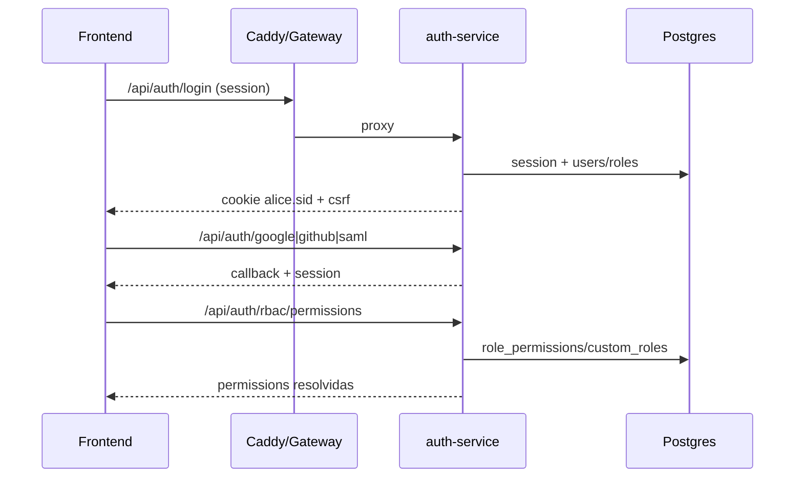
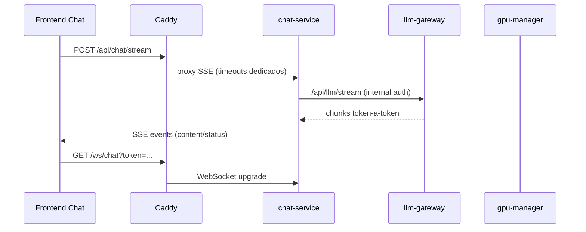
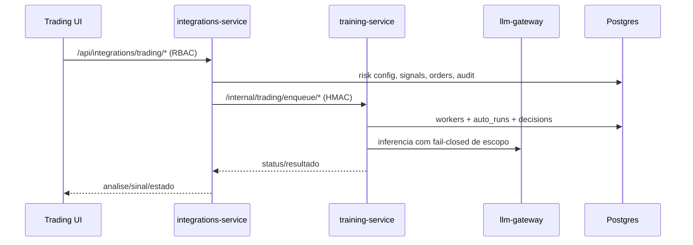
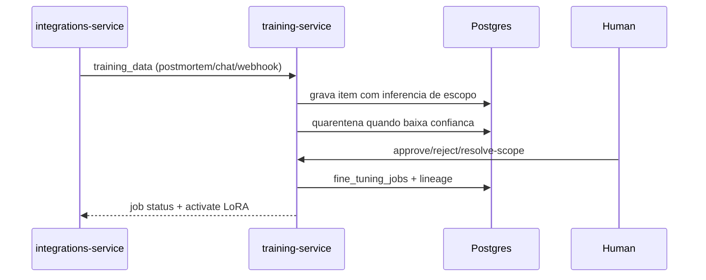
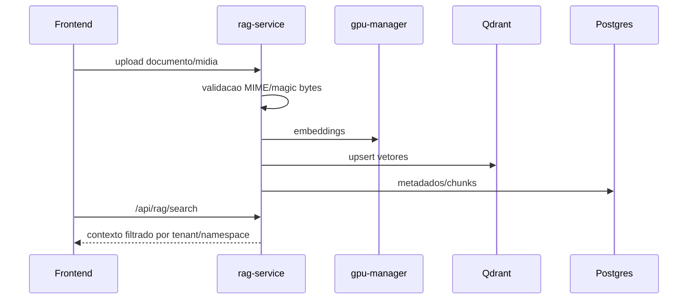

# RELATORIO CODE REVIEW ENTERPRISE - Alice

Data da revisao: 2026-02-26
Escopo: monorepo completo (apps, packages, infra, migrations, docs, server, tests)
Modo: somente leitura (nenhum arquivo de codigo alterado)

## 1) Resumo executivo
- Cobertura da review: 100% dos servicos e stacks listados no escopo solicitado.
- Diamond Readiness (completude rumo ao padrao Diamante): **72%**.
- Estado de baseline tecnica (validacoes executadas):
  - `pnpm -r typecheck`: OK
  - `pnpm -r lint`: OK
  - `pnpm test`: OK (51 arquivos, 1113 testes)
  - `pnpm -r build`: OK
  - `docker compose -f infra/docker/docker-compose.yml config`: OK (warning de `version` obsoleta)
  - `docker compose` (stacks base+infra+alice): FALHOU por env obrigatoria ausente (`QDRANT_API_KEY`).
- Principais riscos CRITICAL encontrados:
  - Rotas internas de chat expostas sem auth de rota.
  - WebSocket `/ws/agent` sem prova criptografica de identidade.
  - Inconsistencia estrutural de RLS (`app.current_tenant_id` vs `app.tenant_id`) em migrations.

## 2) Metodologia e evidencias de execucao
Leituras base:
- `README.md`
- `docs/INDEX.md`
- `docs/ARQUITETURA.md`
- `docs/DEPLOYMENT.md`
- `docs/STATUS-REAL-ATUAL.md`

Validacoes executadas:
- Typecheck/Lint/Test/Build do workspace.
- Validacao de compose base e stacks.
- Revisao estatica de todos os `apps/*`, `packages/*`, `infra/*`, `migrations/*.sql`, `server/*`.

Evidencias de baseline:
- Testes: `51 passed / 1113 passed` (saida do `pnpm test`).
- Compose stack falhou com env obrigatoria:
  - `infra/docker/stacks/docker-compose.alice.yml:348` (`QDRANT_API_KEY: ${QDRANT_API_KEY:?QDRANT_API_KEY e obrigatorio em producao}`)

## 3) Inventario do sistema (servicos, boundaries, dependencias, portas, env)

### 3.1 Apps (microservicos)

| Servico | Responsabilidade principal | Entry point | AuthN/AuthZ | Dados/Filas | Dependencias e integracoes | Evidencias |
|---|---|---|---|---|---|---|
| api-gateway | Proxy, rate limit e circuit breakers para servicos | `apps/api-gateway/src/index.ts` | Nao aplica RBAC proprio, delega ao backend | N/A | auth/chat/rag/training/integrations/observability via URL | `apps/api-gateway/src/index.ts:283`, `:300`, `:542`, `:549`, `:581` |
| chat-service | Chat streaming (SSE), WS, handover/takeover, roteamento, comandos trading | `apps/chat-service/src/index.ts` | `createSessionAuthMiddleware` + rotas com `requireAuth/requirePermission` (com excecoes criticas) | PostgreSQL, Redis pub/sub, chamadas cross-service | integrations/training/llm-gateway | `apps/chat-service/src/index.ts:7356`, `:847`, `:9076`, `:15647`, `:18549` |
| frontend-service | SPA React/Vite (chat, trading, training, observability) | `apps/frontend-service/src/main.tsx` + Nginx runtime | Sessao/cookies e chamadas API | N/A | API via Caddy/gateway | `apps/frontend-service/Dockerfile`, `apps/frontend-service/src/pages/Chat/index.tsx:1479`, `apps/frontend-service/src/hooks/use-websocket-chat.ts:429` |
| gpu-manager-service | Fila e admission control de workloads GPU | `apps/gpu-manager-service/src/index.ts` | `X-Internal-Api-Secret` | Redis queue/result, metricas | llm/embeddings/trainer services | `apps/gpu-manager-service/src/index.ts:107`, `:1046`, `:1082`, `:1112` |
| llm-gateway-service | Proxy/resolve de contexto/modelo/adapter LoRA com fail-closed para trading | `apps/llm-gateway-service/src/index.ts` | Internal secret middleware global | N/A (DB para resolucao de contexto/model) | chamado por chat-service | `apps/llm-gateway-service/src/index.ts:171`, `:185`, `:260`, `:286`, `:419` |
| observability-service | Health aggregation, URLs observability, backup orchestrator | `apps/observability-service/src/index.ts` | internal auth ou sessao (`requireInternalOrSessionAuth`) | chamadas a Prom/Grafana/Jaeger + backup orchestration | pgbackrest, docker exec, qdrant restore | `apps/observability-service/src/index.ts:83`, `:467`, `:868`, `:952`; `apps/observability-service/src/backup-orchestrator.ts:303` |
| rag-service | Ingestao, parsing, upload, embeddings, retrieval, media storage | `apps/rag-service/src/index.ts` | `requireAuth + requirePermission + requireSameTenant` na maioria das rotas | PostgreSQL + Qdrant + storage local + Redis | training/gpu/searxng | `apps/rag-service/src/index.ts:2317`, `:2472`, `:4235`; `apps/rag-service/src/storage.ts:203` |
| training-service | Dataset governance, quarantine/approval, jobs fine-tune, trading workers | `apps/training-service/src/index.ts` | RBAC + rotas internas HMAC | PostgreSQL + Redis streams/queues | rag/integrations/llm scopes | `apps/training-service/src/index.ts:772`, `:877`, `:1945`, `:2281`, `:3512` |
| biometrics-service (Python) | Enrollment/verify facial server-side | `apps/biometrics-service/main.py` | Internal API secret header | PostgreSQL + pgvector | auth-service chama endpoints internos | `apps/biometrics-service/main.py:148`, `:312`, `:443`; `apps/biometrics-service/Dockerfile` |

### 3.2 Packages

| Package | Funcao | Evidencias |
|---|---|---|
| `packages/config` | Validacao de env com Zod e sanitize de config | `packages/config/src/index.ts:9`, `:135`, `:194` |
| `packages/database` | Pool Drizzle/pg + contexto RLS (`set_config`) + utilitarios | `packages/database/src/index.ts:213`, `:295`, `:313`, `:314` |
| `packages/logger` | Logging estruturado Pino + redaction/serializers | `packages/logger/src/index.ts:1`, `:82`, `:129`, `:154` |
| `packages/shared` | Schema Drizzle + Zod contracts (trading/training/rag/auth etc.) | `packages/shared/src/schema.ts:2319`, `:3310`, `:3765`, `:3877` |
| `packages/shared-utils` | middlewares de auth/sessao, rate limit, circuit breaker, metrics | `packages/shared-utils/src/session-auth.ts:342`, `packages/shared-utils/src/circuit-breaker.ts:14`, `packages/shared-utils/src/metrics.ts:256` |

### 3.3 Infra e operacao
- Caddy roteia WS e APIs publicamente para servicos internos:
  - `/ws/*` -> chat (`infra/docker/Caddyfile:207`)
  - `/api/chat/*` -> chat (`infra/docker/Caddyfile:233`)
  - `/api/integrations/*` -> integrations (`infra/docker/Caddyfile:351`)
- Timeouts dedicados para stream/chat/trading analysis:
  - chat stream transport (`infra/docker/Caddyfile:226-230`)
  - trading signals/analysis (`infra/docker/Caddyfile:329-347`)
- Stack principal define envs criticas e dependencias:
  - `infra/docker/stacks/docker-compose.alice.yml:124` (auth)
  - `:224` (chat)
  - `:326` (rag)
  - `:388` (training)
  - `:440` (integrations)
  - `:541` (observability)
- Observabilidade infra com Prometheus/Grafana/Jaeger/OTel/Loki:
  - `infra/observability/prometheus.yml:20-63`, `:190`, `:195`

### 3.4 Portas e env vars criticas (matriz)

| Servico | Porta runtime (evidencia) | Env vars criticas observadas em stack | Evidencias |
|---|---|---|---|
| auth-service | 3001 | `DATABASE_URL`, `SESSION_SECRET`, `INTERNAL_API_SECRET`, `REDIS_URL`, `BIOMETRICS_SERVICE_URL` | `apps/auth-service/src/index.ts:4286`; `infra/docker/stacks/docker-compose.alice.yml:138-142`, `:158-159` |
| chat-service | 3002 | `DATABASE_URL`, `INTERNAL_API_SECRET`, `OPENAI_API_KEY`, `RAG_SERVICE_URL`, `INTEGRATIONS_SERVICE_URL`, `TRAINING_SERVICE_URL`, `GPU_MANAGER_URL`, `LLM_GATEWAY_URL`, `REDIS_URL`, `SESSION_SECRET` | `apps/chat-service/src/index.ts:128`; `infra/docker/stacks/docker-compose.alice.yml:238-252`, `:355-356`, `:362` |
| llm-gateway-service | 3011 | `DATABASE_URL`, `INTERNAL_API_SECRET`, `TRAINING_SERVICE_URL`, `GPU_MANAGER_URL` | `apps/llm-gateway-service/src/index.ts:53`; `infra/docker/stacks/docker-compose.alice.yml:296-301` |
| rag-service | 3003 | `DATABASE_URL`, `INTERNAL_API_SECRET`, `OPENAI_API_KEY`, `QDRANT_URL`, `QDRANT_API_KEY`, `SEARXNG_URL`, `SEARXNG_SECRET_KEY`, `GPU_MANAGER_URL`, `REDIS_URL`, `TRAINING_SERVICE_URL` | `apps/rag-service/src/index.ts:792`; `infra/docker/stacks/docker-compose.alice.yml:342-351`, `:355-356` |
| training-service | 3004 | `DATABASE_URL`, `INTERNAL_API_SECRET`, `GPU_MANAGER_URL`, `QDRANT_URL`, `QDRANT_API_KEY`, `REDIS_URL` | `apps/training-service/src/index.ts:208`; `infra/docker/stacks/docker-compose.alice.yml:404-411` |
| integrations-service | 3005 | `DATABASE_URL`, `INTERNAL_API_SECRET`, `STRIPE_*`, `TWILIO_*`, `OPENAI_API_KEY`, `WISE_*`, `CHAT_SERVICE_URL`, `TRAINING_SERVICE_URL`, `RAG_SERVICE_URL`, `GPU_MANAGER_URL`, `LLM_GATEWAY_URL`, `QDRANT_*`, `KUCOIN_*`, `REDIS_URL`, `SESSION_SECRET` | `apps/integrations-service/src/index.ts:21727`; `infra/docker/stacks/docker-compose.alice.yml:454-495` |
| observability-service | 3007 | `DATABASE_URL`, `INTERNAL_API_SECRET`, `REDIS_URL` | `apps/observability-service/src/index.ts:95`; `infra/docker/stacks/docker-compose.alice.yml:558-572` |
| gpu-manager-service | 3010 | `PORT`, `REDIS_URL`, `INTERNAL_API_SECRET` | `apps/gpu-manager-service/src/index.ts:74`; `infra/docker/stacks/docker-compose.alice.yml:618-620` |
| biometrics-service (Python) | 3011 | `DATABASE_URL`, `INTERNAL_API_SECRET`, `BIOMETRICS_ENCRYPTION_KEY`, `BIOMETRICS_*_RATE_LIMIT` | `infra/docker/stacks/docker-compose.alice.yml:197-203`, `:208`; `apps/biometrics-service/main.py:47-51` |
| frontend-service | 8080 (container Nginx) | `VITE_API_URL` (consumida no cliente para API/SSE) | `apps/frontend-service/Dockerfile:117`; `apps/frontend-service/src/lib/queryClient.ts:3`; `apps/frontend-service/src/hooks/use-websocket-chat.ts:53` |

Observacao:
- Em ambiente de compose principal, o acesso externo ocorre via Caddy e nao por `ports` diretas de cada servico (`infra/docker/Caddyfile:207`, `:233`, `:351`).

### 3.5 Banco e migrations
- Total migrations SQL: **89** (`migrations/*.sql`).
- RLS base e funcoes tenant:
  - `migrations/0001_rls_security_enterprise.sql:87`, `:90`, `:98`, `:117+`
- Trading RLS:
  - `migrations/0007_trading_rls_security.sql:59+`
- Trading auto engine:
  - `migrations/0083_trading_auto_engine.sql:44`, `:85-98`
- Guardrails thresholds:
  - `migrations/0085_trading_guardrail_thresholds.sql:42`, `:72-77`
- Biometrics:
  - `migrations/0050_biometrics.sql:2`, `:41+`, `:98+`

## 4) Mapa ponta-a-ponta por funcionalidade (fluxo real)

### 4.1 Auth / SSO / OIDC / RBAC

Evidencias:
- Sessao segura e CSRF: `apps/auth-service/src/index.ts:959-975`, `:384-410`.
- OAuth/SAML: `apps/auth-service/src/index.ts:2299`, `:2325`, `:2351`.
- OIDC provider mount: `apps/auth-service/src/index.ts:4248-4252`.
- RBAC endpoints: `apps/auth-service/src/index.ts:2397`, `:2584`, `:2703`.

### 4.2 Chat + Streaming (SSE/WS) + Agent routing + Preferred Name

Evidencias:
- SSE frontend: `apps/frontend-service/src/hooks/use-websocket-chat.ts:429-435`.
- Fallback polling para `/api/chat/message`: `apps/frontend-service/src/hooks/use-websocket-chat.ts:554-565`.
- Stream endpoint protegido com RBAC: `apps/chat-service/src/index.ts:9076`.
- WS `/ws/chat` com `verifyClient`: `apps/chat-service/src/index.ts:847-896`.
- Preferred name no frontend e prompt backend: `apps/frontend-service/src/pages/Chat/index.tsx:1210`, `:1350`; `apps/chat-service/src/index.ts:3208-3228`.

### 4.3 Trading institucional (spot/margin/futures, sinais, validacao, approval, schedulers)

Evidencias:
- Risk config endpoints: `apps/integrations-service/src/index.ts:12121`, `:12147`.
- Guardrails DB load: `apps/integrations-service/src/index.ts:12373-12394`.
- Auto-runs: `apps/integrations-service/src/index.ts:13294`, `:13338`, `:13401`.
- Training internal queue HMAC: `apps/training-service/src/index.ts:877-905`, `:1799`, `:1814`.
- Fail-closed trading scope: `apps/llm-gateway-service/src/index.ts:260`, `:286`, `:419`, `:445`.

### 4.4 Dataset generation -> aprovacao/quarentena -> training jobs -> lineage -> LoRA binding

Evidencias:
- Envio postmortem para training: `apps/integrations-service/src/index.ts:21606`, `:21656`.
- Quarantine e scope resolver: `apps/training-service/src/index.ts:1969`, `:1984-1994`, `:2020-2029`.
- Approval/override scope: `apps/training-service/src/index.ts:2281`, `:2337-2340`, `:2390`, `:2436`.
- Lineage tables: `migrations/0079_trading_enterprise_hardening.sql:36`, `:52`.

### 4.5 RAG ingestao (PDF/DOCX/HTML), chunking, embeddings, retrieval, governance

Evidencias:
- Upload com auth+tenant+validacao: `apps/rag-service/src/index.ts:2317-2325`.
- Retrieval com auth/permission/sameTenant: `apps/rag-service/src/index.ts:2472`.
- Uso Qdrant/SEARXNG envs: `apps/rag-service/src/index.ts:835-836`, `:1422-1423`.

### 4.6 GPU Manager + LLM Gateway + quotas + circuit breakers + timeouts
Evidencias:
- GPU internal auth e queue: `apps/gpu-manager-service/src/index.ts:107`, `:1046`, `:1109`.
- Admission control por VRAM: `apps/gpu-manager-service/src/index.ts:1082-1095`.
- LLM gateway internal auth global: `apps/llm-gateway-service/src/index.ts:171-185`.
- Timeouts/circuit breaker no chat para chamadas cross-service: `apps/chat-service/src/index.ts:6081-6087`, `:5703`.

Evidencias:
- KuCoin multi-mercado (spot/margin/futures): `apps/integrations-service/src/index.ts:17864+`, `:19731+`, `:20547`, `:21030`.
- Isolamento via permissao e tenant em queries trading/dataset: `apps/integrations-service/src/index.ts:3596`, `:12121`, `:13614`.

### 4.8 Observabilidade (codigo vs infra)
Evidencias:
- Service metrics e health aggregation: `apps/observability-service/src/index.ts:535`, `:578`, `:624`.
- URLs para Prometheus/Grafana/Jaeger/Langfuse: `apps/observability-service/src/index.ts:923-940`.
- Prometheus scrapes de servicos e exporters: `infra/observability/prometheus.yml:20-63`, `:68+`, `:95+`, `:190`, `:195`.
- Gap: stack Jaeger/OTel existe, mas nao ha instrumentacao de spans no codigo de negocio (busca por `opentelemetry` sem imports em apps de negocio).

### 4.9 Deploy (compose, caddy, migrations, backups, runner)
Evidencias:
- Caddy routes/timeouts: `infra/docker/Caddyfile:207`, `:218-230`, `:351`.
- Stacks e envs obrigatorias: `infra/docker/stacks/docker-compose.alice.yml:124`, `:326-351`, `:541-572`.
- Backup orchestration: `apps/observability-service/src/index.ts:952`; `apps/observability-service/src/backup-orchestrator.ts:1137`, `:1188`, `:1216`.
- Legacy runner ainda ativo no root scripts: `package.json` (`dev/build/start` apontam para `server/index-*.ts`).

## 5) Diamond Readiness Score (rubrica e calculo)

### 5.1 Rubrica
- Seguranca e isolamento tenant: 20%
- Trading risk controls e governanca: 20%
- Confiabilidade/resiliencia (timeouts/retries/idempotencia): 15%
- Integridade de dados (DB/migrations/constraints/RLS): 15%
- Observabilidade (logs/metricas/tracing/alertas): 10%
- Performance (streaming/WS/latencia/backpressure): 10%
- Qualidade de engenharia (TS strict/Zod/testes/arquitetura): 10%

### 5.2 Scores por categoria
| Categoria | Peso | Score (0-100) | Peso x Score | Evidencia resumida |
|---|---:|---:|---:|---|
| Seguranca & Tenant Isolation | 20% | 62 | 12.4 | Boa base em auth/RBAC/CSRF; falhas criticas em rotas internas chat e WS agent (`apps/chat-service/src/index.ts:18549`, `:18829`, `:15647`) |
| Trading Risk Controls & Governanca | 20% | 74 | 14.8 | Guardrails, risk config, kill-switch, approval flows presentes (`apps/integrations-service/src/index.ts:12121`, `apps/training-service/src/trading/jobs/model-risk-worker.ts:79`) |
| Confiabilidade/Resiliencia | 15% | 76 | 11.4 | Circuit breakers/timeouts/filas amplos; excecao critica de fallback sync postmortem (`apps/integrations-service/src/postmortem-worker.ts:144`) |
| Integridade de Dados (DB/RLS) | 15% | 68 | 10.2 | Schema/migrations robustos; mismatch RLS GUC e politica ausente em tabela auto steps (`migrations/0012_technical_indicators.sql:151`, `migrations/0083_trading_auto_engine.sql:86`) |
| Observabilidade | 10% | 78 | 7.8 | Prometheus/Grafana/Jaeger/Loki/backup presentes; falta tracer app-level e RBAC granular em endpoints observability |
| Performance | 10% | 72 | 7.2 | SSE/WS e timeouts dedicados; polling ainda ativo em partes declaradas como WS-only (`apps/frontend-service/src/pages/DemoTrading.tsx:398`) |
| Qualidade de Engenharia | 10% | 80 | 8.0 | TS strict em apps, Zod extensivo, suite de 1113 testes; drift arquitetural com `server/` legacy nos scripts root |

**Resultado final ponderado: 72.0% (completude rumo Diamante).**

## 6) Achados por severidade (formato obrigatorio)

- **ID**: CRIT-001
- **Titulo**
  Rotas internas de orquestracao de chat expostas sem autenticacao/autorizacao de rota.
- **Severidade**: CRITICAL
- **Impacto**
  As rotas `POST /api/chat/message` e `POST /api/chat/notify-agent` aceitam mutacoes de estado sem `requireAuth`, `requirePermission` ou `requireInternalHmacAuth`. Como estao publicamente roteadas pelo Caddy, um atacante que obtenha/guess um `conversationId` pode injetar mensagens, acionar handover/notify e gerar custo operacional/LLM indevido.

  Reproducao (quando aplicavel): enviar `POST` diretamente para `/api/chat/message` com `conversationId` valido sem cookie/sessao.
- **Evidencia**: `apps/chat-service/src/index.ts:18549`, `apps/chat-service/src/index.ts:18829`, `infra/docker/Caddyfile:233`, `apps/integrations-service/src/index.ts:8335-8340`, `apps/integrations-service/src/index.ts:8756-8759`
- **Causa raiz provavel**
  Dependencia implicita em "origem interna" (integrations-service) sem hardening de borda no proprio endpoint.
- **Recomendacao** (SEM codar)
  1. Exigir autenticacao interna HMAC obrigatoria nessas duas rotas (mesmo padrao usado em training internal endpoints).
  2. Adicionar `idempotency-key` e rate-limit por `conversationId`.
  3. Registrar trilha de auditoria para origem interna (service, assinatura valida, correlationId).
  4. Arquivos a tocar: `apps/chat-service/src/index.ts`, `apps/integrations-service/src/index.ts`, `packages/shared-utils/src/internal-auth.ts` (ou equivalente), testes de integracao.
- **Criterio de aceite**
  Requisicoes sem assinatura interna valida retornam 401; chamadas legitimas service-to-service passam; testes de regressao cobrem ambos os cenarios.

- **ID**: CRIT-002
- **Titulo**
  WebSocket `/ws/agent` permite conexao por `agentId/tenantId` sem prova criptografica de identidade.
- **Severidade**: CRITICAL
- **Impacto**
  O upgrade de `/ws/agent` nao usa `verifyClient` com sessao/token como `/ws/chat`. A conexao valida apenas `agentId`/`tenantId` recebidos na URL e consulta DB para role/permissao. Se um `agentId` for exposto, ha risco de impersonacao de agente em takeover.

  Reproducao (quando aplicavel): abrir WS em `/ws/agent?agentId=<uuid>&tenantId=<uuid>` sem cookie/sessao e observar handshake aceito quando IDs correspondem.
- **Evidencia**: `apps/chat-service/src/index.ts:15647-15655`, `apps/chat-service/src/index.ts:15666-15713`, `apps/chat-service/src/index.ts:847-896`, `infra/docker/Caddyfile:207-210`
- **Causa raiz provavel**
  Implementacao separada de `agentWss` sem reaproveitar pipeline de autenticacao de `wss` (`verifyClient`).
- **Recomendacao** (SEM codar)
  1. Unificar autenticacao de `/ws/agent` com token efemero assinado (aud=ws, subject=agentId, tenantId).
  2. Exigir sessao valida + bind do token ao usuario autenticado.
  3. Bloquear conexao por query params sem token assinado.
  4. Arquivos a tocar: `apps/chat-service/src/index.ts`, frontend takeover hook/component, testes e2e WS.
- **Criterio de aceite**
  Conexao em `/ws/agent` sem token/sessao falha com 401/400x; conexao autenticada de agente legitimo funciona.

- **ID**: CRIT-003
- **Titulo**
  Inconsistencia de contexto RLS: codigo usa `app.current_tenant_id`, varias policies usam `app.tenant_id`.
- **Severidade**: CRITICAL
- **Impacto**
  Parte das policies referencia um GUC que nao e setado pelo runtime, o que invalida o comportamento esperado de isolamento por tenant e cria risco de bypass operacional (owner bypass) ou deny inesperado conforme role de conexao.
- **Evidencia**: `packages/database/src/index.ts:313`, `migrations/0001_rls_security_enterprise.sql:90`, `migrations/0012_technical_indicators.sql:151`, `migrations/0056_demo_trading_snapshot_postmortem.sql:43`, `migrations/0057_training_scope_governance.sql:78`, `migrations/0083_trading_auto_engine.sql:92`, `migrations/0085_trading_guardrail_thresholds.sql:77`
- **Causa raiz provavel**
  Evolucao incremental de migrations com convencoes diferentes de GUC tenant.
- **Recomendacao** (SEM codar)
  1. Padronizar todas as policies para `current_tenant_id()` (funcao SSOT).
  2. Criar migration de reparo para policies legadas e adicionar check automatizado no CI.
  3. Revisar role de conexao app vs owner e adotar estrategia de FORCE RLS onde aplicavel.
  4. Arquivos a tocar: novas migrations em `migrations/`, validacoes em testes SQL/integration.
- **Criterio de aceite**
  Nenhuma policy restante usa `current_setting('app.tenant_id', ...)`; testes multi-tenant demonstram isolamento consistente.

- **ID**: HIGH-001
- **Titulo**
  Tabela `trading_auto_run_steps` com RLS habilitado sem policy correspondente.
- **Severidade**: HIGH
- **Impacto**
  Pode causar bloqueio de leitura/escrita por tenant (ou comportamento inconsistente), comprometendo rastreabilidade de etapas de auto-run.
- **Evidencia**: `migrations/0083_trading_auto_engine.sql:44`, `:86`, `:91-99`
- **Causa raiz provavel**
  Migration criou policies para `trading_auto_runs` e `trading_auto_decisions`, omitindo `trading_auto_run_steps`.
- **Recomendacao** (SEM codar)
  Criar migration adicionando policy `FOR ALL` em `trading_auto_run_steps` com mesmo criterio tenant das tabelas irmas; incluir teste de integracao por tenant.
- **Criterio de aceite**
  `trading_auto_run_steps` possui policy tenant-isolation valida e coberta por teste.

- **ID**: HIGH-002
- **Titulo**
  Fallback sincrono de postmortem quando Redis indisponivel.
- **Severidade**: HIGH
- **Impacto**
  Viola regra operacional de tarefas pesadas assicronas; sob indisponibilidade de Redis o fluxo pode bloquear request path e degradar latencia/SLA.
- **Evidencia**: `apps/integrations-service/src/postmortem-worker.ts:144-151`
- **Causa raiz provavel**
  Estrategia de resiliencia implementada como degradacao funcional sincronica.
- **Recomendacao** (SEM codar)
  1. Remover execucao sincronica.
  2. Retornar erro controlado (503) e DLQ/retry agendado.
  3. Adicionar metrica/alerta explicito para "enqueue unavailable".
- **Criterio de aceite**
  Sem Redis, endpoint nao executa `executePostMortem` em request thread; retorna 503 + observabilidade.

- **ID**: HIGH-003
- **Titulo**
  Webhook de training aceita `x-tenant-id` direto do caller apos validar apenas secret.
- **Severidade**: HIGH
- **Impacto**
  Se o segredo for comprometido, o atacante consegue direcionar ingestao para qualquer tenant via header, impactando segregacao de dados e governanca.
- **Evidencia**: `apps/training-service/src/index.ts:3512-3548`
- **Causa raiz provavel**
  Modelo de trust baseado exclusivamente em shared secret sem binding de identidade/tenant.
- **Recomendacao** (SEM codar)
  Exigir assinatura HMAC com claims (`tenantId`, `issuedAt`, `nonce`) e validacao anti-replay; negar `tenantId` fora do claim assinado.
- **Criterio de aceite**
  Header `x-tenant-id` divergente do claim assinado resulta em 401/403; replay detectado e bloqueado.

- **ID**: HIGH-004
- **Titulo**
  Adocao parcial de contexto RLS no codigo (uso predominante de `getDatabase` sem `withTenantContext`).
- **Severidade**: HIGH
- **Impacto**
  A seguranca multi-tenant fica dependente de filtros aplicacionais dispersos, aumentando risco de regressao cross-tenant em novos endpoints.
- **Evidencia**: `packages/database/src/index.ts:295`, busca de uso `withTenantContext` limitada (`apps/integrations-service/src/index.ts:17691`, `apps/training-service/src/index.ts:1239`, `apps/rag-service/src/index.ts:3022`)
- **Causa raiz provavel**
  Evolucao historica com filtros por `tenantId` no application layer e RLS nao uniformemente operacionalizada.
- **Recomendacao** (SEM codar)
  Definir politica de acesso por dominio (sempre `withTenantContext` em rotas tenant-scoped) e adicionar lint/regra arquitetural + testes de isolamento.
- **Criterio de aceite**
  Rotas tenant-scoped criticas usam contexto RLS de forma padrao e possuem testes negativos cross-tenant.

- **ID**: HIGH-005
- **Titulo**
  Stacks de producao nao validam sem envs criticas (Qdrant API key ausente bloqueia compose config).
- **Severidade**: HIGH
- **Impacto**
  Risco operacional em deploy/DR: pipeline pode quebrar por variaveis obrigatorias ausentes sem preflight centralizado.
- **Evidencia**: erro `docker compose ... config`; `infra/docker/stacks/docker-compose.alice.yml:348`
- **Causa raiz provavel**
  Dependencia de envs distribuidas sem etapa unica de validacao de secrets antes do deploy.
- **Recomendacao** (SEM codar)
  Implementar `preflight-secrets` bloqueante no runner/deploy com matriz de obrigatoriedade por profile/stack.
- **Criterio de aceite**
  Deploy falha cedo com relatorio claro de secrets faltantes antes de iniciar stack.

- **ID**: HIGH-006
- **Titulo**
  Drift arquitetural: scripts root ainda executam `server/*` legado em vez do modo microservicos.
- **Severidade**: HIGH
- **Impacto**
  Risco de operacao em modo incorreto (single server legacy) sem os controles de fronteira planejados para arquitetura distribuida.
- **Evidencia**: `package.json` scripts `dev/build/start`; arquivos `server/index-dev.ts`, `server/index-prod.ts`, `server/routes.ts`
- **Causa raiz provavel**
  Transicao incompleta entre arquitetura monolitica legada e microservicos.
- **Recomendacao** (SEM codar)
  Definir script root SSOT para stack microservicos (turbo/pnpm filters), mantendo legacy apenas em comando explicitamente depreciado.
- **Criterio de aceite**
  `pnpm dev/start/build` default executa fluxo de microservicos documentado em `docs/DEPLOYMENT.md`.

- **ID**: MED-001
- **Titulo**
  Endpoints de status de integracoes sem `requirePermission`.
- **Severidade**: MEDIUM
- **Impacto**
  Exposicao de metadados operacionais (estado de configuracao) para chamadas nao autenticadas.
- **Evidencia**: `apps/integrations-service/src/index.ts:8137`, `:9093`; middleware nao-enforcing por design em `packages/shared-utils/src/session-auth.ts:353-356`
- **Causa raiz provavel**
  Suposicao de que middleware de sessao "protege" a rota, sem guard explicito.
- **Recomendacao** (SEM codar)
  Adicionar `requirePermission` (ou internal-only) nas rotas de status sensiveis; manter somente `/health` publico.
- **Criterio de aceite**
  Sem sessao/permissao, `wise/status` e `twilio/status` retornam 401/403.

- **ID**: MED-002
- **Titulo**
  Endpoint de arquivos de media usa parametros de path sem normalizacao defensiva.
- **Severidade**: MEDIUM
- **Impacto**
  Risco de acesso indevido a paths dentro do storage se parametros malformados forem aceitos por decoding de rota.
- **Evidencia**: `apps/rag-service/src/index.ts:4235-4246`, `apps/rag-service/src/storage.ts:203-217`, funcao de sanitizacao existe mas nao aplicada aqui (`apps/rag-service/src/index.ts:736-759`)
- **Causa raiz provavel**
  Sanitizacao concentrada no upload, nao no endpoint de leitura por path.
- **Recomendacao** (SEM codar)
  Canonicalizar path de leitura (normalize + enforce prefix + reject traversal) e validar `mediaType`/`filename` com regex estrita.
- **Criterio de aceite**
  Tentativas com `..`, `%2f`, `%5c` sao rejeitadas com 400/403; testes de path traversal passam.

- **ID**: MED-003
- **Titulo**
  Observability endpoints acessiveis para qualquer sessao sem RBAC granular.
- **Severidade**: MEDIUM
- **Impacto**
  Usuarios autenticados sem perfil de observabilidade podem consultar circuit-breakers/urls/log ingestion, ampliando superficie de informacao operacional.
- **Evidencia**: `apps/observability-service/src/index.ts:83-92`, `:467`, `:868`, `:896`, `:923`
- **Causa raiz provavel**
  Politica de auth coarse-grained (`internal OR any session`) sem camada `requirePermission`.
- **Recomendacao** (SEM codar)
  Introduzir permissoes dedicadas (ex.: `observability:read`, `observability:logs:write`) em todas as rotas nao-health.
- **Criterio de aceite**
  Usuario sem permissao recebe 403; usuario autorizado acessa normalmente.

- **ID**: MED-004
- **Titulo**
  Tracing distribuido no infra sem instrumentacao de spans no codigo de negocio.
- **Severidade**: MEDIUM
- **Impacto**
  Dificulta RCA de latencia ponta-a-ponta apesar de Jaeger/OTel operacionais.
- **Evidencia**: stack OTel/Jaeger em `infra/observability/otel-collector/config.yaml`, `infra/observability/jaeger/jaeger-config.yml`; busca em apps sem imports de `opentelemetry`.
- **Causa raiz provavel**
  Observabilidade priorizou metricas/logs e deixou tracing app-level para etapa posterior.
- **Recomendacao** (SEM codar)
  Instrumentar spans nas rotas criticas (chat stream, trading signal generation, rag ingest, training queue workers).
- **Criterio de aceite**
  Traces completos visiveis no Jaeger por correlationId/requestId nas jornadas criticas.

- **ID**: MED-005
- **Titulo**
  Divergencia doc x codigo sobre "sem polling" em Trading.
- **Severidade**: MEDIUM
- **Impacto**
  Indicadores de status podem superestimar maturidade real-time e mascarar custo/latencia por polling residual.
- **Evidencia**: claim em `docs/STATUS-REAL-ATUAL.md:59`; polling no frontend demo em `apps/frontend-service/src/pages/DemoTrading.tsx:398`, `:435`, `:442`, `:449`, `:462`
- **Causa raiz provavel**
  Documentacao consolidada com premissa de arquitetura alvo, nao estado implementado completo.
- **Recomendacao** (SEM codar)
  Atualizar status para refletir excecoes e plano de eliminacao de polling residual (por tipo de dado).
- **Criterio de aceite**
  Documento passa a distinguir claramente "market data WS-only" vs "dados operacionais em polling".

- **ID**: LOW-001
- **Titulo**
  Biometria sem liveness detection.
- **Severidade**: LOW
- **Impacto**
  Aumenta risco de spoofing por foto/video em cenarios de ameaca avancada.
- **Evidencia**: `apps/biometrics-service/main.py:4`, `migrations/0050_biometrics.sql:2`
- **Causa raiz provavel**
  Escopo inicial priorizou CPU-only e entrega incremental.
- **Recomendacao** (SEM codar)
  Adicionar etapa de liveness ativa/passiva e score de anti-spoofing com threshold configuravel por tenant.
- **Criterio de aceite**
  Verificacao biometrica retorna `livenessScore` e bloqueia tentativas abaixo do threshold.

- **ID**: LOW-002
- **Titulo**
  Dependencia Python de modelos faciais via Git sem pin de commit/tag.
- **Severidade**: LOW
- **Impacto**
  Reduz reprodutibilidade de build e eleva risco de supply-chain drift.
- **Evidencia**: `apps/biometrics-service/requirements.txt` (`face-recognition-models @ git+https://github.com/ageitgey/face_recognition_models`)
- **Causa raiz provavel**
  Uso direto do repositorio upstream sem versionamento fixo.
- **Recomendacao** (SEM codar)
  Pin por commit hash assinado e registrar SBOM/licenca no pipeline.
- **Criterio de aceite**
  Build reproduzivel com lock deterministico e verificacao de integridade.

## 7) Gap analysis: docs/STATUS-REAL-ATUAL.md vs implementacao real

| Afirmacao no STATUS | Evidencia no codigo | Resultado |
|---|---|---|
| "Autenticacao interna HMAC unificada entre servicos" (`docs/STATUS-REAL-ATUAL.md:11`) | Rotas internas de chat sem guard interno (`apps/chat-service/src/index.ts:18549`, `:18829`) | **PARCIAL / DIVERGENTE** |
| "Trading market data 100% WS, sem polling REST" (`docs/STATUS-REAL-ATUAL.md:59`) | `DemoTrading` usa `refetchInterval` para market e dados operacionais (`apps/frontend-service/src/pages/DemoTrading.tsx:398`, `:435`, `:442`, `:449`, `:462`) | **PARCIAL / DIVERGENTE** |
| "WebSocket frontend alinhado com /ws/chat" (`docs/STATUS-REAL-ATUAL.md:61`) | Hook usa `/ws/chat` (`apps/frontend-service/src/hooks/useKucoinWebSocket.ts:279`) | **OK** |
| "Seguranca enterprise com RLS" (`docs/STATUS-REAL-ATUAL.md:46`) | RLS existe, mas com mismatch de GUC em varias migrations (`migrations/0012_technical_indicators.sql:151`) | **PARCIAL / DIVERGENTE** |
| "Observabilidade de latencia/auto-runs em Prometheus" (`docs/STATUS-REAL-ATUAL.md:11`) | metricas presentes em training/integrations (`apps/training-service/src/index.ts:447`, `apps/integrations-service/src/index.ts:2325`) | **OK** |

## 8) Riscos institucionais (hedge fund/trading profissional)

### 8.1 Risco de seguranca
- Injecao de eventos de chat por rotas sem auth de borda (CRIT-001).
- Possivel impersonacao de agente em takeover via WS (CRIT-002).
- Isolamento tenant fragilizado por inconsistencias de RLS (CRIT-003/HIGH-004).

### 8.2 Risco de compliance/auditoria
- Ingestao webhook com tenant controlado por header apos segredo (HIGH-003).
- Endpoints observability e status com auth coarse sem RBAC fino (MED-001/MED-003).

### 8.3 Risco operacional
- Degradacao para processamento sincronico em fluxo pesado (HIGH-002).
- Drift de runtime (scripts root legacy) pode ativar topologia indevida (HIGH-006).
- Deploy sensivel a matriz de env sem preflight unificado (HIGH-005).

### 8.4 Risco de mercado/modelo
- Guardrails e kill-switch existem, mas governanca pode ser comprometida por falhas de isolamento tenant.
- Sem tracing app-level, RCA de eventos de risco/model drift fica mais lenta.

### 8.5 Risco de dados
- Inconsistencia de policies RLS e cobertura parcial de contexto tenant.
- Endpoint de media sem canonicalizacao completa de path (MED-002).

## 9) Checklist de cobertura (nao passar vergonha)
- Cobertura de 100% dos servicos listados: **SIM**.
- Analise de migrations + infra compose + docs comparado com codigo: **SIM**.
- Evidencias com paths/linhas para afirmacoes principais: **SIM**.
- Diamond Score com rubrica e peso: **SIM**.
- Plano detalhado sem implementar (arquivo separado): **SIM**.

## 10) Conclusao
A plataforma Alice tem base tecnica forte (strict TS, cobertura de testes alta, stack observability robusta e pipelines trading/training avancados), mas ainda nao atinge padrao Diamante devido a tres riscos estruturais criticos: borda de autenticacao em rotas internas de chat, autenticacao WS agent, e consistencia/enforcement de RLS multi-tenant. Com a execucao priorizada do plano de correcoes, o sistema pode evoluir de 72% para >90% de readiness em ondas curtas.
